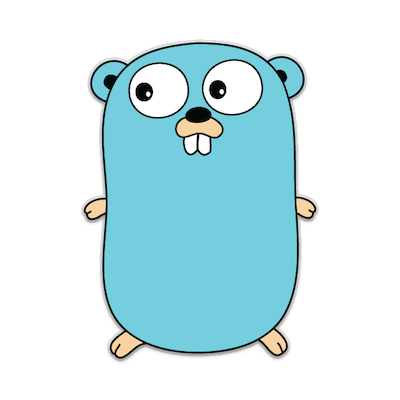
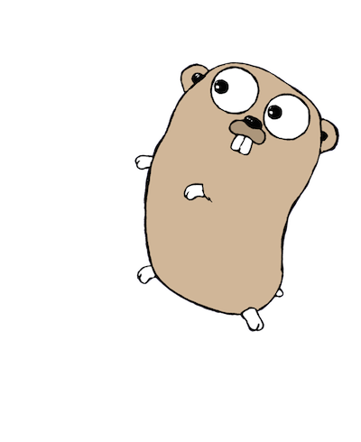

.center.icon[]

---


class: white
background-image: url(tmp/title.svg)
.top.icon[]

# Что за язык - Go ?

### Дмитрий Смаль

---

class: top white
background-image: url(tmp/sound.svg)
background-size: 130%
.top.icon[]

.sound-top[
  # Как меня слышно и видно?
]

.sound-bottom[
  ## > Напишите в чат
  ### **+** если все хорошо
  ### **–** если есть проблемы cо звуком или с видео
]

---

# Что за язык Go ? 

.right-image[

]

# 
- Язык общего назначения
- Минималистичный
- Production-ready!
- Используется в крупнейших Internet компаниях

---

# Пример кода

```
func Count(s, substr string) int {
	if len(substr) == 0 {
		return utf8.RuneCountInString(s) + 1
	}
	if len(substr) == 1 {
		return bytealg.CountString(s, substr[0])
	}
	n := 0
	for {
		i := Index(s, substr)
		if i == -1 {
			return n
		}
		n++
		s = s[i+len(substr):]
	}
}
```

---

# Сильные и слабые стороны

- **+** Простота, можно освоиться за месяц
- **+** Читаемость, легко работать большой командой  
- **+** Баланс удобство / производительность
- **+** Удобная многопоточность и работа с сетью

- **-** Отсутствие шаблонов
- **-** Тяжелая обработка ошибок

---

# Области применения

.right-image[

]

# 

- Серверная Web разработка
- Высоконагруженные сетевые сервисы
- Системные утилиты

---

# На занятии

- Рассмотрели сильные и слабые стороны Go
- Узнали где используется Go

---

class: white
background-image: url(tmp/title.svg)
.top.icon[]

# Спасибо за внимание!

### Ах, да... мы забыли про Hello World!

### Вы можете написать его на [Go Playground](https://play.golang.org/p/WTK-j3MPIuU) <br> прямо сейчас!
