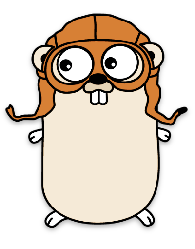
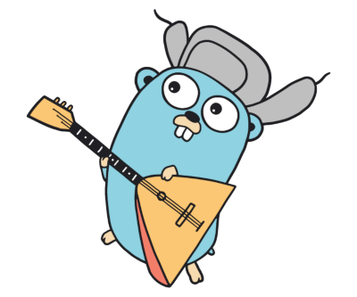

.center.icon[]

---


class: white
background-image: url(img/message.svg)
.top.icon[]

# Обработка ошибок в Go

### Дмитрий Смаль

---

class: top white
background-image: url(img/sound.svg)
background-size: 130%
.top.icon[]

.sound-top[
  # Как меня слышно и видно?
]

.sound-bottom[
  ## > Напишите в чат
  ### **0** если все хорошо
  ### **1** если есть проблемы cо звуком или с видео
]

---

# Небольшой тест

.left-text[
Пожалуйста, пройдите небольшой тест. 
<br><br>
Возможно вы уже многое знает об ошибках в Go =)
<br><br>
[https://forms.gle/gKwYGFtuT6XctBwm9](https://forms.gle/gKwYGFtuT6XctBwm9)
]

.right-image[

]

---

# Как вообще можно обработать ошибку ?

.right-image[

]

# 
- Exceptions (Python, Java, C++)
- Код возврата + errno (C, C++)
- Возврат объекта ошибки 

---

# Пример кода

Возврат ошибок
```
import "errors"

func SafeDiv(a, b int) (int, error) {
	if b == 0 {
        return 0, errors.New("can't divide by zero")
    }
    return a / b, nil
}

```

Обработка ошибок
```
res, err := SafeDiv(a, b)
if err != nil {
    // TODO: something
}
```

---

# Что такое ошибка в Go ?

Ошибкой может быть любой тип данных, если он реализует интерфейс `error`

```
interface error {
    Error() string
}
```

```

import "fmt"

type MyError struct {
    code int
}

func (e *MyError) Error() string {
    return fmt.Sprintf("something went wrong, code %d", e.code)
}

```

---

# Давайте попрактикуемся

Напишите фукнцию которая вычисляет факториал числа N<br>
Если N >= 15, нужно возвращать ошибку, т.к. возможно переполнение
```
1! = 1
2! = 2
N! = N*(N-1)!
```

Отредактируйте код на Go PlayGround

[https://play.golang.com/p/YR-kCt_4iN6](https://play.golang.com/p/YR-kCt_4iN6)

.right-image[

]

---

# Тактика обработки ошибок

Что можно сделать если функция вернула вам ошибку ?

```
res, err := SomeFunc()
```

Обработать и продолжить работу - *не всегда возможно*
```
if err != nil {
    fmt.Printf("error happened %d", err)
    res = SomeOtherFunc()
}
```

Вернуть ошибку дальше
```
if err != nil {
    return err
}
```

Проигнорировать - *плохой вариант*


---

# Как различать типы ошибок ?

Когда мы пишем высокоуровневый код функции могут возвращать принципиально разные типы ошибок.
Например при запросе в базу данных мы можем получить ошибки вида

* Сетевая ошибка или таймаут
* Соединение с базой было закрыто
* Ошибка в SQL запросе

В этих трех случаях нужно предпринять *разные* действия. Как различить ошибки ?

---

# Как различать типы ошибок ?

```
res, err := QueryDatabase(query, args)
if err != nil {
    if err == mysql.ErrInvalidConn {
        Reconnect()
        return QueryDatabase(query, args)
    } else if err2, ok := err.(net.Err); ok {
        if err2.Temporary() {
            Reconnect()
            return QueryDatabase(query, args)
        }
    } else if err2, ok := err.(mysql.MySQLError); ok {
        if err2.Number == 1064 {
            panic("invalid query: " + query)
        }
    }
    return nil, err
}
```

---

# panic ? паника! Пааааника!!!

`panic("message")` - это аналоги exception в Go. Официальная рекомендация: 
используйте их только если хотите *аварийно остановить* программу.

<br>

Как перехватить панику ?
```
func RunUnsafeCode(code) (err error) {
    defer func() {
        if e := recover(); e != nil {
            err = errors.New(e)
        }
    }()
    err = code()
    return
}
```
---

# И еще немного практики

.left-text[
Измените функцию из предыдущего упражнения, что бы она использовала `panic` и `recover` для
обработки ошибок.

<br><br>

[https://play.golang.com/p/YR-kCt_4iN6](https://play.golang.com/p/YR-kCt_4iN6)

<br><br>
*Не повторяйте это на работе!*
]

.right-image[

]

---

# Небольшой тест

.left-text[
Проверим что мы узнали за этот урок
<br><br>
[https://forms.gle/gKwYGFtuT6XctBwm9](https://forms.gle/gKwYGFtuT6XctBwm9)
]

.right-image[

]

---

class: white
background-image: url(img/message.svg)
.top.icon[]

# Спасибо за внимание!

### Вы можете написать его на [Go Playground](https://play.golang.org/p/WTK-j3MPIuU) <br> прямо сейчас!
