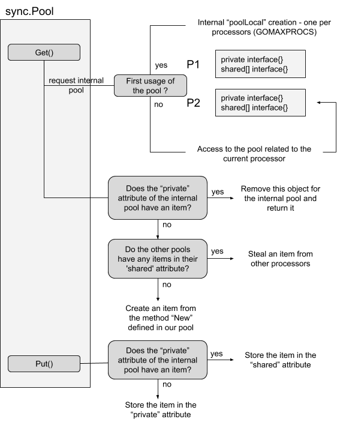
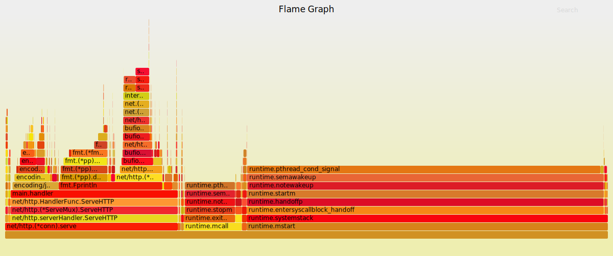

.center.icon[]

---


class: white
background-image: url(tmp/title.svg)
.top.icon[]

## Профилирование и оптимизации в Go

### Антон Телышев

---

class: top white
background-image: url(tmp/sound.svg)
background-size: 130%
.top.icon[]

.sound-top[
  # Как меня слышно и видно?
]

.sound-bottom[
  ## > Напишите в чат
  ### **+** если все хорошо
  ### **–** если есть проблемы cо звуком или с видео
]

---

# Цель занятия 

.right-image[

]


- Научиться писать бенчмарки
- Изучить основные подходы к оптимизации программ в Go
- Научиться пользоваться инструментами профилирования

---

# Аудитория

##Напишите, пожалуйста, в чат:
- 0, если вы в первый раз видите Go
- 1, если вы что-то пописываете на Go временами 
- 2, если Go ваш основной язык

---

# Познакомимся

.me[

### Антон Телышев
]

.about[
-- Ведущий Golang-разработчик в “Центр недвижимости от Сбербанка” (ДомКлик)<br><br>

-- Окончил магистратуру МГТУ им Н.Э. Баумана (кафедра “Компьютерные системы и сети”)<br><br>

-- Разрабатывал и поддерживал системы мониторинга и внутренние сервисы в Mail.Ru Group <b>(Python/Golang)</b><br><br>

-- Разрабатывал и поддерживал Kaspersky Fraud Prevention Cloud <b>(Python/C++)</b><br><br>

-- Окончил Технопарк Mail.Ru (системный архитектор), где впоследствии преподавал "Подготовительную программу по С++"<br><br>

-- Telegram: @antonboom
]


---

# Бенчмаркинг

Тест производительности - контрольная задача, необходимая для определения сравнительных характеристик производительности компьютерной системы.
<br>
https://ru.wikipedia.org/wiki/Benchmark_(computing)

<br>

##### Бенчмаркинг в Go:
https://golang.org/pkg/testing/#hdr-Benchmarks


---

# Бенчмаркинг (пример программы)

```
func Fast() int {
	acc := new(int)
	for i := 0; i < 10; i++ {
		acc2 := new(int)
		*acc2 = *acc + 1
		acc = acc2
	}

	return *acc
}

func Slow() int {
	acc := new(int)
	for i := 0; i < 1000; i++ {
		acc2 := new(int)
		*acc2 = *acc + 1
		acc = acc2
	}

	return *acc
}
```

---

# Бенчмаркинг (пример бенчмарка)

```
import "testing"

func BenchmarkFast(b *testing.B) {
	for i := 0; i < b.N; i++ {
		Fast()
	}
}

func BenchmarkSlow(b *testing.B) {
	for i := 0; i < b.N; i++ {
		Slow()
	}
}
```

```
$ go test -bench=. -benchmem .
```

https://golang.org/cmd/go/#hdr-Testing_flags
(go help testflag)

---

# Бенчмаркинг (работа с таймером)

```
func benchSomething(i int, b *testing.B) {
	// Hard work with i
	b.ResetTimer()

	for i := 0; i < b.N; i++ {
		// ...
		b.StopTimer()
		time.Sleep(1) // For example
		b.StartTimer()
		// ...
	}
}

func BenchSomething100(b *testing.B) {
	benchSomething(100, b)
}
```

---

# Бенчмаркинг (ошибки)

The benchmark function must run the target code b.N times.<br>During benchmark execution, b.N is adjusted until the benchmark function lasts long enough to be timed reliably. 

```
import "testing"

func BenchmarkWrong(b *testing.B) {
    for n := 0; n < b.N; n++ {
    	MyFunc(b.N)
    }
}

func BenchmarkWrong2(b *testing.B) {
	MyFunc(b.N)	
}

func BenchmarkWrong3(b *testing.B) {
	for n := 0; n < b.N; n++ {
		b.ResetTimer()
    	MyFunc()
    }
}
```


---

# Бенчмаркинг (параллельный запуск)

```
var mu = sync.Mutex{}

func Fast() int {
	acc := 0
	for i := 0; i < 1000; i++ {
		acc++
	}

	return acc
}

func Slow() int {
	mu.Lock()
	defer mu.Unlock()

	acc := 0
	for i := 0; i < 1000; i++ {
		acc++
	}

	return acc
}
```


---

# Бенчмаркинг (параллельный запуск)

```
func BenchmarkParallelFast(b *testing.B) {
	b.RunParallel(func(pb *testing.PB) {
		for pb.Next() {
			// It should not use the StartTimer, StopTimer,
			// or ResetTimer functions, because they have global effect.
			Fast()
		}
	})
}

func BenchmarkParallelSlow(b *testing.B) {
	// b.SetParallelism(runtime.NumCPU())
	
	b.RunParallel(func(pb *testing.PB) {
		for pb.Next() {
			Slow()
		}
	})
}
```

```
$ go test -bench=. -benchmem -cpu 8 .
$ go test -bench=. -benchmem -cpu 1 .
```


---
.center[
	## Оптимизации в Go
]
	


---

# Преаллокация slices и map

```
package prealloc

func Fast() {
	const sz = 32000
	a := make([]int, 0, sz)
	for i := 0; i < sz; i++ {
		a = append(a, i)
	}
}

// https://play.golang.org/p/dHrzhqluUyL
func Slow() {
	const sz = 32000
	a := make([]int, 0)
	for i := 0; i < sz; i++ {
		a = append(a, i)
	}
}
```

```
BenchmarkFast-8    33127    36797 ns/op    262144 B/op    1 allocs/op
BenchmarkSlow-8    7012     169300 ns/op   1418496 B/op   25 allocs/op
```

---

# Переиспользование объектов

```
package reuse

import "encoding/json"

type A struct {
	I int
}
func Slow() {
	for i := 0; i < 1000; i++ {
		a := &A{}
		json.Unmarshal([]byte(`{"i": 32}`), a)
	}
}
func Fast() {
	a := &A{}
	for i := 0; i < 1000; i++ {
		json.Unmarshal([]byte(`{"i": 32}`), a)
	}
}
```

```
BenchmarkFast-8    1620    648903 ns/op    224001 B/op    5001 allocs/op
BenchmarkSlow-8    1780    678757 ns/op    232002 B/op    6000 allocs/op
```

---

# strconv vs fmt

```
package fmtvsstrconv

import (
	"fmt"
	"strconv"
)

func Slow() string {
	return fmt.Sprintf("%d", 42) // Reflection
}

func Fast() string {
	return strconv.Itoa(42)
}
```

```
BenchmarkFast-8    320964528    3.94 ns/op    0 B/op    0 allocs/op
BenchmarkSlow-8    14024606     83.3 ns/op    2 B/op    1 allocs/op
```

---

# strings vs regex
```
package stringsvsre

import (
	"regexp"
	"strings"
)

var re *regexp.Regexp

func Fast() bool {
	return strings.Contains("Hello world of golang", "world")
}

func VerySlow() bool {
	 res, _ := regexp.MatchString("world", "Hello world of golang")
	 return res
}
func Slow() bool {
	return re.MatchString("Hello world of golang")
}
func init() {
	re, _ = regexp.Compile("world")
}
```


---

# strings vs regex

```
BenchmarkFast-8        154657551    7.62 ns/op    0 B/op      0 allocs/op
BenchmarkSlow-8        10490900     114 ns/op     0 B/op      0 allocs/op
BenchmarkVerySlow-8    614916       1778 ns/op    1358 B/op   17 allocs/op
```


---

# strings.Builder

```
package stringbuilder

import "strings"

func Slow() string {
	a := ""
	a += "1"
	a += "2"
	a += "3"
	return a
}

func Fast() string {
	builder := strings.Builder{}
	builder.WriteString("1")
	builder.WriteString("2")
	builder.WriteString("3")
	return builder.String()
}

func VeryFast() string {
	return "1" + "2" + "3"
}
```

---

# strings.Builder

```
BenchmarkFast-8        33035418      34.2 ns/op     8 B/op    1 allocs/op
BenchmarkSlow-8        7959651       156 ns/op      16 B/op   4 allocs/op
BenchmarkVeryFast-8    1000000000    0.312 ns/op    0 B/op    0 allocs/op
```


---

# sync.Pool

<br>
https://golang.org/src/sync/pool.go

```
package syncpool

var pool = sync.Pool{
	New: func() interface{} {
		return &strings.Builder{}
	},
}

func Slow() string {
	builder := strings.Builder{}
	builder.WriteString("Hello")
	return builder.String()
}

func Fast() string {
	builder := pool.Get().(*strings.Builder)
	defer pool.Put(builder)  // Try to comment it out!

	builder.Reset()
	builder.WriteString("Hello")
	return builder.String()
}
```


---

# sync.Pool


.center.pool[
	
]

---

# Структуры с указателями как часть map
```
const numElements = 10000000

var foo = map[string]int{}

func timeGC() {
	t := time.Now()
	runtime.GC()
	fmt.Printf("gc took: %s\n", time.Since(t))
}

func main() {
	for i := 0; i < numElements; i++ {
		foo[strconv.Itoa(i)] = i
	}

	for {
		timeGC()
		time.Sleep(1 * time.Second)
	}
}
```
Держать в heap много структур с указателями - дорого!

---

# Кодогенерация vs рефлексия

```
import "encoding/json"

var jsonExample = []byte("{\"I\": 10}")

//easyjson:json
type A struct {
	I int
}

func StandardMarshal() {
	json.Marshal(A{15})
}

func StandardUnmarshal() {
	json.Unmarshal(jsonExample, &A{})
}

func EasyMarshal() {
	&A{15}.MarshalJSON()
}

func EasyUnmarshal() {
	&A{}.UnmarshalJSON(jsonExample)
}
```


---

# Кодогенерация vs рефлексия

```

BenchmarkStandardMarshal-8    2395393  496 ns/op  216 B/op  5 allocs/op
BenchmarkStandardUnmarshal-8  2244314  531 ns/op  200 B/op  4 allocs/op
BenchmarkEasyMarshal-8        13878271 86.3 ns/op 128 B/op  1 allocs/op
BenchmarkEasyUnmarshal-8      13788298 88.1 ns/op 128 B/op  1 allocs/op
```


---

# Переиспользование HTTP-соединений
```
var client = http.Client{
	Timeout:   3 * time.Second,
	// By default, Transport caches connections for future re-use
	Transport: &http.Transport{},
}

func Fast() ([]byte, error) {
	// Slow:
	// resp, err := http.Get("https://api.vk.com/method/users.get")

	resp, err := client.Get("https://api.vk.com/method/users.get")
	if err != nil {
		return nil, err
	}

	defer resp.Body.Close()	// Важно!
	body, err := ioutil.ReadAll(resp.Body)

	return body, nil
}
```

---

# Нагрузчное тестирование (wrk)

https://github.com/wg/wrk
<br>

```
$ wrk -c100 -d10s -t50 http://127.0.0.1:8080/
Running 33m test @ http://127.0.0.1:8080/
  50 threads and 100 connections
    Thread Stats   Avg      Stdev     Max   +/- Stdev
    Latency    78.24ms  199.19ms   1.09s    91.29%
    Req/Sec    64.80     45.40   370.00     70.79%
  4017 requests in 2.42s, 0.89MB read
  Socket errors: connect 0, read 4188, write 4, timeout 0
  Non-2xx or 3xx responses: 4017
Requests/sec:   1657.77
Transfer/sec:    374.16KB
```

---

# Библиотека net/http

```
package main

import (
	"fmt"
	"net/http"
)

func main() {
	http.HandleFunc("/", func (w http.ResponseWriter, r *http.Request) {
		fmt.Fprintf(w, "Hello, world!\n\n")
	})

	http.ListenAndServe(":8080", nil)
}
```


---

# Библиотека fasthttp
```
package main

import (
	"fmt"
	"log"

	"github.com/valyala/fasthttp"
)

func main() {
	h := requestHandler
	h = fasthttp.CompressHandler(h)

	if err := fasthttp.ListenAndServe("127.0.0.1:8080", h); err != nil {
		log.Fatalf("Error in ListenAndServe: %s", err)
	}
}

func requestHandler(ctx *fasthttp.RequestCtx) {
	fmt.Fprintf(ctx, "Hello, world!\n\n")
}
```

---

# nethttp vs fasthttp 

nethttp
```
$ wrk -c100 -d10s -t50 http://127.0.0.1:8081/
Running 10s test @ http://127.0.0.1:8081/
  50 threads and 100 connections
  Thread Stats   Avg      Stdev     Max   +/- Stdev
    Latency     1.47ms    1.52ms  68.91ms   95.79%
    Req/Sec     1.52k   167.31     1.92k    71.49%
  765171 requests in 10.10s, 96.32MB read
Requests/sec:  75743.42		Transfer/sec:      9.53MB
```

fasthttp
```
$ wrk -c100 -d10s -t50 http://127.0.0.1:8081/
Running 10s test @ http://127.0.0.1:8081/
  50 threads and 100 connections
  Thread Stats   Avg      Stdev     Max   +/- Stdev
    Latency     1.15ms    1.22ms 119.49ms   99.33%
    Req/Sec     1.80k   177.21     2.24k    74.73%
  902465 requests in 10.10s, 129.10MB read
Requests/sec:  89341.82		Transfer/sec:     12.78MB

```


---

# Прочие оптимизации

- Избегайте лишних преобразований []byte <-> string
- Проверяйте, не делаете ли вы в цикле то, что можно сделать один раз вне него
(аллокации, преобразования и пр.)
- При возможности используйте каналы вместо мьютекса
- Используйте лок на чтение, если горутина только читает (sync.RWMutex)
- Помните, что большое количество интерфейсов (абстракций) замедляет программу


---

# Прочие оптимизации

- Компилируйте регулярки и шаблоны заранее
- Асинхронно не всегда значит быстро
- Не используйте второе значение в range for при итерации по массиву жирных структур
- Передавайте массивы в функции по указателю


---

.center[
	## Профилирование в Go

]	


---

# Профилирование

Cбор характеристик работы программы, таких как время выполнения отдельных фрагментов, число верно предсказанных условных переходов, число кэш-промахов и т.д.

<br>Инструмент, используемый для анализа работы, называют
<b>профайлером</b>


---

# Какие инструменты профилирования используете?

- C++:
	* easy_profiler: https://github.com/yse/easy_profiler
	* VerySleepy: http://www.codersnotes.com/sleepy/
	* valgrind: http://valgrind.org/

- Python:
	* CProfile: https://docs.python.org/3/library/profile.html#module-cProfile
	* pycallgraph: http://pycallgraph.slowchop.com/en/master/
	* aiomonitor: https://github.com/aio-libs/aiomonitor
	* Django Debug Panel: https://github.com/recamshak/django-debug-panel

- Java:
	* ???

---
# pprof - работаем с консолью

Флаг -x

```
$ go test -bench=. -benchmem -cpuprofile=cpu.out -memprofile=mem.out -x .
```

```
$ go tool pprof 13_pprof_console.test cpu.out
(pprof) list Slow
(pprof) list Fast
```

```
$ go tool pprof 13_pprof_console.test mem.out
(pprof) alloc_objects / alloc_space / inuse_objects / inuse_space
(pprof) list Slow
(pprof) list Fast
```

```
$ go tool pprof 13_pprof_console.test mem.out
(pprof) pdf >profile.pdf
(pprof) quit
```


---
# pprof - работаем с консолью

```
$ go tool pprof -help
```

Часто используемые команды:
```
-disasm          Output assembly listings annotated with samples
-gif             Outputs a graph image in GIF format
-list            Output annotated source for functions matching regexp
-pdf             Outputs a graph in PDF format
-peek            Output callers/callees of functions matching regexp
-png             Outputs a graph image in PNG format
-svg             Outputs a graph in SVG format
-web             Visualize graph through web browser
```

Опции:
```
-sample_index    Sample value to report 
```

---

# pprof - забываем про консоль

```
$ go tool pprof -http :8090 our.binary cpu.out
```

---

# pprof - web profiling

```
package main

import (
	"encoding/json"
	"fmt"
	"net/http"
	_ "net/http/pprof"  // <- Turn on pprof
)

type Resp struct {
	Status int
}
func handler(w http.ResponseWriter, r *http.Request) {
	for i := 0; i < 1000; i++ {
		res, _ := json.Marshal(Resp{200})
		fmt.Fprintln(w, res)
	}
	fmt.Fprintln(w, "Hello, world!\n\n")
}
func main() {
	http.HandleFunc("/", handler)
	http.ListenAndServe(":8080", nil)
}
```


---

# pprof - web profiling

```
$ wrk -c100 -d2000s -t50 http://127.0.0.1:8080/
```

```
$ go tool pprof http://localhost:8080/debug/pprof/profile?seconds=5
```

```
$ go tool pprof http://localhost:8080/debug/pprof/goroutines
```

Без консоли:
```
$ go tool pprof -http :8082 \
http://localhost:8081/debug/pprof/profile?seconds=5
```
```
$ go tool pprof -http :8082 \
http://localhost:8081/debug/pprof/heap?seconds=5
```

---

# flamegraph от Uber

Актуально до Go 1.11, после он стал частью <b>go tool pprof</b>
```
$ go get github.com/uber/go-torch
$ git clone https://github.com/brendangregg/FlameGraph
$ cd FlameGraph
$ go-torch -u localhost:8081 -t 10
```

---

# flamegraph от Uber

.flamegraph[

]


---

# Трейсинг

https://golang.org/pkg/runtime/trace/

```
$ wrk -c100 -d2000s -t50 http://127.0.0.1:8080/
```

```
$ wget http://localhost:8080/debug/pprof/trace?seconds=5 -o trace.out
```

```
$ go tool trace trace?seconds=5
```

---


# Практика

### Оптимизируем программу

---


# На занятии

- Научились писать бенчмарки
- Изучили основные подходы к оптимизации программ в Go
- Научились пользоваться инструментами профилирования

---

# Дополнительное чтение (бенчмаркинг)

- https://blog.golang.org/subtests (!)
- https://dave.cheney.net/2013/06/30/how-to-write-benchmarks-in-go


---

# Дополнительное чтение (профайлинг)

- https://blog.golang.org/profiling-go-programs
- https://habr.com/ru/company/badoo/blog/301990/
- https://habr.com/ru/company/badoo/blog/324682/


---

# Дополнительное чтение (оптимизации)

- https://stephen.sh/posts/quick-go-performance-improvements
- https://habr.com/ru/company/mailru/blog/331784/
- https://habr.com/ru/post/443378/
- https://segment.com/blog/allocation-efficiency-in-high-performance-go-services/ (!)
- https://medium.com/a-journey-with-go/go-understand-the-design-of-sync-pool-2dde3024e277


---

# Дополнительное чтение (оптимизации)

- https://www.signalfx.com/blog/a-pattern-for-optimizing-go-2/
- https://codeburst.io/how-to-optimise-your-go-code-c6b27d4f1452
- https://medium.com/@val_deleplace/go-code-refactoring-the-23x-performance-hunt-156746b522f7
- https://stackimpact.com/docs/go-performance-tuning/
- https://github.com/golang/go/wiki/CompilerOptimizations (!)
- https://github.com/dgryski/go-perfbook (!)


---

# Не рассмотрели, но полезно знать

- Профилирование системными утилитами: top, iotop, perf
- Escape анализ в Go 

---


## Вопросы?

---

# День открытый дверей - 26.11 20:00

.right-image.smal[

### Дмитрий Смаль
]
.right-text[
Разработчик Golang <br>
https://otus.ru/events/golang-dod3/376/
]

---

# Опрос

.left-text[
<br><br>
Заполните пожалуйста опрос
<br><br>
https://otus.pw/VPRZ/ 
]

.right-image[

]

---

class: white
background-image: url(tmp/title.svg)
.top.icon[]

# Спасибо за внимание!

Стикеры в презентации <br>
из github.com/egonelbre/gophers
