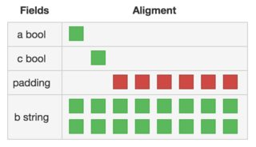

background-image: url(../img/title.svg)

---

background-image: url(../img/rec.svg)

---
background-image: url(../img/topic.svg)

.topic[Синтаксис языка]
.tutor[Алексей Семушкин]
.tutor_desc[Software Engineer at Semrush]
---

background-image: url(../img/rules.svg)

---

# О чем будем говорить:
- Основные синтаксические конструкции языка,
- Преобразование и присвоение типов;
- Указатели;
- Слайсы;
- Строки, руны и функции работы с ними;
- Структуры, функции и методы

---

# Какие есть элементарные типы данных в Go ?

- Логические: `bool`
- Целые: `int`, `uint`, `int8`, `uint8`, ... 
- Алиасы к целым: `byte` = `uint8`, `rune` = `int32`
- С плавающей точкой: `float32`, `float64 `
- Комплексные: `complex64`, `complex128`
- Строки: `string`
- Указатели: `uintptr`, `*int`, `*string`, ...
- Decimal только через сторонние модули.

https://golang.org/ref/spec#Types

---

# Константы

Константы - неизменяемые значения, доступные только во время компиляции.

```
const PI = 3             // принимает подходящий тип
const pi float32 = 3.14  // строгий тип

const (
  TheA = 1
  TheB = 2
)

const (
  X = iota   // 0
  Y          // 1
  Z          // 2
)

```

---

# Объявление переменных в Go

```
var Storage map[string]string         // zero value

var storage = make(map[string]string) // автовывод типа

func Answer() int {
  return 42
}

func main() {
  var i int = 10
  j := i  // короткое объявление, только внутри функций
}
```

---

# Публичные и приватные идентификаторы

Публичные идентификаторы - те, которые видны за пределами вашего *пакета*.
Публичные идентификаторы начинаются с заглавной буквы `Storage`, `Printf`.
<br><br>
Приватные идентификаторы - начинаются со строчной буквы `i`, `j` и видны только в вашем пакете.
Структуры могут содержать как приватные так и публичные поля.
<br><br>

```
type User struct {
    Name     string  // Будет видно в json.Marshal.
    password string  // Не будет видно.
}
```

---

# Литералы числовых типов

Все довольно стандартно

```
42         // десятичная система
0755       // восьмеричная система
0xDeadBeaf // шестнадцатеричная, hex

3.14       // с плавающей точкой
.288
2.e+10

1+1i       // комплексные
```

---

# Особенности целых чисел в Go

- Есть значение "по умолчанию" - это `0`
- Типы `int` и `uint` могут занимать 32 и 64 бита на разных платформах
- Нет автоматического преобразования типов
- `uintptr` - целое число, не указатель

---

# Преобразование типов

В Go всегда необходимо *явное преобразование* типов

```
var i int32 = 42
var j uint32 = i         // ошибка
var k uint32 = uint32(i) // верно
var n int64 = i          // ошибка!
var m int64 = int64(i)   // верно
var r rune = i           // верно ?
```

За редким исключением: [https://golang.org/ref/spec#Properties_of_types_and_values](https://golang.org/ref/spec#Properties_of_types_and_values)

---

# Указатели

Указатель - это адрес некоторого значения в памяти. <br>
Указатели строго типизированы. <br>
Zero Value для указателя - nil.

```
x := 1         // Тип int
xPtr := &x     // Тип *int
var p *int     // Тип *int, значение nil
```

https://goplay.space/#s-LG0fjQxmV

---

# Получение адреса

Можно получать адрес не только переменной, но и поля структуры или элемента массива или слайса. <br>
Получение адреса осуществляется с помощью оператора `&`.
```
var x struct {
    a int
    b string
    c [10]rune
}
bPtr := &x.b
c3Ptr := &x.c[2]
```

Но не значения в словаре!
```
dict := map[string]string{"a": "b"}
valPtr := &dict["a"]  // Не скомпилируется
```
https://github.com/golang/go/issues/11865
<br><br>

Также нельзя (и не нужно) получать указатель на функцию.

<br>
https://goplay.space/#5N5WqdIZVDS

---

# Разыменование указателей

Разыменование осуществляется с помощью оператора `*`:
```
a := "qwe"  // Тип string
aPtr := &a  // Тип *string
b := *aPtr  // Тип string, значение "qwe"

var n *int  // nil
nv := *n    // panic
```

В случае указателей на *структуры* вы можете обращаться к полям структуры без разыменования:
```
p := struct{x, y int }{1, 3}
pPtr := &p
fmt.Println(pPtr.x) // (*pPtr).x
fmt.Println((*pPtr).y)

pPtr = nil
fmt.Println(pPtr.x) // ?
```

https://goplay.space/#q3UDXozLcX9
<br>
https://golang.org/ref/spec#Selectors

---


# Копирование указателей

## В Go нет понятия передачи по ссылке - все всегда передается только по значению!

---

# Массивы

```
var arr [256]int         // фиксированная длина

var arr [10][10]string   // может быть многомерным

arr := [...]int{1, 2, 3} // автоматический подсчет длины

arr := [10]int{1, 2, 3, 4, 5}
```

---

# Массивы: операции

```
v := arr[1] // чтение

arr[3] = 1  // запись

len(arr)    // длина массива

arr[2:4]    // получение слайса
```

https://goplay.tools/snippet/fJIrJ-PciZU

---

# Слайсы

Слайсы — это те же "массивы", но переменной длины.

<br/>
Создание слайсов:

```
var s []int  // не-инициализированный слайс, nil

s := []int{} // с помощью литерала слайса

s := make([]int, 3) // с помощью функции make, s == {0,0,0}
```

---


# Слайсы: операции

```
v := s[1] // чтение
s[3] = 1  // запись
len(s)    // длина слайса
cap(s)    // слайса
s[2:4]    // получение подслайса

s = append(s, 1)       // добавляет 1 в конец слайса
s = append(s, 1, 2, 3) // добавляет 1, 2, 3 в конец слайса
s = append(s, s2...)   // добавляет содержимое слайса s2 в конец s
var s []int            // s == nil
s = append(s, 1)       // s == {1} append умеет работать с nil-слайсами
```

---

# Строки в Go

Строки в Go - это *неизменяемая* последовательность байтов (`byte`=`uint8`)

```
// src/runtime/string.go
type stringStruct struct {
    str unsafe.Pointer
    len int
}
```

Хорошо описано тут: [https://blog.golang.org/strings](https://blog.golang.org/strings)

---

# Строковые литералы

```
s := "hello world"            // в двойных кавычках, на одной строке

s := "hello \n world \u9333"  // c непечатными символами

// если нужно включить в строку кавычки или переносы строки 
// - используем обратные кавычки
s := `hello
"cruel"
'world'
`  
```
---

# Что можно делать со строками ?

```
s := "hello world"       // создавать

var c byte = s[0]        // получать доступ к байту(!) в строке

var s2 string = s[5:10]  // получать подстроку (в байтах!)

s2 := s + " again"       // склеивать

l := len(s)              // узнавать длину в байтах
```

---

# Руны в Go

Руна в Go - это алиас к int32. Каждая руна представляет собой код символа стандарта Юникод.

```
s := "hey😉"

rs := []rune([]byte(s)) // cannot convert ([]byte)(s) (type []byte) to type []rune

bs := []byte([]rune(s)]) // cannot convert ([]rune)(s) (type []rune) to type []byte
```

---

# Строки: итерирование


```
str := "Привет мир!"
for i, v := range str {
	fmt.Printf("%d:%s\n", i, string(v))
}
```

https://go.dev/play/p/gWhbpTHT3Kn 
https://pkg.go.dev/fmt#hdr-Printing

---

# Функции для работы со строками

https://pkg.go.dev/strconv  <br>
https://www.calhoun.io/concatenating-and-building-strings-in-go/

---

# Структуры

Структуры - фиксированный набор именованных переменных. <br>
Переменные размещаются рядом в памяти и обычно используются совместно.

```
struct{}  // Пустая структура, не занимает памяти

type User struct { // Структура с именованными полями
  Id      int64
  Name    string
  Age     int
  friends []int64  // Приватный элемент
}
```
https://golang.org/ref/spec#Struct_types

---

# Литералы структур

```
var u0 User                      // Zero Value для типа User

u1 := User{}                     // Zero Value для типа User

u2 := &User{}                    // То же, но указатель

u3 := User{1, "Vasya", 23, nil}  // По номерам полей

u4 := User{                      // По именам полей
  Id:       1,
  Name:     "Vasya",
  friends:  []int64{1, 2, 3},
}

```

---

# Размер и выравнивание структур

https://goplay.space/#0WdB68TTmkj <br>

```
unsafe.Sizeof(1)   // 8 на моей машине
unsafe.Sizeof("A") // 16 (длина + указатель)

var x struct {
    a bool   // 1 (offset 0)
    c bool   // 1 (offset 1)
    b string // 16 (offset 8)
}

unsafe.Sizeof(x) // 24!
```


https://github.com/dominikh/go-tools/tree/master/cmd/structlayout <br>
https://en.wikipedia.org/wiki/Data_structure_alignment

---

# Анонимные типы и структуры

Анонимные типы задаются литералом, у такого типа нет имени.<br>
Типичный сценарий использования: когда структура нужна только внутри одной функции. 

```
var wordCounts []struct{w string; n int}
```

```
var resp struct {
    Ok        bool `json:"ok"`
    Total     int  `json:"total"`
    Documents []struct{
        Id    int    `json:"id"`
        Title string `json:"title"`
    } `json:"documents"`
}
json.Unmarshal(data, &resp)
fmt.Println(resp.Documents[0].Title)
```
<br>
https://goplay.space/#rE-DsbSFgN1

---

# Встроенные структуры

В Go есть возможность "встраивать" типы внутрь структур. <br>
При этом у элемента структуры НЕ задается имя.

```
type LinkStorage struct {
    sync.Mutex                  // Только тип!
    storage map[string]string   // Тип и имя
}
```

Обращение к элементам встроенных типов:
```
var storage LinkStorage
storage.Mutex.Lock()     // Имя типа используется 
storage.Mutex.Unlock()   // как имя элемента структуры
```

---

# Тэги элементов структуры

К элементам структуры можно добавлять метаинформацию - тэги. <br>
Тэг это просто литерал строки, но есть соглашение о структуре такой строки.

<br>
Например,
```
type User struct {
    Id      int64    `json:"-"`    // Игнорировать в encode/json
    Name    string   `json:"name"`
    Age     int      `json:"user_age" db:"how_old"`
    friends []int64 
}
```

Получить информацию о тэгах можно через `reflect`
```
var u User
ageField := reflect.TypeOf(u).FieldByName("Age")
jsonFieldName := ageField.Get("json")  // "user_age"
```

https://github.com/golang/go/wiki/Well-known-struct-tags

---

# Пустые структуры

https://dave.cheney.net/2014/03/25/the-empty-struct

```
type Set map[int]struct{}
```

```
ch := make(chan struct{})
ch <- struct{}{}
```

---

# Экспортируемые и приватные элементы

Поля структур, начинающиеся со строчной буквы - **приватные**, они будут видны
только в том же пакете, где и структура. <br><br>
Поля, начинающиеся с заглавной - **публичные**, они будут видны везде.

```
type User struct {
  Id      int64
  Name    string   // Экспортируемое поле
  Age     int
  friends []int64  // Приватное поле
}
```

Не совсем очевидное следствие: пакеты стандартной библиотеки, например, `encoding/json` тоже не могут
работать с приватными полями :)<br><br>
Доступ к приватным элементам (на чтение!) все же можно получить с помощью пакета `reflect`.

<br>
https://goplay.space/#g9sldeRCgaO

---

# Объявление функции

```
//   Имя функции            возвращаемые значения
//       |                       |       |
func TrySayHello(name string) (string, error)
//                |      |
//           параметр   тип параметра  
```

Интересное:
- нет дефолтных значений для параметров
- функция может возвращать несколько значений
- функция - first class value, можем работать как с обычным значением
- параметры в функцию передаются по ***значению***

---

# Примеры функций

```
func Hello() {
    fmt.Println("Hello World!")
}

func add(x int, y int) int {
        return x + y
}

func add(x, y int) int {
        return x + y
}

func addMult(a, b int) (int, int) {
        return a + b, a * b
}
```

---

# Пример variadic функции

```
func sum(nums ...int) {
    fmt.Print(nums, " ")
    total := 0
    for _, num := range nums {
        total += num
    }
    fmt.Println(total)
}

func main() {
    sum(5, 7)
    sum(3, 2, 1)

    nums := []int{1, 2, 3, 4}
    sum(nums...)
}
```

https://play.golang.org/p/c2jXVc4ts1-

---

# Анонимные функции

```
func main() {
	func() {
		fmt.Println("Hello ")
	}()

	sayWorld := func() {
		fmt.Println("World!")
	}
	sayWorld()
}
```

https://play.golang.org/p/3Ta6LGb1-tN

---

# Определение методов 

В Go можно определять методы у именованых типов (кроме интерфейсов)

```
type User struct {
    Id      int64
    Name    string
    Age     int
    friends []int64
}

func (u User) IsOk() bool {
    for _, fid := range u.friends {
        if u.Id == fid {
            return true
        }
    }
    return false
}

var u User
fmt.Println(u.IsOk()) // (User).IsOk(u)
```

https://golang.org/ref/spec#Method_declarations
<br>
https://goplay.space/#pp4iiJoQ8sO

---

# Методы типа и указателя на тип

Методы объявленные над типом получают копию объекта, поэтому не могут его изменять!
```
func (u User) HappyBirthday() {
  u.Age++ // Это изменение будет потеряно
}
```

Методы объявленные над указателем на тип - могут.
```
func (u *User) HappyBirthday() {
  u.Age++ // OK
}
```

https://goplay.space/#XP7fc8wxQ3P
<br><br>

Метод типа можно вызывать у значения и у указателя. <br>
Метод указателя можно вызывать у указателя и у значения, если оно адресуемо.

<br>
https://github.com/golang/go/wiki/CodeReviewComments#receiver-type

---

# Функции-конструкторы

В Go принят подход Zero Value: постарайтесь сделать так, что бы
ваш тип работал без инициализации, как реализованы, например
```
var b strings.Builder
var wg sync.WaitGroup
```

Если ваш тип содержит словари, каналы или инициализация обязательна - скройте
ее от пользователя, создав функции-конструкторы:

```
func NewYourType() (*YourType) {
  // ...  
}
func NewYourTypeWithOption(option int) (*YourType) {
  // ...
}
```

https://goplay.space/#5lfGpAcfTyU

---

background-image: url(../img/questions.svg)

---

background-image: url(../img/poll.svg)

---

background-image: url(../img/next_webinar.svg)
.announce_date[9 августа]
.announce_topic[Особенности языка и типовые ошибки]

---
background-image: url(../img/thanks.svg)

.tutor[Алексей Семушкин]
.tutor_desc[Software Engineer at Semrush]