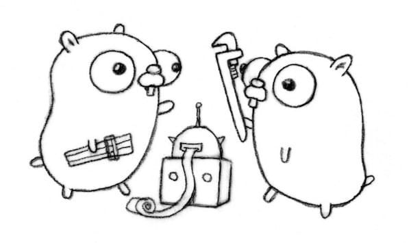

.center.icon[]

---

class: top white
background-image: url(../img/check.svg)
background-size: 130%
.top.icon[]

.sound-top[
  # Как меня слышно и видно?
]

.sound-bottom[
	## > Напишите в чат
	+ если все хорошо
	- если есть проблемы со звуком или с видео]

---

class: white
background-image: url(../img/message.svg)
.top.icon[]

# Инструментарий и начало <br> работы с Go

### Алексей Бакин

---

# Как проходит занятие

* ### Активно участвуем — задаем вопросы.
* ### Чат вижу — могу ответить не сразу.
* ### После занятия — оффтопик, ответы на любые вопросы.

---

# План занятия

.big-list[
* Установка Go: GOROOT
* Сборка и запуск программ: go build, go run
* Кросс-компиляция: GOOS, GOARCH
* Модули и зависимости: go mod, go get
* Мир до модулей: GOPATH
* Форматирование кода: go fmt, goimports
* Линтеры: go vet, golint, gometalinter, golangci-lint
* Как сдавать домашние задания?
]


---

# Первые шаги

https://tour.golang.org/

<br><br>

[Список литературы](https://github.com/OtusGolang/webinars_practical_part/blob/master/LITERATURE.md#%D1%81%D0%BF%D0%B8%D1%81%D0%BE%D0%BA-%D0%BB%D0%B8%D1%82%D0%B5%D1%80%D0%B0%D1%82%D1%83%D1%80%D1%8B-%D0%B4%D0%BB%D1%8F-%D0%BA%D1%83%D1%80%D1%81%D0%B0-%D1%80%D0%B0%D0%B7%D1%80%D0%B0%D0%B1%D0%BE%D1%82%D1%87%D0%B8%D0%BA-golang)

---

# Установка Go

<b>Getting Started</b></br>
https://golang.org/doc/install<br><br>

<b>Downloads</b><br>
https://golang.org/dl/<br><br>

Проще всего через `apt-get`
```
sudo apt-get update

sudo apt-get install golang
```

Или просто скачать с официального сайта
```
wget https://dl.google.com/go/go1.16.linux-amd64.tar.gz

sudo tar -C /usr/local -xzf go1.16.linux-amd64.tar.gz

sudo ln -s /usr/local/go/bin/go /usr/bin/go
```

Готово!

---

# Несколько версий Golang

https://golang.org/doc/manage-install

---


# GOROOT

`GOROOT` — переменная, которая указывает где лежит ваш дистрибутив Go, т.е.
компилятор, утилиты и стандартная библиотека. В новых версия Go (&gt; 1.0) утилиты сами определяют расположение Go.

<br><br>

Однако, вы можете узнать `GOROOT`

```
$ go env | grep ROOT
GOROOT="/usr/local/go"
```

И можете посмотреть исходный код Go =)
```
vim /usr/local/go/src/runtime/slice.go
```

---

# GOPATH

`GOPATH` — переменная окружения, показывает где лежит ваше дерево исходников.

<br><br>
По умолчанию `$HOME/go`. Можно изменить, например, добавив в `.bashrc`
```
export GOPATH=/path/your/go/projects
```
<br>
```
$ tree -d -L 1 /path/your/go/projects
/path/your/go/projects
├── bin
├── pkg
└── src
```

---

# Программа на Go

```
package main // Имя текущего пакета

// Импорты других пакетов
import "fmt"

// Функция main как точка входа
func main() {
	fmt.Println("Hello!")
}
```

```
$ go build -o prog prog.go

$ file prog
prog: Mach-O 64-bit executable x86_64

$ ./prog
Hello!
```

```
$ go run prog.go
Hello!
```

---

# Кросс-компиляция

Go позволяет легко собирать программы для других архитектур и операционных систем.<br><br>
Для этого при сборке нужно переопределить переменные `GOARCH` и `GOOS`:

```
$ GOOS=windows go build -o /tmp/prog prog.go

$ file /tmp/prog
prog: PE32+ executable (console) x86-64 (stripped to external PDB), for MS Windows

$ GOARCH=386 GOOS=darwin go build -o /tmp/prog prog.go

$ file /tmp/prog
prog: Mach-O i386 executable
```

Возможные значения `GOOS` и `GOARCH`
- `go tool dist list`
- [https://gist.github.com/asukakenji/f15ba7e588ac42795f421b48b8aede63](https://gist.github.com/asukakenji/f15ba7e588ac42795f421b48b8aede63)


---

# Go Modules

Начиная с Go 1.11 появилась поддержка модулей — системы версионирования и зависимостей, а также разработки вне `GOPATH`.
<br><br>
Стандартные команды (`go get`, `go install`, `go test` и т.д.) работают по-разному внутри модуля и внутри `GOPATH`.
<br><br>
Модуль — любая директория вне `GOPATH`, содержащая файл `go.mod`

---

# Создание Go модуля

* (Опционально) создайте и склонируйте (в любое место) репозиторий с проектом
```
git clone https://github.com/user/otus-go.git /home/user/otus-go
```
* Создайте внутри репозитория нужные вам директории
```
mkdir /home/user/otus-go/hw-1
```
* Зайдите в директорию и инициализируйте Go модуль
```
cd /home/user/otus-go/hw-1
go mod init github.com/user/otus-go/hw-1
```

Теперь `/home/user/otus-go/hw-1` — это Go модуль.

<br>
https://blog.golang.org/using-go-modules

---

# Добавление зависимостей

Внутри модуля, вы можете добавить зависимость от пакета с помощью
```
$ go get github.com/beevik/ntp
go: finding golang.org/x/net latest
```

```
$ cat go.mod
module github.com/mialinx/foobar

go 1.16

require (
	github.com/beevik/ntp v0.2.0 // indirect
	golang.org/x/net v0.0.0-20190827160401-ba9fcec4b297 // indirect
)
```

<br><br>

Внимание: в момент добавления зависимостей их версии фиксируются в `go.sum`.

---

# Авто-добавление

Также можно просто редактировать код
```
package main

import (
	"fmt"

	"github.com/go-loremipsum/loremipsum"
)

func main() {
	fmt.Println(loremipsum.New().Word())
}
```
А потом запустить
```
$ go mod tidy
```
Это добавит новые и удалит неиспользуемые зависимости.

---

# Базовые команды

`go get -d` — скачивает пакеты из Git репозиториев в `$GOPATH/src`.
<br><br>
`go install` собирает и устанавливает указанные пакеты в `$GOPATH/pkg` и `$GOBIN` (по умолчанию `$GOPATH/bin`).
<br><br>
`go get` (без флажка `-d`) — так же вызовет `install`.
<br><br>
`go run prog.go` — сборка и запуск программы.
<br><br><br>
### Многоточия

`go get github.com/golang/protobuf/...` — многоточие тут означает
"и все дочерние пакеты".
<br>
Это необходимо если пакет сложный, и содержит подпакеты.
<br>
Для простых достаточно `go get github.com/beevik/ntp`

---

# Работа в «безмодульном» GOPATH-режиме

Для работы в парадигме `GOPATH` нужно:
* Создать *публичный* проект `github.com/username/projectname`
* Скачать проект в `GOPATH` с помощью `go get github.com/username/projectname/...`
* Изменять, компилировать, и комитить проект из `$GOPATH/src/github.com/username/projectname`

Плюсы:
* Простота. Плоская структура
* Отсутствие версий (?) (master должен быть стабилен).

Минусы:
* Отсутствие версий (!)
* Иногда в проекте не только Go-код.
* Неудобно для корпоративных и других непубличных проектов.

### **В Go 1.17 планировали убрать поддержку GOPATH-режима.**
https://go.dev/blog/go116-module-changes

---

# Как понять, я в режиме модуля или GOPATH?

[Читаем вики по модулям](https://github.com/golang/go/wiki/Modules#when-do-i-get-old-behavior-vs-new-module-based-behavior)
<br><br><br>

- Внутри GOPATH — модули игнорируются (старое поведение)

- Вне GOPATH — если рядом лежит go.mod, то модули «включаются»

- Переменная окружения `GO111MODULE`:
	- auto / unset — применяются правила выше
	- on — форсируем использование модулей внезависимости от директории
	- off — форсируем игнорирование модулей внезависимости от директории и go.mod

---

# Утилиты

.main-image[
  
]

---

# One-shot запуск

Запустить файл "как скрипт".

```
go run ./path/to/your/snippet.go
```

Удобно для проверки кода и синтаксиса.<br><br>

Так же можно использовать Go PlayGround: [https://play.golang.org/p/Fz3j-hbcocv](https://play.golang.org/p/Fz3j-hbcocv)

---

# Получение справки

```
$ go help
Go is a tool for managing Go source code.

Usage:

	go <command> [arguments]

The commands are:
	bug         start a bug report
	build       compile packages and dependencies
	clean       remove object files and cached files
	doc         show documentation for package or symbol
...

$ go help build
usage: go build [-o output] [-i] [build flags] [packages]

Build compiles the packages named by the import paths,
along with their dependencies, but it does not install the results.
...
```


---

# Форматирование кода
<br>
В Go нет style guide, зато есть `go fmt path/to/code.go`
<br><br>
.left-code[
Было:
```
package main
import "fmt"


const msg = "%d students in chat\n"
type Student struct{
	Name string
	Age int
}
func main() {
	for i:=99;i>0;i-- {
		fmt.Printf(msg, i)
		if i<10{
			break
		}

	}
}

```
]
.right-code[
Стало:
```
package main

import "fmt"

const msg = "%d students in chat\n"

type Student struct {
	Name string
	Age  int
}

func main() {
	for i := 99; i > 0; i-- {
		fmt.Printf(msg, i)
		if i < 10 {
			break
		}

	}
}
```
]


---

# Форматирование кода: advanced

```
$ cd /tmp
$ go get mvdan.cc/gofumpt
```

```
$ gofumpt -l -w .
```

---

# Обновление и сортировка импортов

```
$ go get golang.org/x/tools/cmd/goimports
$ goimports -local my/module/name -w path/to/code.go
```

```
import (
	"strings"
)

func main() {
	fmt.Println(loremipsum.New().Word())
}
```

```
import (
	"fmt"

	"github.com/go-loremipsum/loremipsum"
)

func main() {
	fmt.Println(loremipsum.New().Word())
}
```


---

# Обновление и сортировка импортов: advanced

```
$ cd /tmp
$ go get github.com/daixiang0/gci
```

```
$ gci -w -local github.com/Antonboom/hw01 .
```

---

# Линтеры

Линтер — программа, анализирующая код и сообщающая о потенциальных проблемах.
<br><br>
`go vet` — встроенный линтер
```
$ go vet ./run.go
# command-line-arguments
./run.go:14:3: Printf call needs 1 arg but has 2 args

$ echo $?
2
```

`golint` — популярный сторонний линтер
```
$ go get -u golang.org/x/lint/golint

$ ~/go/bin/golint -set_exit_status ./run.go
run.go:7:6: exported type Student should have comment or be unexported
Found 1 lint suggestions; failing.

$ echo $?
1
```

---

# Металинтеры

Металинтеры — обертка, запускающая несколько линтеров за один проход.
<br><br>

https://github.com/golangci/golangci-lint/

```
$ ~/go/bin/golangci-lint run ./run.go
run.go:14:3: printf: Printf call needs 1 arg but has 2 args (govet)
		fmt.Printf(msg, i, i)
		^
run.go:7:6: `Student` is unused (deadcode)
type Student struct {
     ^

$ echo $?
1
```

---

# Как сдавать домашние задания?

https://github.com/OtusGolang/home_work/wiki/[Студентам]-Процесс-сдачи-ДЗ

---

# Опрос

.left-text[
Заполните пожалуйста опрос
<br><br>
Ссылка в чате
]

.right-image[

]

---

# Следующее занятие

## Тестирование в Go. Часть 1

<br>
<br>
<br>

## 7 сентября, вторник

---

class: white
background-image: url(../img/message.svg)
.top.icon[]

# Спасибо за внимание!
