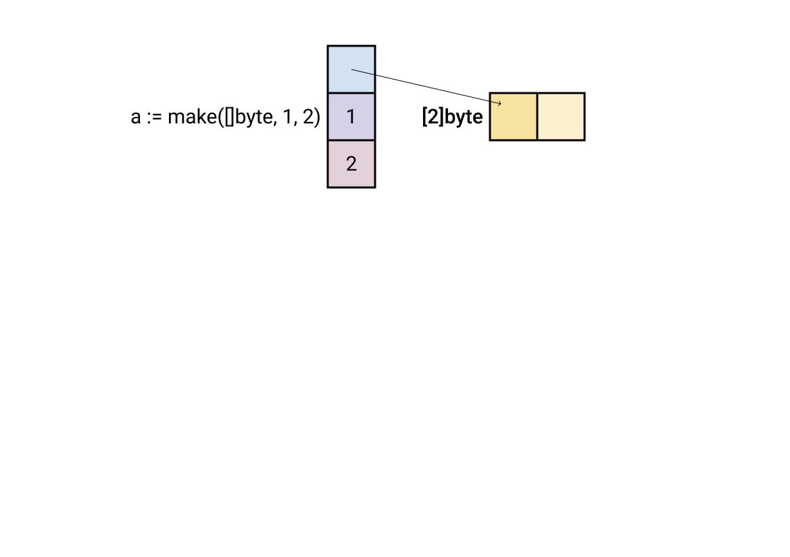
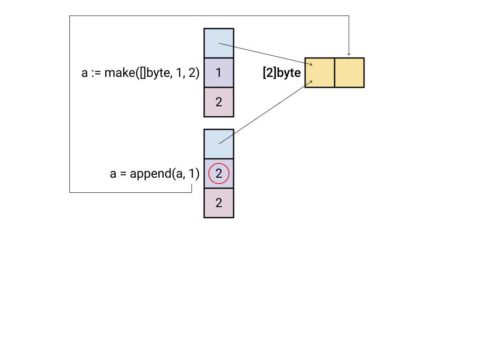
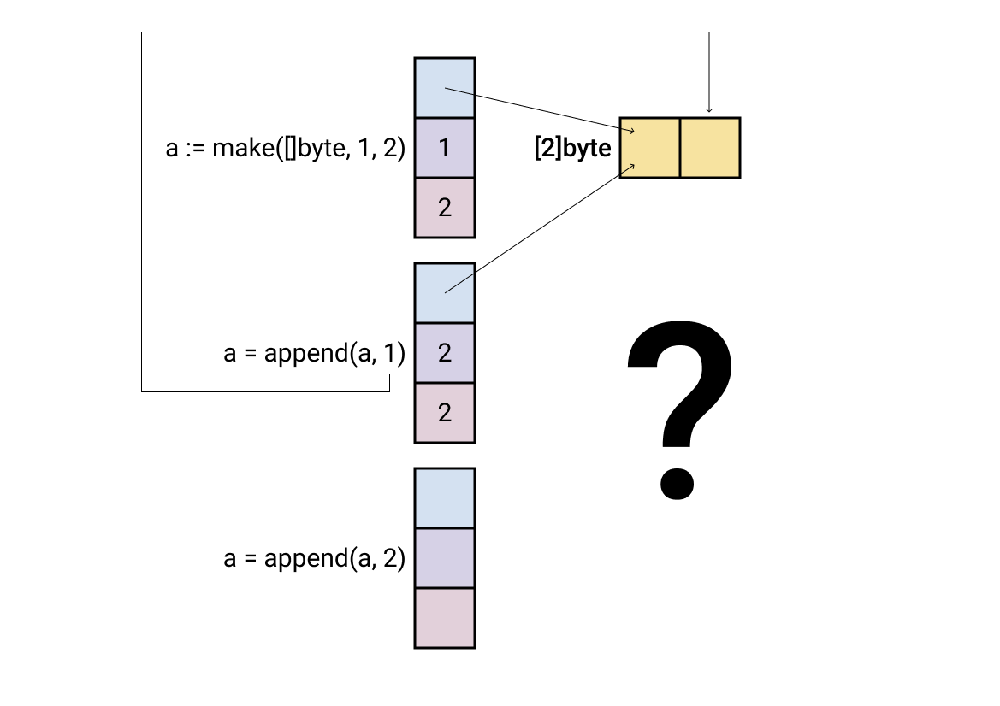
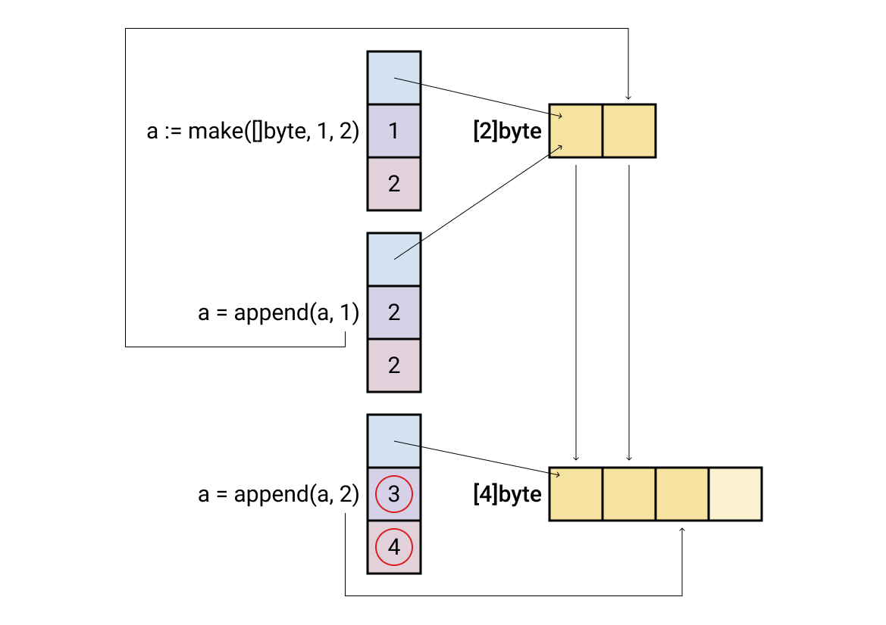
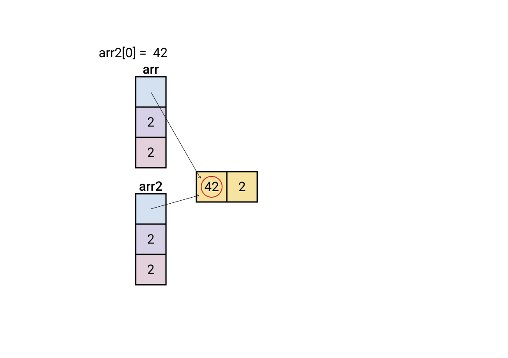
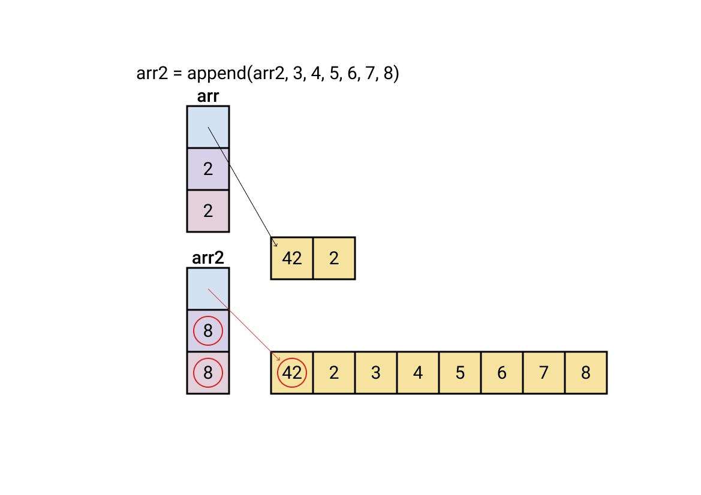
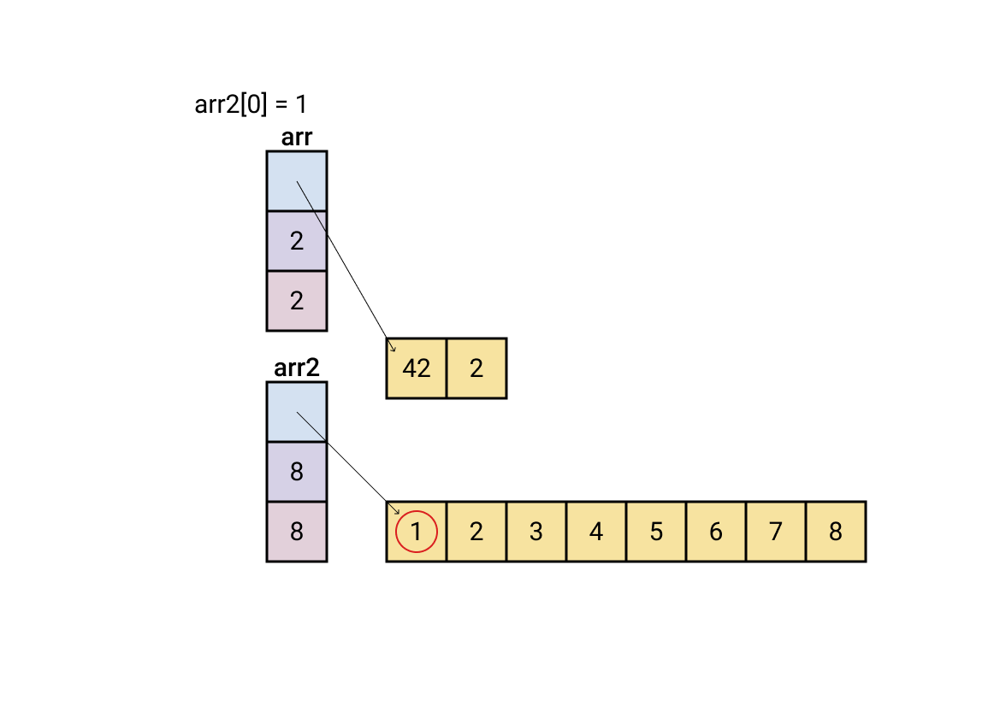
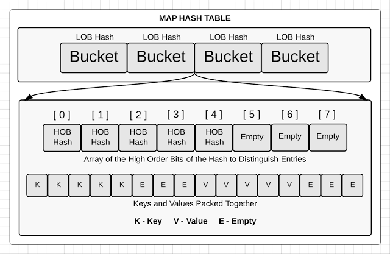

background-image: url(../img/title.svg)

---

background-image: url(../img/rec.svg)

---
background-image: url(../img/topic.svg)

.topic[Особенности языка и типовые ошибки]
.tutor[Алексей Семушкин]
.tutor_desc[Software Engineer at Semrush]

---

background-image: url(../img/rules.svg)

---

# О чем будем говорить:
- Затенения и ошибки связанные с областью видимости;
- Замыкания и ошибки связанные с именованными значениями;
- Устройство слайсов;
- Мапы;
- Ошибки при использовании слайсов и мап;

---

# Области видимости и блоки

```
var a = 1 // <- уровень пакета

func main() {
	fmt.Println("1: ", a)

	a := 2 // <-- уровень блока функции
	fmt.Println("2: ", a)
	{
		a := 3 // <-- уровень пустого блока
		fmt.Println("3: ", a)
	}
	fmt.Println("4: ", a) // <-- ???

	f()
}

func f() {
	fmt.Println("5: ", a) // <-- ???
}
```

https://play.golang.org/p/NcjESEYxQAN

---

# Неявные блоки: for, if, switch, case, select

```
for i := 0; i < 5; i++ {
    fmt.Println(i)
}
```

```
if v, err := doSmth(); err != nil {
    fmt.Println(err)
} else {
    process(v)
}
```

```
switch i := 2; i * 4 {
case 8:
    j := 0
    fmt.Println(i, j)
default:
    // "j" is undefined here
    fmt.Println(i)
}
```

---

# Вопрос: сколько раз объявлен x?

```
package main

import "fmt"

func f(x int) {
	for x := 0; x < 10; x++ {
		fmt.Println(x)
	}
}

var x int

func main() {
	var x = 200
	f(x)
}
```

---

# Опасное затенение

```
func main() {
	data, err := callServer()
	if err != nil {
		fmt.Println(err)
		return
	}

	defer func() {
		if err != nil {
			fmt.Println(err)
		}
	}()

	if err := saveToDB(data); err != nil {
		fmt.Println(err)
		return
	}

	return
}

func callServer() (int, error) {return 0, nil}

func saveToDB(a int) error {return fmt.Errorf("save error")}
```

https://go.dev/play/p/AIvIbz30qfZ

---

# Функции: именованные возвращаемые значения

```
func sum(a, b int) (s int) {
    s = a + b
    return
}
```

---

# Опасный defer

```
func main() {
	if err := DoDBRequest(); err != nil {
		fmt.Println(err)
	}
}

func DoDBRequest() (err error) {
	defer func() {
		if err = close(); err != nil {
			return
		}
	}()

	err = request()

	return
}

func request() error {return fmt.Errorf("request error")}

func close() error {return nil}
```
https://go.dev/play/p/HNGk_r2T8bY


---

# Замыкания

```
func intSeq() func() int {
    i := 0
    return func() int {
        i++
        return i
    }
}

func main() {
    nextInt := intSeq()

    fmt.Println(nextInt()) // <-- ?
    fmt.Println(nextInt()) // <-- ?
    fmt.Println(nextInt()) // <-- ?

    newInts := intSeq()
    fmt.Println(newInts()) // <-- ?
}
```

https://play.golang.org/p/w-8lPCNFrbX

---

# Замыкания: middleware

```
package main

import (
  "fmt"
  "net/http"
  "time"
)

func main() {
  http.HandleFunc("/hello", timed(hello))
  http.ListenAndServe(":3000", nil)
}

func timed(f func(http.ResponseWriter, *http.Request)) func(http.ResponseWriter, *http.Request) {
  return func(w http.ResponseWriter, r *http.Request) {
    start := time.Now()
    f(w, r)
    end := time.Now()
    fmt.Println("The request took", end.Sub(start))
  }
}

func hello(w http.ResponseWriter, r *http.Request) {
  fmt.Fprintln(w, "<h1>Hello!</h1>")
}
```

---

# Опасное замыкание

```
func main() {
	s := "hello"

	defer fmt.Println(s)
	defer func() {
		fmt.Println(s)
	}()

	s = "world"
}
```
https://play.golang.org/p/LCBMgmREhjE


---

# Слайсы: как они устроены?

```
// runtime/slice.go
type slice struct {
  array unsafe.Pointer
  len   int
  cap   int
}
```

```
l := len(s) // len — вернуть длину слайса
c := cap(s) // cap — вернуть емкость слайса
```

```
s := make([]int, 3, 10) // s == {?}
```

Отличное описание: https://blog.golang.org/go-slices-usage-and-internals

---

# Слайсы: добавление элементов

.full-image[

]

---

# Слайсы: добавление элементов

.full-image[

]

---

# Слайсы: добавление элементов

.full-image[

]

---

# Авто-увеличение слайса

.full-image[

]
---

# Авто-увеличение слайса

Если `len < cap` — увеличивается `len`

<br/>
Если `len = cap` — увеличивается `cap`, выделяется новый кусок памяти, данные копируются.

```
func main() {
	s := []int{1}
	for i := 0; i < 10; i++ {
		fmt.Printf("ptr %0x   len: %d \tcap %d  \t\n",
			&s[0], len(s), cap(s))
		s = append(s, i)
	}
}
```
https://goplay.tools/snippet/UjQR5fiudyO

---

# Получение под-слайса (нарезка)

`s[i:j]` — возвращает под-слайс, с `i` -ого элемента включительно, по `j` -ый не влючительно.

Длинна нового слайса будет `j-i`.

```
s := []int{0, 1, 2, 3, 4, 5, 6, 7, 8, 9}

s2 := s[3:5] // ?

s2 := s[3:]  // ?

s2 := s[:5]  // ?

s2 := s[:]   // копия s (shallow)
```

https://goplay.tools/snippet/6nHKyMNjQbO

---

# Получение под-слайса (нарезка)

```
s := []byte{1, 2, 3, 4, 5}

s2 := s[2:5]
```

<br>

.left-image[

]

.right-image[

]

---

# Неочевидные следствия

```
arr := []int{1, 2}
arr2 := arr // копируется только заголовок, массив остался общий
arr2[0] = 42

fmt.Println(arr[0]) // ?

arr2 = append(arr2, 3, 4, 5, 6, 7, 8) // реаллокация
arr2[0] = 1

fmt.Println(arr[0]) // ?
```

https://goplay.tools/snippet/QrBpZWTeaos

---

# Неочевидные следствия

.full-image[

]

---

# Неочевидные следствия

.full-image[

]

---

# Неочевидные следствия

.full-image[

]

---

# Неочевидные следствия

.full-image[

]

---

# Правила работы со слайсами

### Функции изменяющие слайс
- принимают shalow копии
- возвращают новый слайс

```
func AppendUniq(slice []int, slice2 []int) []int {
  ...
}

s = AppendUniq(s, s2)
```

### Копирование слайса

```
s := []int{1,2,3}
s2 := make([]int, len(s))
copy(s2, s)
```

### SliceTricks

https://github.com/golang/go/wiki/SliceTricks

---

# Сортировка

```
  s := []int{3, 2, 1}
  sort.Ints(s)
```

```
  s := []string{"hello", "cruel", "world"}
  sort.Strings(s)
```
https://goplay.tools/snippet/hTEHP-bdemH

---

# Сортировка: типы

```
type User struct {
	Name string
	Age  int
}

func main() {
	s := []User{
		{"vasya", 19},
		{"petya", 18},
	}
	sort.Slice(s, func(i, j int) bool {
		return s[i].Age < s[j].Age
	})
	fmt.Println(s)
}
```

https://goplay.tools/snippet/1K0s37F0z4I

---

# Слайсы: итерирование


```
// Индекс и значение
for i, v := range s {
  ...
}
```
```
// Только индекс
for i := range s {
  ...
}
```
```
// Только значение
for _, v := range s {
  ...
}
```

---

# Задачка

.left-code[
Написать функцию `Concat`, которая получает несколько слайсов и склеивает их в один длинный.
`{ {1, 2, 3}, {4, 5}, {6, 7} }  => {1, 2, 3, 4, 5, 6, 7}`
<br><br>

https://goplay.tools/snippet/GGlrv2nmqYb
]

.right-image[

]

---

# Словари (map)

- Отображение ключ => значение.

- Реализованы как хэш-таблицы.

- Аналогичные типы в других языках: в Python — `dict`, в JavaScript — `Object`, в Java — `HashMap`, в C++ — `unordered_map`.

---

# Словари: cоздание

```
var cache map[string]string  // не-инициализированный словарь, nil

cache := map[string]string{} // с помощью литерала, len(cache) == 0

cache := map[string]string{  // литерал с первоначальным значением
	"one":   "один",
	"two":   "два",
	"three": "три",
}

cache := make(map[string]string)      // тоже что и map[string]string{}

cache := make(map[string]string, 100) // заранее выделить память
                                      // на 100 ключей
```

---

# Словари: операции

```
value := cache[key]     // получение значения,

value, ok := cache[key] // получить значение, и флаг того что ключ найден

_, ok := cache[key]     // проверить наличие ключа в словаре

cache[key] = value      // записать значение в инициализированный(!) словарь

delete(cache, key)      // удалить ключ из словаря, работает всегда
```

Подробное описание: https://blog.golang.org/go-maps-in-action

---

# Словари: внутреннее устройство

.threefour-image[

]

Про устройство мапы:
- https://www.ardanlabs.com/blog/2013/12/macro-view-of-map-internals-in-go.html
- https://dave.cheney.net/2018/05/29/how-the-go-runtime-implements-maps-efficiently-without-generics

---

# Словари: итерирование

```
// Ключ и значение
for key, val := range cache {
  ...
}
```
```
// Только ключ
for key := range cache {
  ...
}
```
```
// Только значение
for _, val := range cache {
  ...
}
```

---

# Словари: списки ключей и значений

В Go нет функций, возвращающих списки ключей и значений словаря.

<br/>
Получить ключи:
```
var keys []string
for key, _ := range cache {
  keys = append(keys, key)
}
```

<br/>
Получить значения:
```
values := make([]string, 0, len(cache))
for _, val := range cache {
  values = append(values, val)
}
```
---

# Словари: требования к ключам

Ключом может быть любой типа данных,
для которого определена операция сравнения `==` :
- строки, числовые типы, bool каналы (chan);
- интерфейсы;
- указатели;
- структуры или массивы содержащие сравнимые типы.

```
type User struct {
  Name string
  Host string
}
var cache map[User][]Permission
```

Подробнее https://golang.org/ref/spec#Comparison_operators

---

# Словари: порядок ключей

* ### Какой порядок итерирования по словарю?
* ### Что будет, если удалить ключ во время итерирования?
* ### Что будет, если добавить ключ во время итерирования?

https://goplay.tools/snippet/SmisQCUpCGb

---

# Использование Zero Values

Для слайсов и словарей, zero value — это nil .

<br/>
С таким значением будут работать функции и операции читающие данные, например:

```
var seq []string             // nil
var cache map[string]string  // nil
l := len(seq)       // 0
c := cap(seq)       // 0
l := len(cache)     // 0
v, ok := cache[key] // "", false
```

Для слайсов будет так же работать `append`
```
var seq []string             // nil
seq = append(seq, "hello")   // []string{"hello"}
```

---

# Использование Zero Values

Вместо
```
hostUsers := make(map[string][]string)
for _, user := range users {
  if _, ok := hostUsers[user.Host]; !ok {
    hostUsers[user.Host] = make([]string)
  }
  hostUsers[user.Host] = append(hostUsers[user.Host], user.Name)
}
```

Можно
```
hostUsers := make(map[string][]string)
for _, user := range users {
  hostUsers[user.Host] = append(hostUsers[user.Host], user.Name)
}
```

---

background-image: url(../img/questions.svg)

---

background-image: url(../img/poll.svg)

---

background-image: url(../img/next_webinar.svg)
.announce_date[11 августа]
.announce_topic[Лучшие практики работы с ошибками]

---
background-image: url(../img/thanks.svg)

.tutor[Алексей Семушкин]
.tutor_desc[Software Engineer at Semrush]
