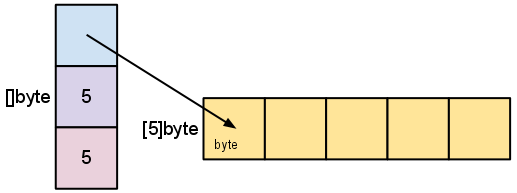
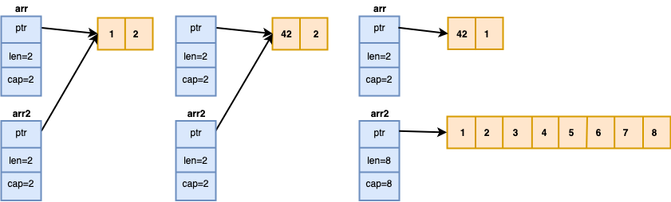

.center.icon[]

---


class: white
background-image: url(img/message.svg)
.top.icon[]

# Слайсы и словари <br> в Go

### Дмитрий Смаль

---

class: top white
background-image: url(img/sound.svg)
background-size: 130%
.top.icon[]

.sound-top[
  # Как меня слышно и видно?
]

.sound-bottom[
  ## > Напишите в чат
  ### **+** если все хорошо
  ### **-** если есть проблемы cо звуком или с видео
  ### !проверить запись!
]

---

# Небольшой тест

.left-text[
Пожалуйста, пройдите небольшой тест. 
<br><br>
Возможно вы уже многое знаете про слайсы и словари в Go =)
<br><br>
[https://forms.gle/tjn43RZYCSPyoU789](https://forms.gle/tjn43RZYCSPyoU789)
]

.right-image[

]

---


# Массивы

Массив - нумерованая последовательность элементов фиксированной длинны.
Массив располагается последовательно в памяти и не меняет своей длинны.

```
var arr [256]int        // фиксированная длинна

var arr [10][10]string  // может быть многомерным 

var arr [...]{1 ,2, 3}

arr := [10]int{1,2,3,4,5}
```

Длинна массива - часть типа, т.е. массивы разной длинны это разные типы данных.

---


# Операции над массивами

Все ожидаемо

```
arr[3] = 1  // индексация

len(arr)    // длинна массива

arr[3:5]    // получение слайса
```

---


# Слайсы

Слайсы - это те же "массивы", но переменной длинны.
<br><br>
Создание слайсов:

```
var s []int   // не-инициализированный слайс, nil

s := []int{}  // c помощью литерала слайса

s := make([]int, 3) // с помощью функции make, s == {0,0,0}

s := make([]int, 3, 10)

```
---


# Добавление элементов в слайс

Добавить новые элементы в слайс можно с помощью функции `append`

```
s[i] = 1               // работает если i < len(s)

s[len(s) + 10] = 1     // случится panic

s = append(s, 1)       // добавляет 1 в конец слайса

s = append(s, 1, 2, 3) // добавляет 1, 2, 3 в конец слайса

s = append(s, s2...)   // добавляет содержимое слайса s2 в конец s

var s []int            // s == nil
s = append(s, 1)       // s == {1}  append умеет работать с nil-слайсами
```

---


# Получение под-слайсов (нарезка)

`s[i:j]` - возвращает под-слайс, с `i`-ого элемента включительно, по `j`-ый не влючительно.
Длинна нового слайса будет `j-i`.

```
s := []int{0, 1, 2, 3, 4, 5, 6, 7, 8, 9}

s2 := s[:]    // копия s (shallow) 

s2 := s[3:5]  // []int{3,4}

s2 := s[3:]   // []int{3, 4, 5, 6, 7, 8, 9}

s2 := s[:5]   // []int{0, 1, 2, 3, 4}
```

---


# Как это реализовано ?

```

// runtime/slice.go

type slice struct {
  array unsafe.Pointer
  len   int
  cap   int
}
```

```
l := len(s)  // len - вернуть длинну слайса

c := cap(s)  // cap - вернуть емкость слайса
```

Отличное описание: [https://blog.golang.org/go-slices-usage-and-internals](https://blog.golang.org/go-slices-usage-and-internals)

---


# Получение под-слайса (нарезка)

```
s := []byte{1,2,3,4,5}

s2 := s[2:5]
```

.left-image[

]

.right-image[

]

---


# Авто-увеличение слайса

Если `len < cap` - увеличивается `len` <br><br>
Если `len = cap` - увеличивается `cap`, выделяется новый кусок памяти, данные копируются.

```
arr := []int{1}

for i := 0; i < 100; i++ {

  fmt.Printf("len: %d \tcap %d  \tptr %0x\n",
             len(arr), cap(arr), &arr[0])

  arr = append(arr, i)

}
```

Попробуйте на [https://play.golang.org/p/g7cjWi_dF9F](https://play.golang.org/p/g7cjWi_dF9F)

---


# Неочевидные следствия

При копировании слайса (а так же получени под-слайса и передаче в функцию) копируется только заголовок. Область памяти остается общей. Но только до тех пор пока один из слайсов не "вырастет" (произведет реаллокацию)

```
arr := []int{1, 2}

arr2 := arr
arr2[0] = 42
fmt.Println(arr[0]) // ?

arr2 = append(arr2, 3, 4, 5, 6, 7, 8, 9, 0)
arr2[0] = 1
fmt.Println(arr[0]) // ?
```

---


# Неочевидные следствия



<br><br>
Попробуйте на [https://play.golang.org/p/d-QBZnH5Jd6](https://play.golang.org/p/d-QBZnH5Jd6)

---


# Правила работы со слайсами

Если хотите написать функцию *изменяющую* слайс, сделайте так что бы он возвращала новый слайс.
Не изменяйте слайсы, которые передали вам как аргументы, т.к. это shalow копии исходых слайсов.
```
func AppendUniq(slice []int, slice2 []int) []int {
  ...
}
s = AppendUniq(s, s2)
```
<br><br>
Если хотите получить полную копию, используйте функцию `copy`
```
s := []int{1,2,3}
s2 := make([]int, len(s))
copy(s2, s)
```

---

# Сортировка

Для сортировки используется пакет `sort`

```
import sort

s := []int{3, 2, 1}
sort.Ints(s)

s := []string{"hello", "cruel", "world"}
sort.Strings(s)

// а что если нужно сортировать свои типы ?
s := []User{ 
  {"vasya", 19},
  {"petya", 18},
}
sort.Slice(s, func(i, j int) bool {
  return s[i].Age < s[j].Age
})
```

---

# Задачка

.left-code[
Написать функцию `Concat`, которая получает несколько слайсов и склеивает их в один длинный.
`{ {1, 2, 3}, {4, 5}, {6, 7} }  => {1, 2, 3, 4, 5, 6, 7}`
<br><br>

[https://play.golang.org/p/TfbWKFRtqje](https://play.golang.org/p/TfbWKFRtqje)
]

.right-image[

]

---

# Словари (map)

Словари в Go - это отображение ключ => значение. Словари реализованы как хэш-таблицы.
Аналогичные типы в других языках: в Python - `dict`, в Java - `HashMap`, в JavaScript - `Object`.
<br><br>
Создание словарей

```
var cache map[string]string     // не-инициализированный словарь, nil

cache := map[string]string{}    // с помощью литерала, len(cache) == 0

cache := map[string]string{     // литерал с первоначальным значением
  "one":   "один",
  "two":   "два",
  "three": "три",
}

cache := make(map[string]string)  // тоже что и map[int]string{}

cache := make(map[string]string, 100)  // заранее выделить память 
                                       // на 100 ключей
```

---

# Работа со словарями

```
value := cache[key]     // получение значения, 
                        // если ключ не найден - Zero Value

value, ok := cache[key] // получить значение, и флаг того что ключ найден


_, ok := cache[key]     // проверить наличие ключа в словаре


cache[key] = value      // записать значение в инициализированный(!) словарь 


delete(cache, key)      // удалить ключ из словаря, работает всегда

```

Подробное описание: [https://blog.golang.org/go-maps-in-action](https://blog.golang.org/go-maps-in-action)

---

# Итерация по словарю

```
for key, val := range cache {
  ...
}

for key, _ := range cache {  // eсли значение не нужно
  ...
}

for _, val := range cache {  // если ключ не нужен
  ...
}
```

Порядок ключей при итерации *не гарантирован*, более того в современных версиях Go этот порядок *рандомизирован*, 
т.е. Go будет возвращать ключи *в разном порядке* каждый раз.

---

# Список ключей и список значений

В Go нет функций, возвращающих списки ключей и значейний словаря. (Почему?)

Получить ключи:
```
var keys []string
for key, _ := range cache {
  keys = append(keys, key)
}
```

Получить значения:
```
values := make([]string, 0, len(cache))
for _, val := range cache {
  values = append(values, val)
}
```

---

# Требования к ключам

Ключом может быть любой типа данных, <br>
для которого определена операция сравнения `==`:
<br><br>

* строки, числовые типы, bool
* каналы (chan)
* интерфейсы
* указатели 
* структуры или массивы содержащие сравнимые типы

```
type User struct {
  Name string
  Host string
}
var cache map[User][]Permission
```
Подробнее [https://golang.org/ref/spec#Comparison_operators](https://golang.org/ref/spec#Comparison_operators)

---


# Использование Zero Values

Для слайсов и словарей, zero value - это `nil`. <br><br>
С таким значением будут работать функции и операции *читающие* данные, например:
```
var seq []string             // nil
var cache map[string]string  // nil
l := len(seq)       // 0
c := cap(seq)       // 0
l := len(cache)     // 0
v, ok := cache[key] // "", false 
```

Для слайсов будет так же работать `append`
```
var seq []strings            // nil
seq = append(seq, "hello")   // []string{"hello"}
```

---

# Использование Zero Values

Удобное использовани, например для словаря слайсов.<br><br>

Вместо
```
hostUsers := map[string][]string{}
for _, user := range users {
  if _, ok := hostUsers[user.Host]; !ok {
    hostUsers[user.Host] = make([]string)
  }
  hostUsers[user.Host] = append(hostUsers[user.Host], user.Name)
}
```

Можно
```
hostUsers := map[string][]string{}
for _, user := range users {
  hostUsers[user.Host] = append(hostUsers[user.Host], user.Name)
}
```
---

# Конкурентный доступ

Словари не безопасны для конкуретного (одновременного) доступа из разных горутин.
Если необходимо конкурентно работать со словарем, доступ к нему нужно защитить с помощью `sync.Mutex` или `sync.RWMutex`

```
var sharedCache map[string]string
var cacheMutex sync.RWMutex

func Get(key string) string {
  var s string
  cacheMutex.RLock()
  s = sharedCache[key]
  cacheMutex.RUnlock()
  return s
}

func Set(key string, val string) {
  cacheMutex.Lock()
  sharedCache[key] = val
  cacheMutex.Unlock()
}
```

---

# Небольшой тест

.left-text[
Проверим что мы узнали за этот урок
<br><br>
[https://forms.gle/tjn43RZYCSPyoU789](https://forms.gle/tjn43RZYCSPyoU789)
]

.right-image[

]

---

# Опрос

.left-text[
Заполните пожалуйста опрос
<br><br>
[https://otus.ru/polls/3590/](https://otus.ru/polls/3590/)
]

.right-image[

]

---

class: white
background-image: url(img/message.svg)
.top.icon[]

# Спасибо за внимание!