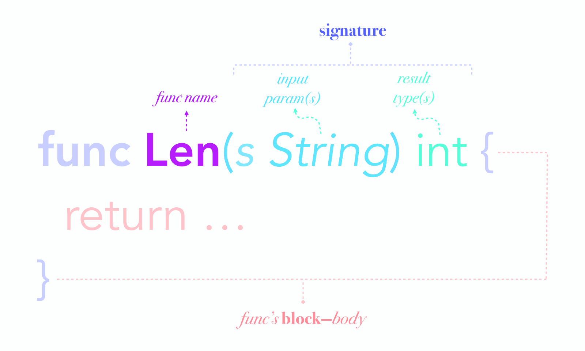

.center.icon[]

---


class: white
background-image: url(img/message.svg)
.top.icon[]

# Функции и ошибки <br> в Go

### Александр Давыдов

---

class: top white
background-image: url(img/sound.svg)
background-size: 130%
.top.icon[]

.sound-top[
  # Как меня слышно и видно?
]

.sound-bottom[
  ## > Напишите в чат
  ### **+** если все хорошо
  ### **-** если есть проблемы cо звуком или с видео
  ### !проверить запись!
]

---

# О чем будем говорить:
- области видимости, блоки
- функции: вариадические, анонимные, замыкания, методы
- ошибки: принципы обработки, best practices
- panic, recover, defer


---

# Области видимости и блоки
<br>
Блок (block) - это, возможно пустая, последовательность объявлений (declarations) и операторов (statements) в соответствующих фигурных скобках.
<br>
	- universe block - весь код проекта
	- package block - весь код пакета
	- file block - исходный код в файле
	- local block - просто {}

```
func main() {
    { // начало блока 1
        a := 1
        fmt.Println(a)
        { // начало блока 2
            b := 2
            fmt.Println(b)
        } // конец блока 2
    } // конец блока 1
}
```

---

# Неявные блоки: for, if, switch, case, select

```
// {
for i := 0; i < 5; i++ {
    fmt.Println(i)
}
// }
```

```
if i := 0; i >= 0 {
    fmt.Println(i)
}
```

```
switch i := 2; i * 4 {
case 8:
    j := 0
    fmt.Println(i, j)
default:
    // "j" is undefined here
    fmt.Println(“default”)
}// "j" is undefined here
```

---

# Объявления

Объявление (declaration) связывает непустой идентификатор с константой, типом, переменной, функцией, меткой (label) или пакетом. Каждый идентификатор в программе должен быть объявлен. Ни один идентификатор не может быть объявлен дважды в одном и том же блоке, и ни один идентификатор не может быть объявлен как в блоке файла, так и в блоке пакета.

```
var a int

type Student struct {
	name string
}

const Pi float64 = 3.14159265358979323846
```
---

---

# Область видимости
<br>
- Область видимости предварительно объявленного идентификатора - это всеобщий блок (universe block)
```
bool, int32, int64, float64, …
nil
make, new, panic, …
true or false
```
- Область видимости идентификатора, обозначающего константу, тип, переменную или функцию (но не метод), объявленную на верхнем уровне (вне какой-либо функции), это блок пакета.

```
package mypackage

import (
	"fmt"
)

type Student struct {
	name string
}
```

---

# Область видимости
<br>

- Область видимости имени импортируемого пакета - это блок файла, содержащий объявление импорта.
```
// sandbox.go
package main
import “fmt”
func main() {
	fmt.Println(“main”)
	f()
}
```
```
// utils.go
package main
func f() {
	fmt.Println(“f”)
}
```

---

# Область видимости
<br>


- Область видимости идентификатора, обозначающего приемник метода (method receiver), параметра функции или переменной результата, это тело функции.

```
type Student struct {
	name string
}

func (s *Student) Name() string {
	return s.name
}
```

---

# Область видимости
<br>
<br>
- Область видимости идентификатора константы или переменной, объявленного внутри функции, начинается после объявления и заканчивается в конце самого внутреннего содержащего блока.

<br>
```
func main() {
    fmt.Println(v)
    v := 1
}
```
```
func main() {
	{
		{
			var a = 22
			println(a)
		}
		println(a) // unresolved reference
	}

}
```

---

# Область видимости
<br>


<br>
- Область видимости идентификатора типа, объявленного внутри функции, начинается с идентификатора в TypeSpec и заканчивается в конце самого внутреннего содержащего блока.

```
package main

func studentName(name string) string {
	type Student struct {
		name string
	}

	s := Student{name}

	return s.name
}

func main() {
	println(studentName("olga"))
	student := Student{"alex"} // undefined: Student
}
```
---

# Область видимости
<br>

- Идентификатор, объявленный в блоке, может быть повторно объявлен во внутреннем блоке. Пока идентификатор внутренней декларации находится в области видимости, он обозначает сущность, объявленную внутренней декларацией.
<br>
```
	{
		var a = 4
		println(a) // 4
		{
			println(a) // 4
			var a = 22
			println(a) // 22
		}
	}
```

---

# Shadowing
<br>
Один идентификатор нельзя объявить два раза в одном блоке.
Но можно объявить его во внутреннем блоке!
<br>
```
v := "outer"
fmt.Println(v)
{
    v := "inner"
    fmt.Println(v)
    {
        fmt.Println(v)
    }
}
{
    fmt.Println(v)
}
fmt.Println(v)
```

```
outer
inner
inner
outer
outer
```

---

# Контрольный вопрос: сколько раз мы объявили x?

```
package main

import "fmt"

func f(x int) {
	for x := 0; x < 10; x++ {
		fmt.Println(x)
	}
}

var x int

func main() {
	var x = 200
	f(x)
}
```

---

# Еще пример:

```
package main

import "fmt"
import "strconv"

func parseInt(s string) (int, error) {
	n, err := strconv.Atoi(s)
	if err != nil {
		b, err := strconv.ParseBool(s)
		if err != nil {
			return 0, err
		}

		if b {
			n = 1
		}
	}
	return n, err
}

func main() {
	fmt.Println(parseInt("TRUE"))
}
```

---

# Нужен ли интерактив?

https://forms.gle/nan9N5fGJYRrZ3QE7


---

# Объявление функции

.left-image[
   
  ]

Интересное:
- в го нет дефолтных значений для параметров
- функция может возвращать несколько значений
- функция - first class value, можем работать как с обычным значением
- параметры в функцию передаются по значению

---

# Именованные функции

могут декларироваться только на уровне пакета, вне тела другой функции, примеры:

```
func Hello() {
    fmt.Println("Hello World!")
}

func greet(user string) {
        fmt.Println("Hello " + user)
}

func add(x int, y int) int {
        return x + y
}

func add(x, y int) int {
        return x + y
}
```

---

# Именованные функции

могут декларироваться только на уровне пакета, вне тела другой функции, примеры:

```
func Hello() string {

	func Hello2() string { // !!! unresolved reference!
		return "hello"
	}

	return Hello2()
}
```

---

# Функции

могут возвращать несколько значений:


```
func addMult(a, b int) (int, int) {
        return a + b, a * b
}
```

```
func SquaresOfSumAndDiff(a int64, b int64) (s int64, d int64) {
        x, y := a + b, a - b
        s = x * x
        d = y * y
        return // <=> return s, d
}
```

---

# Вариадические функции 

могут быть вариадическими, то есть принимать неограниченное кол-во параметров


```
	fmt.Println("one", "two", "three", "four")	
```

```
	someSlice = append(someSlice, "one", "two", "N")
```
<br>
```
func Printf(format string, a ...interface{}) (n int, err error) {
	return Fprintf(os.Stdout, format, a...)
}
```

```
func f(elem ...Type)
```

... - pack operator, он собирает все параметры типа Type в слайс, и он же их распаковывает.
<br>
Только последний параметр функции может быть вариадическим.

---

# Вариадические функции

<br>

```
func sum(nums ...int) {
    fmt.Print(nums, " ")
    total := 0
    for _, num := range nums {
        total += num
    }
    fmt.Println(total)
}

func main() {
    sum(1, 2)
    sum(1, 2, 3)

    nums := []int{1, 2, 3, 4}
    sum(nums...)
}
```

```
[1 2] 3
[1 2 3] 6
[1 2 3 4] 10
```


---

# Анонимные функции

анонимная функция - определение функции, не связанное с идентификатором 

```
func() {
    fmt.Println("Hello!")
}()  // "Hello!"
```

```
var foo func() = func() {
    fmt.Println("Hello!")
}
foo() // Hello! 
```

```
foo := func() {
	fmt.Println("Hello!")
}
foo()
```

---

# Анонимные функции

Зачем?

можем, например, использовать кастомную сортировку:

```
people := []string{"Alice", "Bob", "Dave"}
sort.Slice(people, func(i, j int) bool {
    return len(people[i]) < len(people[j])
})
fmt.Println(people)
```

---

# Замыкания

Замыкание — это особый вид функции. Она определена в теле другой функции и создаётся каждый раз во время её выполнения. Синтаксически это выглядит как функция, находящаяся целиком в теле другой функции. При этом вложенная внутренняя функция содержит ссылки на локальные переменные внешней функции.


---

# Замыкания


```
package main

import "fmt"

func intSeq() func() int {
    i := 0
    return func() int {
        i++
        return i
    }
}

func main() {
    nextInt := intSeq()

    fmt.Println(nextInt()) // 1
    fmt.Println(nextInt()) // 2
    fmt.Println(nextInt()) // 3

    newInts := intSeq()
    fmt.Println(newInts()) // 1
}
```

---

# Замыкания


Практическое применение: middleware


```
package main

import (
  "fmt"
  "net/http"
)

func main() {
  http.HandleFunc("/hello", hello)
  http.ListenAndServe(":3000", nil)
}

func hello(w http.ResponseWriter, r *http.Request) {
  fmt.Fprintln(w, "<h1>Hello!</h1>")
}
```

---

# Замыкания

```
package main

import (
  "fmt"
  "net/http"
  "time"
)

func main() {
  http.HandleFunc("/hello", timed(hello))
  http.ListenAndServe(":3000", nil)
}

func timed(f func(http.ResponseWriter, *http.Request)) func(http.ResponseWriter, *http.Request) {
  return func(w http.ResponseWriter, r *http.Request) {
    start := time.Now()
    f(w, r)
    end := time.Now()
    fmt.Println("The request took", end.Sub(start))
  }
}

func hello(w http.ResponseWriter, r *http.Request) {
  fmt.Fprintln(w, "<h1>Hello!</h1>")
}
```


---

# Функции

могут быть рекурсивными:

```
// n! = n×(n-1)! where n >0
func getFactorial(num int) int {
        if num > 1 {
                return num * getFactorial(num-1)
        } else {
                return 1 // 1! == 1
        }
}
```

но хвостовая рекурсия не оптимизируется:

https://blog.gopheracademy.com/recursion/

Go 2?
https://github.com/golang/go/issues/22624


---

# Функции: сигнатуры и типы

Тип функции определяет  набор всех функций с одним и тем же набором параметров и результатов (и их типов). Неинициализированная переменная типа функции - nil.

Сигнатура - это "тип функции", примеры:

```
func()
func(x int) int
func(a, b int, z float32) (bool)
func(prefix string, values ...int)
```

---

# Функции: сигнатуры и типы

```
package main

type SumFunc func(base int, arguments ...int) int

func main() {

	var summer SumFunc
	summer = func(a int, args ...int) int {
		for _, v := range(args) {
			a = a + v
		}
		return a
	}

	println(summer(1, 2, 3, 4)) // 10
}
```

---

# Методы

```
type Employee struct {
   name, surname string
}

func FullName(e Employee) string {
   return e.name + " " + e.surname
}

func (e Employee) FullName() string {
   return e.name + " " + e.surname
}

func main() {
    print(Employee{"alexander", "davydov"}.FullName())
    print(FullName(Employee{"alexander", "davydov"}))
}
```

---

# Методы

- `T` должен быть определен в одном пакете в методом
- `T` не должен быть указателем
- `T` не должен быть интерфейсом

Нельзя (явно) объявлять методы для:

- встроенных типов ( `int` ,  `string`)
- интерфейсов

* опустил условие про определенный тип https://go101.org/article/type-system-overview.html#non-defined-type

---

# Методы

можно навешивать на базовые типы!

```

type Age int

func (age Age) LargerThan(a Age) bool {
        return age > a
}
func (age *Age) Increase() {
        *age++
}

func main() {
    var a Age // 0
    a = a + 1 // 1
    a.Increase() //2
}
```

---

# Методы

соответствуют имплицитным функциям:

```
type Book struct {
	pages int
}
func (b Book) Pages() int {
	return b.pages
}
func (b *Book) SetPages(pages int) {
	b.pages = pages
}


func Book.Pages(b Book) int {
	// The body is the same as the Pages method.
	return b.pages
}

func (*Book).SetPages(b *Book, pages int) {
	// The body is the same as the SetPages method.
	b.pages = pages
}
```

---

# Ошибки


- Ошибка - тип, реализующий интерфейс error
- Функции возвращают ошибки как обычные значения
- По конвенции, ошибка - последнее возвращаемое функцией значение
- Ошибки обрабатываются проверкой значения (и/или передаются выше через обычный return)

```
type error interface {
    Error() string
}
```


```
func Marshal(v interface{}) ([]byte, error) {
   e := &encodeState{}
   err := e.marshal(v, encOpts{escapeHTML: true})
   if err != nil {
      return nil, err
   }
   return e.Bytes(), nil
}
```

---


# errors.go

Ошибки из стандартной библиотеки:

```
package errors

func New(text string) error {
   return &errorString{text}
}

type errorString struct {
   s string
}

func (e *errorString) Error() string {
   return e.s
}
```
---

# errors.go

```
	err := errors.New("Im an error")
	if err != nil {
		fmt.Print(err)
	}
```
```
	whoami := "error"
	err := fmt.Errorf("Im an %s", whoami)
	if err != nil {
		fmt.Print(err)
	}
```


---

# Идиоматичная проверка ошибок

<br>
В целом ок:

```
func (router HttpRouter) parse(reader *bufio.Reader) (Request, error) {
  requestText, err := readCRLFLine(reader) //string, err Response
  if err != nil {
    //No input, or it doesn't end in CRLF
    return nil, err
  }

  requestLine, err := parseRequestLine(requestText) //RequestLine, err Response
  if err != nil {
    return nil, err
  }

  if request := router.routeRequest(requestLine); request != nil {
    return request, nil
  }

  //Valid request, but no route to handle it
  return nil, requestLine.NotImplemented()
}
```


---

# Ошибка - это значение

```
func (s *Scanner) Scan() (token []byte, error)

scanner := bufio.NewScanner(input)
for {
    token, err := scanner.Scan()
    if err != nil {
        return err // or maybe break
    }
    // process token
}
```

мы можем сохранять его во внутренней структуре:

```
scanner := bufio.NewScanner(input)
for scanner.Scan() {
    token := scanner.Text()
    // process token
}
if err := scanner.Err(); err != nil {
    // process the error
}
```

---

# Обработка ошибок: sentinel values
<br>

```
package io


// ErrShortWrite means that a write accepted fewer bytes than requested
// but failed to return an explicit error.
var ErrShortWrite = errors.New("short write")

// ErrShortBuffer means that a read required a longer buffer than was provided.
var ErrShortBuffer = errors.New("short buffer")
```

Ошибки в таком случае - часть публичного API, это наименее гибкая стратегия:

```
if err == io.EOF {
	...
}
```


---

# Проверка ошибок: типы

```

    // PathError records an error and the operation and
    // file path that caused it.
    type PathError struct {
        Op string    // "open", "unlink", etc.
        Path string  // The associated file.
        Err error    // Returned by the system call.
    }
    
    func (e *PathError) Error() string {
        return e.Op + " " + e.Path + ": " + e.Err.Error()
    }

```

```
    open /etc/passwx: no such file or directory
```

---

# Проверка ошибок: типы

```
err := readConfig()
switch err := err.(type) {
	case nil:
	    // call succeeded, nothing to do
	case *PathError:
        fmt.Println(“invalid config path:”, err.Path)
	default:
		// unknown error
}
```

---

# Проверка ошибок: интерфейсы

```
package net

type Error interface {
    error
    Timeout() bool   // Is the error a timeout?
    Temporary() bool // Is the error temporary?
}
```

Проверяем поведение, а не тип:

```
if nerr, ok := err.(net.Error); ok && nerr.Temporary() {
    time.Sleep(1e9)
    continue
}
if err != nil {
    log.Fatal(err)
}
```

---


# Антипаттерны проверки ошибок:

```
if err.Error() == "smth" { // строковое представление - для людей
```

```
func Write(w io.Writer, buf []byte) {
        w.Write(buf) // забыли проверить ошибку
}
```

```
func Write(w io.Writer, buf []byte) error {
        _, err := w.Write(buf)
        if err != nil {
                // логируем ошибку вероятно несколько раз
				// на разных уровнях абстракции
                log.Println("unable to write:", err)
 
                // unannotated error returned to caller
                return err
        }
        return nil
}
```


---

# Stacktrace: github.com/pkg/errors
```
_, err := ioutil.ReadAll(r)
if err != nil {
        return errors.Wrap(err, "read failed")
}
```
```
package main

import "fmt"
import "github.com/pkg/errors"

func main() {
        err := errors.New("error")
        err = errors.Wrap(err, "open failed")
        err = errors.Wrap(err, "read config failed")

        fmt.Println(err) // read config failed: open failed: error
		fmt.Printf("%+v\n", err) // напечатает stacktrace

}
```

---

# Stacktrace: github.com/pkg/errors

Чтобы проверить, соответствует ли ошибка значению/типу, ее надо развернуть:

```
// Cause unwraps an annotated error.
func Cause(err error) error
```
```
	err1 := errors.New("im an error")
	err2 := errors.Wrap(err1, "some context")
	print(err1 == err2)				   // false
	print(err1 == errors.Cause(err2))  // true
```
---

# Stacktrace: github.com/pkg/errors
```
switch err := errors.Cause(err).(type) {
case *MyError:
        // handle specifically
default:
        // unknown error
}
```
```
// IsTemporary returns true if err is temporary.
func IsTemporary(err error) bool {
        te, ok := errors.Cause(err).(temporary)
        return ok && te.Temporary()
}
```

---

# Stacktrace: github.com/pkg/errors

<br>
<br>

```
func Cause(err error) error {
	type causer interface {
		Cause() error
	}

	for err != nil {
		cause, ok := err.(causer)
		if !ok {
			break
		}
		err = cause.Cause()
	}
	return err
}
```
---

# Итого: 

- проверяйте ошибки
- лишний раз не логируйте
- проверяйте поведение, а не тип
- ошибки - это значения

---


# Defer, Panic и Recover: defer

<br>
defer позволяет назначить выполнение вызова функции непосредственно
перед выходом из вызывающей функции

```
func Contents(filename string) (string, error) {
    f, err := os.Open(filename)
    if err != nil {
        return "", err
    }
    defer f.Close()  // f.Close will run when we're finished.

    var result []byte
    buf := make([]byte, 100)
    for {
        n, err := f.Read(buf[0:])
        result = append(result, buf[0:n]...) // append is discussed later.
        if err != nil {
            return "", err  // f will be closed if we return here.
        }
    }
    return string(result), nil // f will be closed if we return here.
}
```

---

# Defer, Panic и Recover: defer

Аргументы отложенного вызова функции вычисляются тогда, когда вычисляется команда defer.

```
func a() {
    i := 0
    defer fmt.Println(i)
    i++
    return
}
```

```
0
```

---

# Defer, Panic и Recover: defer


Отложенные вызовы функций выполняются в порядке LIFO: последний отложенный вызов будет вызван первым — после того, как объемлющая функция завершит выполнение.

```
func b() {
    for i := 0; i < 4; i++ {
        defer fmt.Print(i)
    }
}
```

```
3210
```

---
# Defer, Panic и Recover: defer

Отложенные функции могут читать и устанавливать именованные возвращаемые значения объемлющей функции.

```
func c() (i int) {
    defer func() { i++ }()
    return 1
}
```

Эта функция вернет 2

---

# Panic и Recover

Panic — это встроенная функция, которая останавливает обычный поток управления и начинает паниковать. Когда функция F вызывает panic, выполнение F останавливается, все отложенные вызовы в F выполняются нормально, затем F возвращает управление вызывающей функции. Для вызывающей функции вызов F ведёт себя как вызов panic. Процесс продолжается вверх по стеку, пока все функции в текущей го-процедуре не завершат выполнение, после чего аварийно останавливается программа. Паника может быть вызвана прямым вызовом panic, а также вследствие ошибок времени выполнения, таких как доступ вне границ массива.

<br>
<br>

Recover — это встроенная функция, которая восстанавливает контроль над паникующей го-процедурой. Recover полезна только внутри отложенного вызова функции. Во время нормального выполнения, recover возвращает nil и не имеет других эффектов. Если же текущая го-процедура паникует, то вызов recover возвращает значение, которое было передано panic и восстанавливает нормальное выполнение.

---

# Panic and recover

Паниковать стоит только в случае, если ошибку обработать нельзя, например:

```
var user = os.Getenv("USER")

func init() {
    if user == "" {
        panic("no value for $USER")
    }
}
```

---

# Panic and recover

<br><br>
"поймать" панику можно с помощью recover: вызов recover останавливает выполнение отложенных функций
и возвращает аргумент, переданнй panic
<br>

```
func server(workChan <-chan *Work) {
    for work := range workChan {
        go safelyDo(work)
    }
}

func safelyDo(work *Work) {
    defer func() {
        if err := recover(); err != nil {
            log.Println("work failed:", err)
        }
    }()
    do(work)
}
```

---

# Panic and recover


пример из encoding/json:

```
// jsonError is an error wrapper type for internal use only.
// Panics with errors are wrapped in jsonError so that the top-level recover
// can distinguish intentional panics from this package.
type jsonError struct{ error }

func (e *encodeState) marshal(v interface{}, opts encOpts) (err error) {
	defer func() {
		if r := recover(); r != nil {
			if je, ok := r.(jsonError); ok {
				err = je.error
			} else {
				panic(r)
			}
		}
	}()
	e.reflectValue(reflect.ValueOf(v), opts)
	return nil
}
```

---

class: white
background-image: url(img/message.svg)
.top.icon[]

# Спасибо за внимание!
