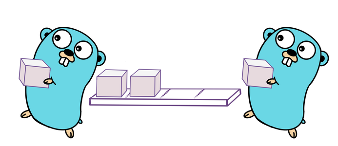

.center.icon[]

---

class: top white
background-image: url(img/sound.svg)
background-size: 130%
.top.icon[]

.sound-top[
  # Как меня слышно и видно?
]

.sound-bottom[
  ## > Напишите в чат
  ### **+** если все хорошо
  ### **-** если есть проблемы cо звуком или с видео
]

---

class: white
background-image: url(img/message.svg)
.top.icon[]

# Горутины и каналы

### Алексей Бакин

---

# Как проходит занятие

* ### Активно участвуем - задаем вопросы.
* ### Чат вижу - могу ответить не сразу.
* ### После занятия - оффтопик, ответы на любые вопросы.

---

# О чем будем говорить

- ### Горутины
- ### Каналы
- ### Синхронизация

---

# Настройка на занятие

.left-text[
Пожалуйста, пройдите небольшой тест.
<br><br>
Возможно, вы уже многое знаете про&nbsp;горутины и каналы в Go.
<br><br>
Ссылка в чате
]

.right-image[

]

---

# Горутины

Горутины - функции, которые выполняются конкурентно.
Горутины - легковесные, у каждой из них свой стек, все остальное (память, файлы и т.п.) - общее.

---

# Параллелизм vs конкурентность

.center-image-sq[

]

---

# Параллелизм vs конкурентность

.center-image[

]

<br>

Картинки из выступления Роба Пайка: https://blog.golang.org/waza-talk

---

# Параллелизм vs конкурентность

.center-image[

]

---

# Параллелизм vs конкурентность

.center-image[

]

---

# Запуск горутины

```
go func() {
	fmt.Println("hello world")
}()
```

---

# Как работают горутины?

- ### Когда запускается горутина?
- ### .
- ### .

---

# Как работают горутины?

- ### Когда запускается горутина?
- ### Когда горутина приостанавливается?
- ### .

---

# Как работают горутины?

- ### Когда запускается горутина?
- ### Когда горутина приостанавливается?
- ### Что будет с горутинами, если программа закончится?

---

# Сколько тут горутин?

```
func main() {
	fmt.Printf(
		"Goroutines: %d",
		runtime.NumGoroutine(),
	)
}
```

https://goplay.space/#8is1y5tu-m3

---

# Что напечатает программа?

```
func main() {
	go fmt.Printf("Hello")
}
```

https://goplay.space/#SBO2dnLQPue

---

# Каналы

```
chan T
```

- работают с конкретным типом
- потокобезопасны
- похожи на очереди FIFO

---

# Каналы: операции

```
ch := make(chan int) // создать канал
ch <- 10             // записать в канал
v := <-ch            // прочитать из канала
close(ch)            // закрыть канал
```

---

# Каналы: буферизованные

```
ch := make(chan int, 4)
```

.center-image[

]

---

# Каналы: небуферизованные

```
ch := make(chan int)
```

.center-image[

]

---

# Каналы: небуферизованные

Чему равен буфер небуферизованного канала?

```
ch := make(chan int, ?)
```

---

# Что будет, если читать из пустого канала?

.center-image[

]

---

# Что будет, если читать из пустого канала?


.center-image[

]

---

# Что будет, если писать в заполненный канал?

.center-image[

]

---

# Что будет, если писать в заполненный канал?

.center-image[

]

---

# Что будет, если писать в закрытый канал?

.center-image[

]

---

# Что будет, если писать в закрытый канал?

.center-image[

]

---

# Что будет, если читать из закрытого канала?

.center-image[

]

---

# Что будет, если читать из закрытого канала?

.center-image[

]

---

# Что будет, если читать из пустого закрытого канала?

.center-image[

]

---

# Что будет, если читать из пустого закрытого канала?


.center-image[

]

---

# Проверьте себя

https://goplay.space/#K4bxk92rF3q

---

# Синхронизация горутин каналами

```
func main() {
	go fmt.Printf("Hello")
}
```
---

# Синхронизация горутин каналами

```
func main() {
	var ch = make(chan struct{})

	go func() {
		fmt.Printf("Hello")
		ch <- struct{}{}
	}()

	<-ch
}
```

https://goplay.space/#TeLXxeAP0D6

---

# Синхронизация горутин каналами

```
func main() {
	var ch = make(chan struct{})

	go func() {
		fmt.Printf("Hello")
		<-ch
	}()

	ch <- struct{}{}
}
```

https://goplay.space/#TeLXxeAP0D6

---

# Чтение из канала, пока он не закрыт

```
v, ok := <-ch // значение и флаг "открытости" канала
```

---

# Чтение из канала, пока он не закрыт

```
for {
	x, ok := <-ch
	if !ok {
		break
	}

	fmt.Println(x)
}
```

---

# Чтение из канала, пока он не закрыт

```
for x := range ch {
	fmt.Println(x)
}
```

---

# Правила закрытия канала

- ## Кто закрывает канал?

---

# Правила закрытия канала

- ### Канал закрывает тот, кто в него пишет.
- ### Если несколько писателей, то тот, кто создал писателей и канал.

---

# Каналы: однонаправленные

```
chan<- T // только запись
<-chan T // только чтение
```

Что произойдет?
```
func f(out chan<- int) {
	<-out
}

func main() {
	var ch = make(chan int)
	f(ch)
}
```

https://goplay.space/#t6bVfgg6BTu

---

# Каналы: мультиплексирование

```
select {
case <-ch1:
	// ...
case ch2 <- y:
	// ...
default:
	// ....
}
```

---

# Каналы: таймаут

```
timer := time.NewTimer(10 * time.Second)
select {
case data := <-ch:
	fmt.Printf("received: %v", data)
case <-timer.C:
	fmt.Printf("failed to receive in 10s")
}
```

https://goplay.space/#40A5bnJQiAk

---


# Каналы: периодик

```
ticker := time.NewTicker(10 * time.Second)
for {
	select {
	case <-ticker.C:
		// ...
	}
}
```

https://goplay.space/#OSLQuy37n0Q

---
# Каналы: как сигналы

```
make(chan struct{}, 1)
```

Источник сигнала:
```
select {
	case notifyCh <- struct{}{}:
	default:
}
```

Приемник сигнала:
```
select {
	case <-notifyCh:
	case ...
}
```

---


# Каналы: graceful shutdown

```
interruptCh := make(chan os.Signal, 1)

signal.Notify(interruptCh, os.Interrupt, syscall.SIGTERM)

fmt.Printf("Got %v...\n", <-interruptCh)
```

---

# Каналы: замыкание

```
for i := 0; i < 5; i++ {
	go func() {
		fmt.Print(i)
	}()
}
time.Sleep(2 * time.Second)
```

https://goplay.space/#rSKy5YetcJS

---

# Каналы: паттерн синхронизации

```
for {
	select {
		case <-quitCh:
			return
		default:
	}

	select {
		case <-quitCh:
			return
		case <-ch1:
			// do smth
		case <-ch2:
			// do smth
	}
}
```

---

# Повторение

.left-text[
Давайте проверим, что вы узнали за этот урок, а над чем стоит еще поработать.
<br><br>
Ссылка в чате
]

.right-image[

]

---

# Опрос

.left-text[
Заполните пожалуйста опрос
<br><br>
Ссылка в чате.
]

.right-image[

]

---

class: white
background-image: url(img/message.svg)
.top.icon[]

# Спасибо за внимание!
