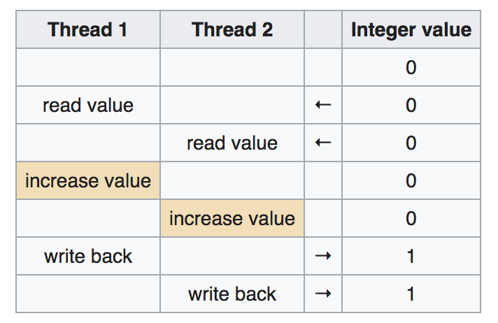

center.icon[]

---


class: white
background-image: url(img/message.svg)
.top.icon[]

# Примитивы синхронизации <br> в Go

### Александр Давыдов

---

class: top white
background-image: url(img/sound.svg)
background-size: 130%
.top.icon[]

.sound-top[
  # Как меня слышно и видно?
]

.sound-bottom[
  ## > Напишите в чат
  ### **+** если все хорошо
  ### **-** если есть проблемы cо звуком или с видео
  ### !проверить запись!
]

---

# О чем будем говорить:

* Мьютексы
* Условные переменные
* Гарантировано одноразовое выполнение
* Pool и WaitGroup
* Модель памяти в Go
* Race-детектор

---

# sync.WaitGroup

Что выведет эта программа?

```
type Dog struct { name string; walkDuration time.Duration }

func (d Dog) Walk() {
	fmt.Printf("%s is taking a walk\n", d.name)
	time.Sleep(d.walkDuration)
	fmt.Printf("%s is going home\n", d.name)
}

func walkTheDogs(dogs []Dog) {
	for _, d := range dogs { go d.Walk() }
	fmt.Println("everybody's home")
}


func main() {
	dogs := []Dog{{"vasya", time.Second}, {"john", time.Second*3}}
	walkTheDogs(dogs)
}
```


---

# sync.WaitGroup

WaitGroup - механизм для ожидания завершения работы нескольких горутин.

```
type WaitGroup struct {
        // неэкспортируемые поля
}

func (wg *WaitGroup) Add(delta int) - инерементирует счетчик WaitGroup на 1

func (wg *WaitGroup) Done() - декрементит счетчик на 1

func (wg *WaitGroup) Wait() - блокируется, пока счетчик WaitGroup не обнулится.
```

---


# sync.WaitGroup

```
type Dog struct { name string; walkDuration time.Duration }

func (d Dog) Walk(wg *sync.WaitGroup) {
	fmt.Printf("%s is taking a walk\n", d.name)
	time.Sleep(d.walkDuration)
	fmt.Printf("%s is going home\n", d.name)
	wg.Done()
}


func main() {
	dogs := []Dog{{"vasya", time.Second}, {"john", time.Second*3}}
	var wg sync.WaitGroup

	for _, d := range dogs {
		wg.Add(1)
		go d.Walk(&wg)
	}

	wg.Wait()
	fmt.Println("everybody's home")
}
```

---

# sync.WaitGroup

```
type httpPkg struct{}
func (httpPkg) Get(url string) {}

var http httpPkg

func main() {
	var wg sync.WaitGroup
	var urls = []string{
		"http://www.golang.org/",
		"http://www.google.com/",
		"http://www.somestupidname.com/",
	}
	for _, url := range urls {
		wg.Add(1)
		go func(url string) {
			defer wg.Done()
			http.Get(url)
		}(url)
	}
	wg.Wait()
}
```

---

# sync.WaitGroup

fun fact: аргумент Add может быть отрицательным

```
// Done decrements the WaitGroup counter by one.
func (wg *WaitGroup) Done() {
	wg.Add(-1)
}
```


---

# Задачка

https://play.golang.org/p/m16jnq3kO2O

использовать WaitGroup чтобы выпустить собак одновременно
и дождаться их возвращения


---

# sync.Mutex

```
var i int // i == 0

func worker(wg *sync.WaitGroup) {
	i = i + 1
	wg.Done()
}

func main() {
	var wg sync.WaitGroup

	for i := 0; i < 1000; i++ {
		wg.Add(1)
		go worker(&wg)
	}

	wg.Wait()

	fmt.Println("value of i after 1000 operations is", i)
}
```

https://play.golang.org/p/MQNepChxiEa

---

# sync.Mutex

Если мы увеличим число процессоров, i будет < 1000:

```
➜  GOMAXPROCS=4 go run main.go
value of i after 1000 operations is 995
➜  GOMAXPROCS=4 go run main.go 
value of i after 1000 operations is 999
➜  GOMAXPROCS=4 go run main.go
value of i after 1000 operations is 992
➜  GOMAXPROCS=2 go run main.go
value of i after 1000 operations is 994
```

```
runtime.GOMAXPROCS(2)
```

---

# sync.Mutex

```
hello10 go run -race main.go
==================
WARNING: DATA RACE
Read at 0x00000121e868 by goroutine 7:
  main.worker()
```


---

# What could possibly go wrong?
<br>
.full-image[

]


---

# sync.Mutex

Мью́текс (англ. mutex, от mutual exclusion — «взаимное исключение») — механизм для синхронизации одновременно выполняющихся потоков. 

```
type Mutex struct {
	state int32
	sema  uint32
}

// A Locker represents an object that can be locked and unlocked.
type Locker interface {
	Lock()
	Unlock()
}
```

---

# sync.Mutex


Код между Lock() и Unlock() может исполняться только одной горутиной.

```
mutex.Lock()  
i = i + 1  
mutex.Unlock()
```

Если какая-то горутина владеет мьютексом, то новая горутина должна дождаться
освобождения мьютекса этой горутиной.


---

# Mutex

```
var i int // i == 0

func worker(wg *sync.WaitGroup, m *sync.Mutex) {
	m.Lock() // acquire lock
	i = i + 1
	m.Unlock() // release lock
	wg.Done()
}

func main() {
	var wg sync.WaitGroup
	var m sync.Mutex

	for i := 0; i < 1000; i++ {
		wg.Add(1)
		go worker(&wg, &m)
	}

	wg.Wait()

	fmt.Println("value of i after 1000 operations is", i)
}
```

https://play.golang.org/p/xVFAX_0Uig8

---

# sync.Mutex

Вывод: не стоит принимать во внимание работу планировщика Go: синхронизировать работу горутин надо самому.

---

# sync.Mutex: паттерны использования

помещайте мьютекс выше тех полей, доступ к которым он будет защищать:

```
var sum struct {
    sync.Mutex     // <-- этот мьютекс защищает
    i int          // <-- поле под ним
}
```


держите блокировку не дольше, чем требуется:

```
func doSomething(){
    mu.Lock()
    item := cache["myKey"]
    http.Get() // какой-нибудь дорогой IO-вызов
    mu.Unlock()
}
```

---

# sync.Mutex: паттерны использования

используйте defer, чтобы разблокировать мьютекс там где у функции есть несколько точек выхода:

```
func doSomething() {
	mu.Lock()
	defer mu.Unlock()
    err := ...
	if err != nil {
		//log error
		return // <-- разблокировка произойдет здесь
	}

        err = ...
	if err != nil {
		//log error
		return // <-- или тут
	}
	return // <-- и тут тоже
}
```
---

# sync.Mutex: паттерны использования

но надо быть аккуратным:

```
func doSomething(){
    for {
        mu.Lock()
        defer mu.Unlock()
         
        // какой-нибудь интересный код
        // <-- defer будет выполнен не тут, а при выходе из функции
     }
}
// И поэтому в коде выше будет дедлок!
```

---

# sync.Mutex

Когда использовать каналы: 
- передача данныx
- распределение вычислений
- передача асинхронных результатов.

Когда использовать мьютексы: 
- кэши
- состояния

---

# sync.RWMutex

как быть?

```
var wg sync.WaitGroup
m :=  make(map[string]int)

for x := 0; x < 12; x++ {
	wg.Add(1)
	go func(wg *sync.WaitGroup) {
		defer wg.Done()
			m["hello"] = 1
	}(&wg)
}
wg.Wait()
```

```
fatal error: concurrent map writes
```

https://play.golang.org/p/SaExRk_Zw6S

---

# sync.RWMutex

попробуем мьютекс:

```
type Counters struct {
    mx sync.Mutex
    m map[string]int
}

func (c *Counters) Load(key string) (int, bool) {
    c.mx.Lock()
    defer c.mx.Unlock()
    val, ok := c.m[key]
    return val, ok
}

func (c *Counters) Store(key string, value int) {
    c.mx.Lock()
    defer c.mx.Unlock()
    c.m[key] = value
}
```

---

# sync.RWMutex


- defer имеет небольшой оверхед (порядка 50-100 наносекунд), поэтому если у вас код для высоконагруженной системы и 100 наносекунд имеют значение, то вам может быть выгодней не использовать defer
- методы Get() и Store() должны быть определены для указателя на Counters, а не на Counters (тоесть не func (c Counters) Load(key string) int { ... }, потому что в таком случае значение ресивера (c) копируется, вместе с чем скопируется и мьютекс в нашей структуре, что лишает всю затею смысла и приводит к проблемам.

---

# sync.RWMutex

Паттерн доступа к данным часто неравномерный, например мы редко пишем и много читаем.
В таком случае, блокировать чтение не стоит.

```
type RWMutex struct {
        // contains filtered or unexported fields
}
```

```
func (rw *RWMutex) RLock() // блокирует на чтение:
						   // другие горутины могут читать, но не могут писать
func (rw *RWMutex) RUnLock()
```

---

# sync.RWMutex

RWMutex - стандартное решение для map:

```
type Counters struct {
    mx sync.RWMutex
    m  map[string]int
}
...
func (c *Counters) Load(key string) (int, bool) {
    c.mx.RLock()
    defer c.mx.RUnlock()
    val, ok := c.m[key]
    return val, ok
}
```

---

# sync.RWMutex

RWMutex - стандартное решение для map

```
type Counters struct {
    mx sync.RWMutex
    m  map[string]int
}
...
func (c *Counters) Load(key string) (int, bool) {
    c.mx.RLock()
    defer c.mx.RUnlock()
    val, ok := c.m[key]
    return val, ok
}
```

---

# Cache contention


.full-image[

]

При блокировке на чтение каждое ядро обновляет счетчик.
Следующие ядра - вычитывают значение из кэша предыдущего.


---

# sync.Map решает конкретную проблему

Если у вас высоконагруженная (и 100нс решают) система с большим количеством ядер процессора (32+),
 вы можете захотеть использовать sync.Map вместо стандартного map+sync.RWMutex. 
В остальных случаях, sync.Map особо не нужен.

https://www.youtube.com/watch?v=C1EtfDnsdDs

---

# sync.Map

Map реализует "из коробки" API для работы с map+RWMutex:

```
type Map struct {
        // contains filtered or unexported fields
}

func (m *Map) Delete(key interface{})
func (m *Map) Load(key interface{}) (value interface{}, ok bool)
func (m *Map) LoadOrStore(key, value interface{}) (actual interface{}, loaded bool)
func (m *Map) Range(f func(key, value interface{}) bool)
func (m *Map) Store(key, value interface{})
```

API обусловлен паттернами использования в стандартной библиотеке.

---

# sync.Map

```
var counters sync.Map

counters.Store("habr", 42)

v, ok := counters.Load("otus")
if ok {
   val = v.(int)
}


counters.Range(func(k, v interface{}) bool {
	fmt.Println("key:", k, ", val:", v)
	return true // if false, Range stops
})

counters.Delete("otus")
```

https://play.golang.org/p/q1DrtemZv_U

---

# sync.Pool

Pool - хранилище временных объектов, безопасное для использования несколькими горутинами.

```
type Pool struct {
		// New - функция, которая возвращает значение, если Get() 
		// возвращает nil
        New func() interface{}
        // contains filtered or unexported fields
}

func (p *Pool) Get() interface{}


func (p *Pool) Put(x interface{})
```

---

# sync.Pool

```
type Dog struct { name string }

func (d *Dog) Bark() { fmt.Printf("%s", d.name) }

var dogPack = sync.Pool{
	New: func() interface{} { return &Dog{} },
}

func main() {
	dog := dogPack.Get().(*Dog)
	dog.name = "ivan"
	dog.Bark()
	dogPack.Put(dog)
}
```


---

# sync.Pool

```
var gdog *Dog

func BenchmarkWithPool(b *testing.B) {
	b.RunParallel(func(pb *testing.PB) {
		for pb.Next() {
			dog := dogPool.Get().(*Dog)
			dog.name = "ivan"
			dogPool.Put(dog)
		}
	})
}

func BenchmarkWithoutPool(b *testing.B) {
	b.RunParallel(func(pb *testing.PB) {
		for pb.Next() {
			dog := &Dog{name:"ivan"}
			gdog = dog
		}
	})
}
```

---

# sync.Pool

```
go test -bench . -benchmem
goos: darwin
goarch: amd64
pkg: github.com/nyddle/dogpool
BenchmarkWithPool       100000000      17.5 ns/op     0 B/op     0 allocs/op
BenchmarkWithoutPool    50000000       26.0 ns/op    16 B/op     1 allocs/op
PASS
ok      github.com/nyddle/dogpool 3.109s
```

---

# sync.Pool

! Любой элемент, хранящийся в пуле, может быть удален автоматически в любое время без уведомления

runtime/mgc.go:

```
func gcStart(trigger gcTrigger) {
  [...]
  // clearpools before we start the GC
  clearpools()
```

Пример использования: https://golang.org/src/fmt/print.go#L109
Подробнее про устройство в 1.13: https://dev-gang.ru/article/go-ponjat-dizain-syncpool-cpvecztx8e/


---

# sync.Pool


Итого, Pool:
- набор временных объектов которыми можно пользоваться (доставать, создавать и класть назад) независимо
- может использоваться несколькими горутинами
- у нас нет гарантий времени жизни объекта
- снижает время на выделение памяти под объект
- нагружает gc

Pool (как и другие примитивы синхронизации) нельзя копировать после первого использования.


---

# sync.Once

```
type Once struct {
	m    Mutex
	done uint32
}

func (o *Once) Do(f func()) {
	if atomic.LoadUint32(&o.done) == 1 {
		return
	}
	// Slow-path.
	o.m.Lock()
	defer o.m.Unlock()
	if o.done == 0 {
		defer atomic.StoreUint32(&o.done, 1)
		f()
	}
}
```

---

# sync.Once

 Do вызывает функцию f только в том случае, если это первый вызов Do для 
 этого экземпляра Once. Другими словами, если у нас есть var once Once и 
 once.Do(f) будет вызываться несколько раз, f выполнится только в 
 момент первого вызова, даже если f будет иметь каждый раз другое значение.
 Для вызова нескольких функций таким способом нужно несколько
 экземпляров Once.
<br><br>
 Do предназначен для инициализации, которая должна выполняться единожды
 Так как f ничего не возвращает, может быть необходимым использовать
 замыкание для передачи параметров в функцию, выполняемую Do:
  config.once.Do(func() { config.init(filename) })
<br><br>
 Поскольку ни один вызов к Do не завершится пока не произойдет 
 первый вызов f, то f может заблокировать последующие вызовы
 Do и получится дедлок.

 Если f паникует, то Do считает это обычным вызовом и, при последующих
 вызовах, Do не будет вызывать f.


---

# sync.Once

```
type OldDog struct {
	name string
	die sync.Once
}

func (d *OldDog) Die() {
	d.die.Do(func() { println("bye!") })
}


func main() {

	d := OldDog{name:"bob"}
	d.Die()
	d.Die()
	d.Die()
}
```

```
bye!
```

---

# sync.Once

```
package main

import (
	"fmt"
	"sync"
)

func main() {
	var once sync.Once
	onceBody := func() {
		fmt.Println("Only once")
	}
	done := make(chan bool)
	for i := 0; i < 10; i++ {
		go func() {
			once.Do(onceBody)
			done <- true
		}()
	}
	for i := 0; i < 10; i++ {
		<-done
	}
}
```

---

# sync.Cond

Cond(itional variable) - механизм для ожидания горутинами сигнала о событии

```
type Cond struct {
        L Locker
        // contains filtered or unexported fields
}
```

```
func NewCond(l Locker) *Cond

func (c *Cond) Broadcast() // будит все горутины, которые ждут c

func (c *Cond) Signal() // будит все одну горутину, которая ждет c, если такая есть

func (c *Cond) Wait() // разблокирует c.L, ждет сигнала и снова блокирует c.L
```

---

# sync.Cond

```
type Dog struct{ name string }

func (d *Dog) Eat(food *DogFood) {
	food.Lock()
	food.cond.Wait()
	food.food--
	food.Unlock()
}

type DogFood struct {
	sync.Mutex
	food int

	cond *sync.Cond
}

func NewDogFood(food int) *DogFood {
	r := DogFood{food: food}
	r.cond = sync.NewCond(&r)
	return &r
}
```

---

# sync.Cond

```
func main() {
	var wg sync.WaitGroup

	food := NewDogFood(4)

	for _, d := range []Dog{{name: "Vasya"}, {name: "Bob"}, {name: "Henry"}, {name: "Jane"}} {
		wg.Add(1)
		go func(d Dog) {
			defer wg.Done()
			d.Eat(food)
		}(d)
	}

	println("Waiting for food to arrive...\n")
	time.Sleep(1 * time.Second)

	food.cond.Broadcast()

	wg.Wait()
	fmt.Printf("Food left: %d\n", food.food)
}
```

---

# Race detector

data races - одна из самых сложных для дебага ошибок

Условие, при котором порядок доступа к памяти в памяти определяет 
корректность результата.


```
func main() {
	c := make(chan bool)
	m := make(map[string]string)
	go func() {
		m["1"] = "a" // First conflicting access.
		c <- true
	}()
	m["2"] = "b" // Second conflicting access.
	<-c
	for k, v := range m {
		fmt.Println(k, v)
	}
}
```

---

# Race detector

Два обращения к памяти, создают гонку, если они:

- обращаются к одному участку памяти
- происходят параллельно в 2 горутинах
- одно из этих обращений - на запись
- ни одно из этих обращений не "происходит до" второго

```
value := 0
for i := 0; i < 1000000; i++ {
    go func() {
        value += 1
    }()
}
fmt.Printf("%d\n", value)
```

---

# Race detector

найдите баг:

```
func main() {
    done := make(chan bool)
    paths := os.Args[1:]

    for _, path := range paths {
        go func() {
            fmt.Printf("Processing %s\n", path)
            processImage(path)
            done <- true
        }()
    }

    for processed := 0; processed < len(paths); processed++ {
        <-done
    }
}
```

---

# Race detector

к счастью, в го есть race detector


```
$ go test -race mypkg    // to test the package
$ go run -race mysrc.go  // to run the source file
$ go build -race mycmd   // to build the command
$ go install -race mypkg // to install the package
```

http://robertknight.github.io/talks/golang-race-detector.html


---

# Race detector

Можно складывать результаты отдельно
```
 GORACE="log_path=/tmp/race/report strip_path_prefix=/my/go/sources/" go test -race
```

Можно исключать тесты:

```
// +build !race

package foo

// The test contains a data race. See issue 123.
func TestFoo(t *testing.T) {
	// ...
}
```

---

# Модель памяти Go


Если чтобы понять вашу программу, надо изучить этот документ, вы слишком умничаете.
На умничайте.

https://golang.org/ref/mem

---

# Модель памяти Go

Если событие e1 происходит до события e2, мы говорим, что e2 происходит после e1
Если событие e1 не происходит до е2 и не происходит после е2, 
мы говорим, что они происходят одновременно (concurrently).

---

# Модель памяти Go: инициализация

- Инициализация программы происходит в единственной горутине, которая может создавать другие горутины.

- Если пакет p импортирует q, функции инициализации q произойдут до инициализации p.

- Старт функции main.main происходит по завершении всех функций инициализации (init).


---

# Модель памяти Go: создание горутин


"go" происходит до начала выполнения горутины. 

```
var a string

func f() {
	print(a)
}

func hello() {
	a = "hello, world"
	go f()
}
```

"hello, world" будет напечатан когда-то в будущем, возможно, после выхода из hello()

---

# Модель памяти Go: выход из горутины


Выход из горутины не гарантирован для выполнения до какого-либо события.

```
var a string

func hello() {
	go func() { a = "hello" }()
	print(a)
}
```

В этом случае (нет момента синхронизации) компилятор может вообще удалить горутину.

---

# Модель памяти Go: каналы


Каналы - основное средство синхронизации горутин.

Отправка в канал происходит до завершения соответствующего чтения из канала.

```
var c = make(chan int, 10)
var a string

func f() {
	a = "hello, world"
	c <- 0
}

func main() {
	go f()
	<-c
	print(a)
}
```

гарантированно вываедет "hello, world"


---

# Модель памяти Go: Locks

Для любой переменной l типа sync.Mutex / sync.RWMutex и n < m  n-й вызов l.Unlock() произойдет до вызова m l.Lock(): 

```
var l sync.Mutex
var a string

func f() {
	a = "hello, world"
	l.Unlock()
}

func main() {
	l.Lock()
	go f()
	l.Lock()
	print(a)
}
```

гарантированно выведет "hello, world"


---

# Модель памяти Go: Once

Первый вызов f() из Once.Do(f) происходит до возврата любого вызова once.Do(f)

```
var a string
var once sync.Once

func setup() {
	a = "hello, world"
}

func doprint() {
	once.Do(setup)
	print(a)
}

func twoprint() {
	go doprint()
	go doprint()
}
```


---

class: white
background-image: url(img/message.svg)
.top.icon[]

# Спасибо за внимание!
