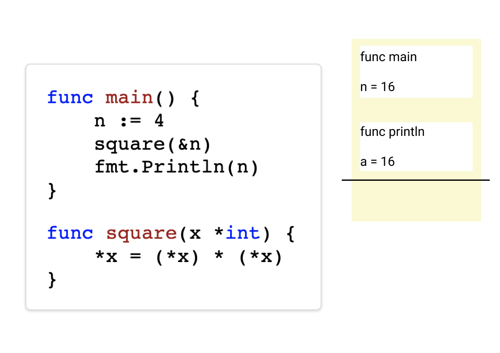
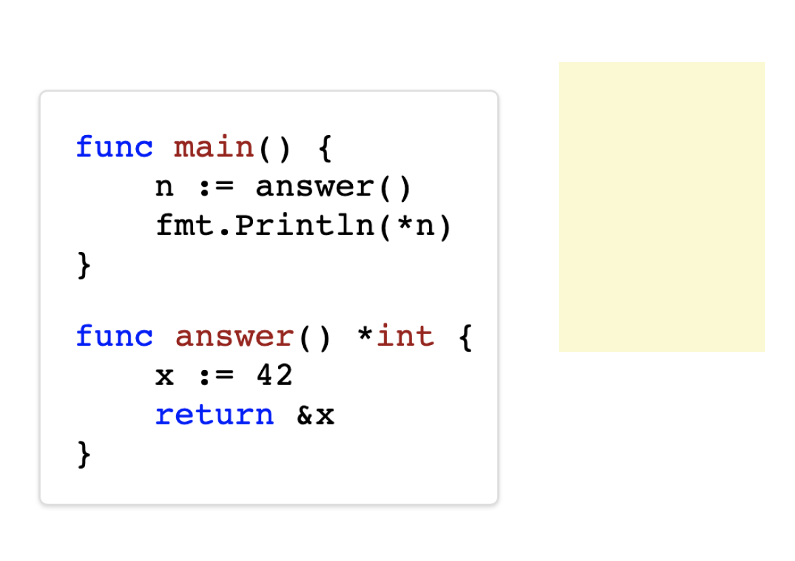
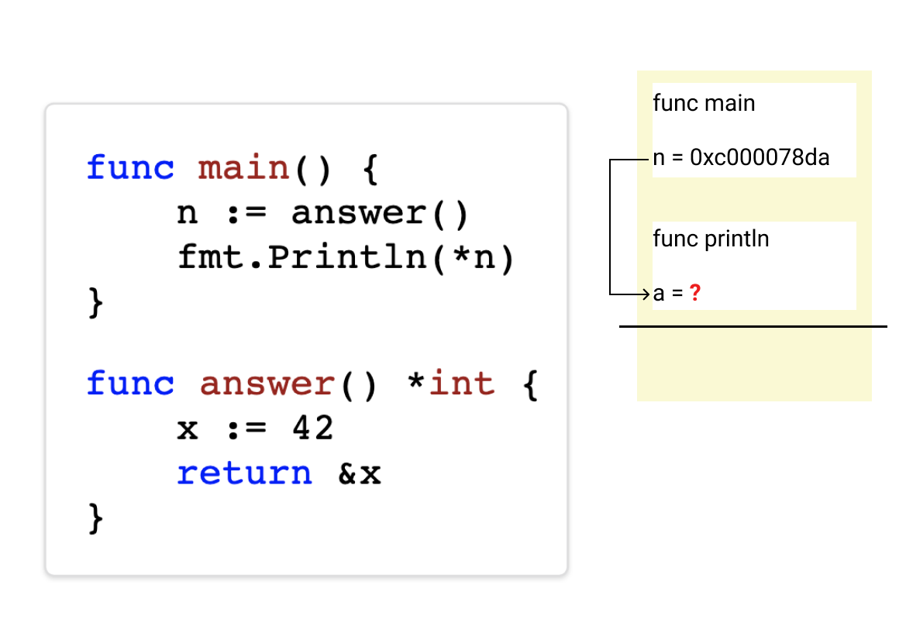

background-image: url(../img/title.svg)

---

background-image: url(../img/rec.svg)

---
background-image: url(../img/topic.svg)

.topic[Go внутри. Память и сборка мусора]
.tutor[Алексей Семушкин]
.tutor_desc[Software Engineer at Semrush]

---

background-image: url(../img/rules.svg)

---

# О чем будем говорить

* ### Зачем знать?
* ### Выделение памяти
* ### Сборка мусора

---

# Зачем?

## Зачем нам знать про работу Go с памятью?

Ведь все автоматически выделятеся и удаляется.

---

# Зачем?

- ### Не нужно, чтобы писать хорошие программы на Go.
- ### .<br>.
- ### .

---

# Зачем?

- ### Не нужно, чтобы писать хорошие программы на Go.
- ### Нужно, когда есть проблемы с производительностью из-за памяти.<br>(и есть пруфы!)
- ### .

---

# Зачем?

- ### Не нужно, чтобы писать хорошие программы на Go.
- ### Нужно, когда есть проблемы с производительностью из-за памяти.<br>(и есть пруфы!)
- ### Важно знать поведение, а не то, как все устроено.

---

# Память процесса в Linux

.threefour-image[

]

---

# Stack vs Heap

.full-image[

]

---

# Go: Stack vs Heap

## Как узнать, где Go выделит память?
## .

---

# Go: Stack vs Heap

## Как узнать, где Go выделит память?
## Зачем это знать? :)

---

# Go: Stack

.full-image[

]

---

# Go: Stack

.full-image[

]

---

# Go: Stack

.full-image[

]

---

# Go: Stack

.full-image[

]

---

# Go: Stack

.full-image[

]

---

# Go: Stack pointer

.full-image[

]

---

# Go: Stack pointer

.full-image[

]

---

# Go: Stack pointer

.full-image[

]

---

# Go: Stack pointer

.full-image[

]

---

# Go: Stack pointer

.full-image[

]

---

# Go: Stack pointer

.full-image[

]

---

# Go: Heap

.full-image[

]

---

# Go: Heap

.full-image[

]

---

# Go: Heap

.full-image[

]

---

# Go: Heap

.full-image[

]

---

# Go: Heap

.full-image[

]

---

# Go: Heap

.full-image[

]

---

# Go: Heap

.full-image[

]

---

# Go: Heap

.full-image[

]

---

# Go: Heap

.full-image[

]

---

# Go: Stack vs Heap

## Как узнать, где Go выделит память?

---

# Go: Stack vs Heap

## Никак.

Только компилятор знает, где будет выделена память.

---

# Go: escape analysis

```
go build -gcflags="-m"
```

```
...

./full.go:12:2: moved to heap: x

...

./full.go:7:14: *n escapes to heap

...
```

---

# Go: Stack vs Heap

## Зачем знать, где Go выделит память?

---

# Алгоритм выделения памяти

.full-image[
  
]

---

# Простое правило

# Уменьшайте количество<br>ненужных аллокаций.

---

# Go: Stack vs Heap (вопрос)

Почему `io.Reader` имеет такой интерфейс?
```
type Reader interface {
	Read(p []byte) (n int, err error)
}
```

А не такой?
```
type Reader interface {
	Read(n int) (p []byte, err error)
}
```

---

# Выделение памяти: фрагментация


---

# Выделение памяти: фрагментация (спаны)


---

# Выделение памяти: классы Span'ов

Конкретный Span хранит:
- объекты одного размера (классы)
- объекты либо с указателями, либо без (нужно для gc)

```
// runtime/sizeclasses.go

// class  bytes/obj  bytes/span  objects  tail waste  max waste
//     1          8        8192     1024           0     87.50%
//     2         16        8192      512           0     43.75%
//     3         32        8192      256           0     46.88%
...
//    33       1152        8192        7         128     12.41%
//    34       1280        8192        6         512     15.55%
//    35       1408       16384       11         896     14.00%
...
//    65      27264       81920        3         128     10.00%
//    66      28672       57344        2           0      4.91%
//    67      32768       32768        1           0     12.50%
```

---

# Выделение памяти: основные понятия

* ### Arena - большой кусок памяти (64 МБ)
* ### Page - кусочек Арены (8 KБ)
* ### Span - несколько страничек подряд


---

# Выделение памяти: общая картина

.threefour-image[
  
]

---

# Алгоритм выделения памяти

.full-image[
  
]

https://golang.org/src/runtime/malloc.go#L905

---

# Сборка мусора: алгоритм

* ### Остановить ненадолго выполнение (STW - Stop The World)
* ### Разметить объекты в куче (алгоритм tricolor)
* ### Еще раз остановить все (STW - Stop The World)
* ### Освобождать память по ходу работы

---

# Сборка мусора: STW

* ### Останавливает все горутины.
* ### .
* ### .

---

# Сборка мусора: STW

* ### Останавливает все горутины.
* ### Обычно отрабатывает очень быстро (~100 мкс).
* ### .

---

# Сборка мусора: STW

* ### Останавливает все горутины.
* ### Обычно отрабатывает очень быстро (~100 мкс).
* ### Не ждет горутины в syscalls.

---

# Сборка мусора: STW

* ### Переключает рантайм в режим Мarking.
* ### Вклчючает Write Barrier.

---

# Сборка мусора: разметка объектов

.full-image[
  
]

---

# Сборка мусора: разметка объектов

.full-image[
  
]

---

# Сборка мусора: разметка объектов

.full-image[
  
]

---

# Сборка мусора: разметка объектов

.full-image[
  
]

---

# Сборка мусора: разметка объектов

.full-image[
  
]

---

# Сборка мусора: STW

.full-image[
  
]

---

# Сборка мусора: memory barier

.full-image[
  
]

---

# Сборка мусора: memory barier

.full-image[
  
]

---

# Сборка мусора: memory barier

.full-image[
  
]

---

# Сборка мусора: чего это стоит?

---

# Сборка мусора: чего это стоит?

* ### 25% CPU
* ### .

---

# Сборка мусора: чего это стоит?

* ### 25% CPU (иногда больше, если GC не успевает)
* ### .

---

# Сборка мусора: чего это стоит?

* ### 25% CPU (иногда больше, если GC не успевает)
* ### Замедление выделения памяти.

---

# Простое правило

# Уменьшайте количество<br>мусора.
Чисто не там где убирают, а там, где не мусорят.

---

# Сборка мусора: моменты запуска

* ### По времени.

* ### По количеству выделенной памяти.

* ### Вручную (`runtime.GC()`).

---

# Сборка мусора: GOGC

.threefour-image[

]

---

# Простое правило

# Не трогайте GOGC.<br><br>Уменьшайте количество<br>ненужных аллокаций<br>и мусора.

---

background-image: url(../img/questions.svg)

---

background-image: url(../img/poll.svg)

---

background-image: url(../img/next_webinar.svg)
.announce_date[15 сентября]
.announce_topic[Работа с вводом/выводом в Go]

---
background-image: url(../img/thanks.svg)

.tutor[Алексей Семушкин]
.tutor_desc[Software Engineer at Semrush]
