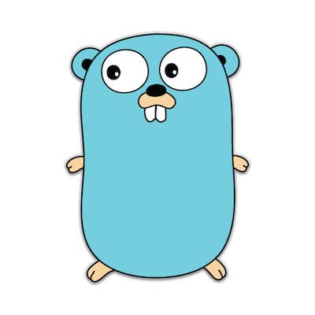

.center.icon[]

---

class: top white
background-image: url(img/sound.svg)
background-size: 130%
.top.icon[]

.sound-top[
  # Как меня слышно и видно?
]

.sound-bottom[
  ## > Напишите в чат
  ### **+** если все хорошо
  ### **-** если есть проблемы cо звуком или с видео
]

---


class: white
background-image: url(img/message.svg)
.top.icon[]

# Примитивы синхронизации <br> в Go. Часть 2.

### Алексей Бакин

---

# Как проходит занятие

* ### Активно участвуем - задаем вопросы.
* ### Чат вижу - могу ответить не сразу.
* ### После занятия - оффтопик, ответы на любые вопросы.

---

# О чем будем говорить

* ### go memory model
* ### sync.RWMutex
* ### sync.Cond
* ### sync.Pool
* ### atomic

---

# Настройка на занятие

.left-text[
Пожалуйста, пройдите небольшой тест.
<br><br>
Он поможет понять, что вы уже знаете,
а&nbsp;что предстоит узнать во время занятия.
<br><br>
Ссылка в чате
]

.right-image[

]

---

# Модель памяти Go

```
func main() {
	text := ""
	isInit := false
	go func() {
		text = "go-go-go"
		isInit = true
	}()

	for !isInit {
		time.Sleep(time.Nanosecond)
	}
	fmt.Println(text)
}
```

---

# Модель памяти Go

https://golang.org/ref/mem
<br/>
<br/>

If you must read the rest of this document to understand the behavior of your program, you are being too clever.
<br/>
<br/>

Don't be clever.

---

# sync.Mutex

```
type Counters struct {
    mu sync.Mutex
    m  map[string]int
}

func (c *Counters) Load(key string) (int, bool) {
    c.mu.Lock()
    defer c.mu.Unlock()
    val, ok := c.m[key]
    return val, ok
}

func (c *Counters) Store(key string, value int) {
    c.mu.Lock()
    defer c.mu.Unlock()
    c.m[key] = value
}
```

https://goplay.space/#Qp-w_QsOleR

---

# sync.RWMutex

```
type Counters struct {
    mu sync.RWMutex
    m  map[string]int
}

func (c *Counters) Load(key string) (int, bool) {
    c.mu.RLock()
    defer c.mu.RUnlock()
    val, ok := c.m[key]
    return val, ok
}

func (c *Counters) Store(key string, value int) {
    c.mu.Lock()
    defer c.mu.Unlock()
    c.m[key] = value
}
```

https://goplay.space/#1Itioa-0cXF

---

# Cache contention

.full-image[

]

При блокировке на чтение каждое ядро обновляет счетчик.
Следующие ядра - вычитывают значение из кэша предыдущего.

https://habr.com/ru/post/338718/

---

# sync.Map

### Решает проблему map + rwmutex.

.full-image[

]

---

# sync.Map

```
type Map struct {
}

func (m *Map) Delete(key interface{})
func (m *Map) Load(key interface{}) (value interface{}, ok bool)
func (m *Map) LoadOrStore(key, value interface{}) (actual interface{}, loaded bool)
func (m *Map) Range(f func(key, value interface{}) bool)
func (m *Map) Store(key, value interface{})
```

https://www.youtube.com/watch?v=C1EtfDnsdDs

---

# sync.Map

```
type Counters struct {
	m sync.Map
}

func (c *Counters) Load(key string) (int, bool) {
	val, _ := c.m.Load(key)
	v, ok := val.(int)
	return v, ok
}

func (c *Counters) Store(key string, value int) {
	c.m.Store(key, value)
}

func (c *Counters) Range(f func(k string, v int) bool) {
	c.m.Range(func(k, v interface{}) bool {
		return f(k.(string), v.(int))
	})
}
```

https://goplay.space/#5CbUZMh7cIT

---

# Практика

```
// Сделайте тип Worker потокобезопасным
// с помощью mutex или rwmutex.
// Объясните свой выбор.

type Worker struct {
	ready bool
}

func (w *Worker) setReady() {
	w.ready = true
}

func (w *Worker) CheckReady() bool {
	return w.ready
}
```

https://goplay.space/#djgdo2jollq

---

# sync.Cond

Cond(ition variable) - механизм для ожидания горутинами сигнала о событии

```
type Cond struct {
    L Locker
}

func NewCond(l Locker) *Cond

func (c *Cond) Broadcast() // будит все горутины, которые ждут c

func (c *Cond) Signal() // будит одну горутину, которая ждет c, если такая есть

func (c *Cond) Wait() // разблокирует c.L, ждет сигнала и снова блокирует c.L
```

---

# sync.Cond

```
func worker() {
	for task := range tasks {
		task()
	}
}

func produce(task func()) {
	tasks <- task
}
```

---

# sync.Cond

```
func worker() {
	var task func()

	for !stopped {
		mu.Lock()
		for len(tasks) == 0 { // <=== for, а не if! Почему?
			cond.Wait()
		}
		task, tasks = tasks[0], tasks[1:]
		mu.Unlock()

		task()
	}
}

func produce(task func()) {
	mu.Lock()
	tasks = append(tasks, task)
	mu.Unlock()

	cond.Broadcast()
}
```

https://goplay.space/#FPuOkRPJzDh

---

# sync.Cond: практика

```
// Доработайте тип Worker
// с помощью sync.Cond.

func (w *Worker) WaitReady() {
	for !w.CheckReady() {
		time.Sleep(100 * time.Millisecond)
	}
}
```

https://goplay.space/#zq5RB88skD8

---

# sync.Pool

```
type Pool struct {
    New func() interface{}
}

func (p *Pool) Get() interface{}


func (p *Pool) Put(x interface{})
```

---

# sync.Pool

```
type Person struct {
	name string
}

type PersonPool struct {
	pool sync.Pool
}

func NewPersonPool() *PersonPool {
	return &PersonPool{
		pool: sync.Pool{
			New: func() interface{} { return new(Person) },
		},
	}
}

func (p *PersonPool) Get() *Person {
	return p.pool.Get().(*Person)
}

func (p *PersonPool) Put(person *Person) {
	p.pool.Put(person)
}
```

---

# sync.Pool

```
func BenchmarkWithPool(b *testing.B) {
	pool := NewPersonPool()

	for i := 0; i < b.N; i++ {
		person := pool.Get()
		person.name = "Ivan"
		pool.Put(person)
	}
}

func BenchmarkWithoutPool(b *testing.B) {
	for i := 0; i < b.N; i++ {
		person := &Person{name: "Ivan"}
		gPerson = person
	}
}
```

---

# sync.Pool

```
func BenchmarkWithPoolGC(b *testing.B) {
	pool := NewPersonPool()

	for i := 0; i < b.N; i++ {
		person := pool.Get().(*Person)
		person.name = "Ivan"
		pool.Put(person)
		if (i % gcFreq) == 0 {
			runtime.GC()
		}
	}
}

func BenchmarkWithoutPoolGC(b *testing.B) {
	for i := 0; i < b.N; i++ {
		person := &Person{name: "Ivan"}
		gPerson = person
		if (i % gcFreq) == 0 {
			runtime.GC()
		}
	}
}
```

---

# atomic

* Store/Load
* Add
* CompareAndSwap

https://golang.org/pkg/sync/atomic/

---

# Повторение

.left-text[
Давайте проверим, что вы узнали за этот урок, а над чем стоит еще поработать.
<br><br>
Ссылка в чате
]

.right-image[

]

---

# Опрос

.left-text[
Заполните пожалуйста опрос
<br><br>
Ссылка в чате.
]

.right-image[

]

---

class: white
background-image: url(img/message.svg)
.top.icon[]

# Спасибо за внимание!
