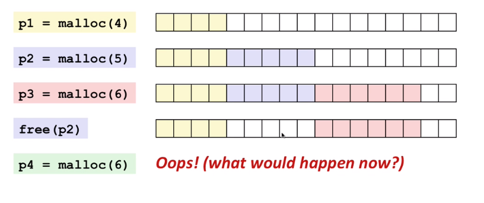

.center.icon[]

---

class: top white
background-image: url(img/sound.svg)
background-size: 130%
.top.icon[]

.sound-top[
  # Как меня слышно и видно?
]

.sound-bottom[
  ## > Напишите в чат
  ### **+** если все хорошо
  ### **-** если есть проблемы cо звуком или с видео
  ### !проверить запись!
]

---

class: white
background-image: url(img/message.svg)
.top.icon[]

# Go Memory

### Дмитрий Смаль

---

# План занятия

.big-list[
* Память процесса в Linux
* Структура стеков в Go
* Выделение памяти на стеке
* Структура кучи в Go
* Выделение памяти в куче (различные сценарии)
* Механизм сборки мусора в Go
]

---

# Память процесса в linux

.main-image[

]
---

# Память процесса в linux

.small[
```
$ cat /proc/5913/maps | tac

ffffffffff600000-ffffffffff601000 r-xp 00000000 00:00 0    [vsyscall]
7ffeb2fb2000-7ffeb2fb4000 r-xp 00000000 00:00 0            [vdso]
7ffeb2faf000-7ffeb2fb2000 r--p 00000000 00:00 0            [vvar]
7ffeb2f39000-7ffeb2f5a000 rw-p 00000000 00:00 0            [stack]
7f2e908f9000-7f2e908fa000 rw-p 00000000 00:00 0
...
7f2e906ca000-7f2e906cc000 rw-p 001eb000 09:02 130089146    /lib/x86_64-linux-gnu/libc-2.27.so
7f2e906c6000-7f2e906ca000 r--p 001e7000 09:02 130089146    /lib/x86_64-linux-gnu/libc-2.27.so
...
7f2e8d6af000-7f2e900c0000 rw-p 00000000 00:00 0
7f2e8d6ae000-7f2e8d6af000 ---p 00000000 00:00 0
...
7f2dc0021000-7f2dc4000000 ---p 00000000 00:00 0
7f2dc0000000-7f2dc0021000 rw-p 00000000 00:00 0
c000e00000-c004000000 rw-p 00000000 00:00 0
c000800000-c000e00000 rw-p 00000000 00:00 0
c000000000-c000800000 rw-p 00000000 00:00 0
02ca4000-02cc5000 rw-p 00000000 00:00 0                    [heap]
00d57000-00d7a000 rw-p 00000000 00:00 0
00d1f000-00d57000 rw-p 0091f000 09:02 127405274            /usr/local/bin/mysync
00842000-00d1f000 r--p 00442000 09:02 127405274            /usr/local/bin/mysync
00400000-00842000 r-xp 00000000 09:02 127405274            /usr/local/bin/mysync
```
]
---

# Выделение памяти в linux

.big-list[
* Stack (System Stack) - не нужно, просто уменьшите регистр `SP`, нельзя выходить за `RLIMIT_STACK`
* Heap - системный вызов `brk`, устанавливает ограничение размера `Heap`
* Отдельные сегменты - системный вызовы `mmap`, позволяющий добавить в виртуальную память новый сегмент, отображенный на файл или просто физическую память.
]

Отличное видео по теме: [https://www.youtube.com/watch?v=bhdkFPGhxfI](https://www.youtube.com/watch?v=bhdkFPGhxfI)

---

# Особенности памяти в Go

.big-list[
* Используется множество горутин => необходимо множество мелких стеков, располагающихся в куче
* Автоматическое управление памятью => есть механизм аллокации/сборки мусора => запрос памяти у OS происходит большими фрагментами (arena)
]
---

# Выделение на стеке в Go

.right-code[
```
//go:noinline
func HalfSum(a, b int) int {
	c := a + b
	c /= 2
	return c
}

func main() {
	s := HalfSum(1, 2)
	fmt.Println(s)
}
```
]

.left-code[
```
TEXT main.main(SB) /Users/mialinx/tmp/scrpt/main.go
func main() {
  0x1092f50	MOVQ GS:0x30, CX
  0x1092f59	CMPQ 0x10(CX), SP
  0x1092f5d	JBE 0x1092ff6
  0x1092f63	SUBQ $0x58, SP
  0x1092f67	MOVQ BP, 0x50(SP)
  0x1092f6c	LEAQ 0x50(SP), BP
	s := HalfSum(1, 2)
  0x1092f71	MOVQ $0x1, 0(SP)
  0x1092f79	MOVQ $0x2, 0x8(SP)
  0x1092f82	CALL main.HalfSum(SB)
  0x1092f87	MOVQ 0x10(SP), AX
	fmt.Println(s)
  0x1092f8c	MOVQ AX, 0(SP)
  0x1092f90	CALL runtime.convT64(SB)
  0x1092f95	MOVQ 0x8(SP), AX
  0x1092f9a	XORPS X0, X0
  0x1092f9d	MOVUPS X0, 0x40(SP)
  0x1092fa2	LEAQ runtime.types+66176(SB), CX
  0x1092fa9	MOVQ CX, 0x40(SP)
  0x1092fae	MOVQ AX, 0x48(SP)
  0x1092fb3	90			NOPL
	return Fprintln(os.Stdout, a...)
```
]
---

# Фрейм стека в Go
.main-image[

]
---

# Цена выделения на стеке

Рассмотрим функцию `main`:

```
$ go tool objdump -s main.main prog

...
TEXT main.main(SB) /Users/mialinx/tmp/prog/main.go
func main() {
  0x10949a0		MOVQ GS:0x30, CX
  0x10949a9		CMPQ 0x10(CX), SP
  0x10949ad		JBE 0x1094a64
...
  0x1094a64		CALL runtime.morestack_noctxt(SB)
  0x1094a69		JMP main.main(SB)
...
```

В Go используются очень небольшие стеки (2Кб) поэтому перед вызовом функции
производится проверка и увеличение стека при необходимости. Память под стек
выделяется в той же куче. Стек может быть перемещен.

---

# Проблема выделения памяти в куче

.main-image[
  
]
---

# Структура кучи в Go

.big-list[
* Память у OS запрашивается большими кусками `Arena` = 64Мб (linux)
* Внутри `Arena` память разбивается на фиксированные страницы `Page` = 8Кб
* Подряд идущие страницы объединяются в интервалы `Span`, различной длинны
]


---

# Общая картина

.main-image[
  
]

---

# Arena

Для каждой области `Arena` создается структура с мета-информацией:
<br>
```
// runtime/mheap.go

type heapArena struct {
  // битовая карта указателей в арене
	bitmap [heapArenaBitmapBytes]byte

  // карта принадлежности страниц конкретным Span-ам
	spans [pagesPerArena]*mspan

	// карта, показывающая какие Span в состоянии Used
	pageInUse [pagesPerArena / 8]uint8

  // для GC
	pageMarks [pagesPerArena / 8]uint8
}
```

---

# Span - последовательный блок памяти

Для каждого выделенного Span так же есть структура (не все поля!!):
<br>

```
// runtime/mheap.go

type mspan struct {
  next *mspan           // следующий span в списке
  prev *mspan           // предыдущий

  startAddr uintptr     // начало адресуемой памяти
  npages    uintptr     // количество 8Кб страниц
  nelems uintptr        // количество "объектов" в span
  allocCount  uint16    // количество "выделенных" объектов
  elemsize    uintptr   // размер "объекта" в span
  limit       uintptr   // конец адресуемой памяти

  allocBits  *gcBits    // (*uint8) карта выделенных объектов
  gcmarkBits *gcBits    // (*uint*) карта отметок для GC

  spanclass   spanClass // класс span, типовой размер объекта )
  ...
}
```

---

# Внутренняя структура Span

.main-image[
  
]

---

# Классы Span-ов

Span разделяются на классы в зависимости от того объекты какого размера в них размещаются,
а так же от наличия указателей внутри объекта (scan/noscan).

```
// runtime/sizeclasses.go

// class  bytes/obj  bytes/span  objects  tail waste  max waste
//     1          8        8192     1024           0     87.50%
//     2         16        8192      512           0     43.75%
//     3         32        8192      256           0     46.88%
...
//    33       1280        8192        6         512     15.55%
//    34       1408       16384       11         896     14.00%
//    35       1536        8192        5         512     14.00s
...
//    64      27264       81920        3         128     10.00%
//    65      28672       57344        2           0      4.91%
//    66      32768       32768        1           0     12.50%
```

---

# mheap - основная структура

```
// runtime/mheap.go
type mheap struct {
  lock      mutex
  free      mTreap  // дерево свободных span-ов
 
  // списки свободных и занятых Span-ов по классам
  central [numSpanClasses]struct {
    mcentral mcentral
  }

  // массив выделеных Arena (см arenaIndex)
  arenas [1 << arenaL1Bits]*[1 << arenaL2Bits]*heapArena

  sweepgen  uint32         // итерация GC
  sweepSpans [2]gcSweepBuf // спискс Span-ов для очистки Gc
}

// runtime/mcentral.go
type mcentral struct {
  lock      mutex
  spanclass spanClass
  nonempty  mSpanList // список Span в которых есть свободный объект
  empty     mSpanList // список полностью занятых Span 
}
```
---

# Локальные кеши

Локальный (для каждого ядра) кеш содержит по одному Span каждого класса.
<br>
```
type mcache struct {
  // для выделения очень мелких объектов (tiny класс)
	tiny             uintptr
	tinyoffset       uintptr
	local_tinyallocs uintptr // number of tiny allocs not counted in other stats

  // кеш Span-ов готовых для выделения, по одному каждого класса
	alloc [numSpanClasses]*mspan

  // кеш стэков различных размеров
	stackcache [_NumStackOrders]stackfreelist
  ...
}
```
<br>
Это позволяет горутинам (в большинстве случаев) выделять выделять память без обращения 
к общей куче и без блокировок.

---

# Общая картина

.main-image[
  
]

---

# Алгоритм выделения памяти

.main-image[
  
]

---

# Алгоритм освобождения

.big-list[

* В какой-то момент времени в занятом Span освобождается место

* Возвращаем Span в соответствующий список свободных Span-ов `mheap.central[cls].mcentral.nonempty`

* Если Span полностью полностью свободен, пытаемся соединить с соседними (`coalesce`) и возвращаем в дерево свободных Span-ов `mheaf.free`
]

Как освобождается память внутри Span ?

---


# Сборка мусора

В Go для сборки мусор используется алгоритм Concurrent Mark & Sweep

<br><br><br>

.left-image[

]

.right-text[
Корневые объекты в Go:
<br><br>
* Глобальные переменные

* Стеки выполняющихся горутин
]

---

# Переход между объектами

GC работает с областями памяти и не знает про типы объектов. <br>
Как GC может перейти "по указателям" в объектах ?
<br><br>
.left-text[
Допустим у нас есть объект типа:

```
type Row struct {
  index int
  data []interface{}
}
```
]
.right-image[

]

<br><br>
В типе данного объекта хранится информация о расположении указателей.<br>
При выделении памяти под объект эта информации сохраняется в битовой карте соответствующей `heapArena`
---

# Битовые карты указателей

.main-image[

]

---

# Изменение топологии

Допустим у нас есть код вида
```
func code(jobs <-chan interface{}) {
    // do some work
    // gc marked the stack as black
    // do some work
    job := <- chan
    // do some work
}
```
И мы перемещаем указатель до того как GC успел его пометить
<br><br>
.left-image[

]
.right-image[

]

---

# Write barriers

Для того что бы избежать потери объекта, компилятор преобразует присвоения указателей
в специальные вызовы:

.main-image[

]

Здесь `shade` - отмечает объект серым и помещает в очередь GC для дальнейшего анализа.
Write barriers активны только на этапе разметки объектов `_GCMark`.

---

# Очистка Span

После того как все объекты в Span размечены, очистка осуществляется простой заменой битовых масок.
<br><br>


---

# Фазы работы GC

`runtime.gcStart` - точка входа в Garbage collector.
<br><br>

#### Завершение очистки
* завершение очистки Span-ов из `mheap_.sweepSpans[1-sg/2%2]`
* запуск горутин `gcBgMarkWorker` для разметки объектов
  
#### _GCMark
* stop the world
* завершение очисти Span-ов
* инициализация очереди разметки корневыми объектами
* start the world
* ожидание завершения всех `gcBgMarkWorker`

#### _GCmarktermination
* stop the world
* завершение разметки Span-ов
* start the world
  
#### _GCoff
* увеличивается итерация GC `mheap_.sweepdone`
* фоновая очистка Span-ов из `mheap_.sweepSpans[1-sg/2%2]`
  
---

# Моменты запуска GC

.big-list[

* периодически из потока `sysmon`, если прошло достаточно много времени с последнего запуска
  
* после выделения памяти, если выделен большой Span или не удалось выделить быстро
 
* при ручном вызове `runtime.GC()`

]

---

# Ссылки

.big-list[
* [http://goog-perftools.sourceforge.net/doc/tcmalloc.html](http://goog-perftools.sourceforge.net/doc/tcmalloc.html)
* [https://programmer.help/blogs/exploration-of-golang-source-code-3-realization-principle-of-gc.html](https://programmer.help/blogs/exploration-of-golang-source-code-3-realization-principle-of-gc.html)
* [https://blog.golang.org/ismmkeynote](https://blog.golang.org/ismmkeynote)
* !!! [https://about.sourcegraph.com/go/gophercon-2018-allocator-wrestling](https://about.sourcegraph.com/go/gophercon-2018-allocator-wrestling)
* [http://gchandbook.org](http://gchandbook.org)
]

---

# Опрос

.left-text[
Заполните пожалуйста опрос
<br><br>
[https://otus.ru/polls/4561/](https://otus.ru/polls/4561/)

]

.right-image[

]

---

class: white
background-image: url(img/message.svg)
.top.icon[]

# Спасибо за внимание!
