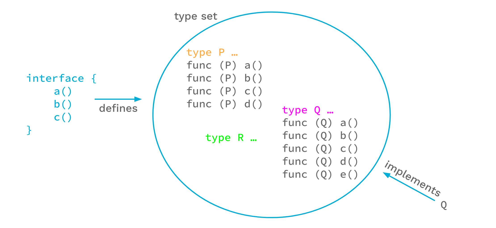

background-image: url(../img/title.svg)

---

background-image: url(../img/rec.svg)

---
background-image: url(../img/topic.svg)

.topic[Дженерики в Go]
.tutor[Родион Ступников]
.tutor_desc[Software Engineer]

---

background-image: url(../img/rules.svg)

---

# О чем будем говорить:
- Что такое дженерики
- Внутреннее устройство
- Базовые типы в контексте дженериков
- Интерфейсы в контексте дженериков
- Примеры использования

---

# Дженерики
- Дженерики - это инструмент обобщенного программирования, которые позволяет писать обощенный код для разных типов данных
без необходимости его дублирования или использования интерфейсов. По сути это такой placeholder для типов,
в который можно подставить нужный тип при разработке.

---

# Дженерики в Golang

- Появились в go1.18
- Продолжают развиваться
- Примеры актуальны для go1.21

---


# Функция без дженериков

```

func IMax(a, b int) int {
    if a > b {
        return a
    }
    return b
}

func SMax(a, b string) string {
    if a > b {
        return a
    }
    return b
}

```

---

# Функция с дженериком

```
func GMax[T interface{ string | int }](a, b T) T {
	if a > b {
		return a
	}
	return b
}
```

https://go.dev/play/p/xKo8N-LwcOJ

---

# Функция с дженериком

```go
type Numbers interface {
	int | int32 | int64 | float64
}

func NMax[T Numbers](a, b T) T {
	if a > b {
		return a
	}
	return b
}
```

---

# Дженерики изнутри

### Мономорфизация типов


При работе с базовыми типами-значениями, наподобие `int`, `float64`, `uint32`, 
компилятор будет по сути создавать несколько копий функции с дженериками для разных типов.


---

# Дженерики изнутри

### Мономорфизация типов

В исходном коде есть такая функция:
```go
func Scale[T Number](i T) T {
	return i * i
}
```
Если весь проект использует ее только с `int64`, и `float64`,
то компилятор фактически создаст  функции приведенные ниже:

```go
func Scale(i int64) int64 {
	return i * i
}

func Scale(i float64) float64 {
    return i * i
}
```

---

# Дженерики изнутри

GCShape (или группа gcshape) — это набор типов,
которые могут использовать один и тот же экземпляр универсальной функции/метода
в нашей реализации, если он указан в качестве одного из аргументов типа.

То есть это объединение типов, которые могут использовать
одну и ту-же сгенерированную дженерик-функцию.

---

# Дженерики изнутри

## GCShape

* В скомпилированном коде GCShape выглядит как обычная ссылка фиксированного размера, 
за которой может скрываться любой объект.

* Это было сделано для того, чтобы при множестве разнообразных типов, 
с которыми может использоваться дженерик-функция,
время компиляции оставалось достаточно быстрым.

---


# Дженерики изнутри

## GCShape

* Общий GCShape имеют базовый и производные от него типы:

```go
type Point int
```
В описанном выше случае `int` и `Point` попадут в один GShape, 
поскольку являются родственными типами и поддерживают один и тот же набор операций.

---


# Дженерики изнутри

## GCShape

* В один GCShape попадают все типы-поинтеры. К примеру это
  поинтеры на любые переменные:  `*time.Time`, `*uint64`, `*bytes.Buffer`, `*strings.Builder`.

* Таким образом рантайм языка при исполнении такой функции должен обратиться к словарю типов, 
который является обычной хеш-мапой.

Подробнее можно прочитать здесь:
https://habr.com/ru/articles/660007/
---


# Констрейты (ограничения типов)

У каждого параметра-типа обязательно указывается ограничение типа.
Констрейт - это интерфейс, который описывает, каким может быть тип.
Этот интерфейс может быть обычным go-интерфейсом:

```
type OwnConstraint interface {
	String() string
}
```

А может быть интерфейсом, перечисляющим полный список типов, для которых он может быть использован,
а **использован он может быть только внутри дженериков:**

```
type OwnConstraint interface {
	int | int8 | int16 | int32 | int64
}
```

```
type OwnConstraint interface {
	~int | ~int8 | ~int16 | ~int32 | ~int64
}
```

---

# Type-Set


До недавнего времени в спецификации Go говорилось, что интерфейс определяет набор методов (Method-Set), 
который строится из списка методов, описанных в интерфейсе.
Любой тип, реализующий все эти методы, реализует этот интерфейс.

.full-image[

]

---

# Type-Set

Но можно посмотреть на это иначе, сказав,
что интерфейс определяет набор типов (Type-Set), которые реализуют необходимый набор методов.
С этой точки зрения любой тип, являющийся элементом Type-Set интерфейса,
реализует интерфейс.

.full-image[

]

---

# Type-Set

В данном случае представление набора типов имеет преимущество перед
представлением набора методов: мы можем явно добавлять типы в набор и, 
таким образом, управлять набором типов по-новому.
.full-image[

]

---

# Мешать их нельзя

```
type OwnConstraintWithMethods interface {
	String() string
}

type OwnConstraint interface {
	int | int8 | int16 | int32 | int64 | OwnConstraintWithMethods
}
```

```
cannot use main.OwnConstraintWithMethods in union (main.OwnConstraintWithMethods contains methods)
```

---

# Build-in констрейнты

```
// any is an alias for interface{} and is equivalent to interface{} in all ways.
type any = interface{}

// comparable is an interface that is implemented by all comparable types
// (booleans, numbers, strings, pointers, channels, arrays of comparable types,
// structs whose fields are all comparable types).
// The comparable interface may only be used as a type parameter constraint,
// not as the type of a variable.
type comparable interface{ comparable }
```

---

# Библиотечные готовые констрейнты


https://pkg.go.dev/golang.org/x/exp/constraints

```
type Complex
type Float
type Integer
type Ordered
type Signed
type Unsigned
```

---
# Библиотечные готовые констрейнты

Как они описаны внутри
```go
type Unsigned interface {
    ~uint | ~uint8 | ~uint16 | ~uint32 | ~uint64 | ~uintptr
}

type Signed interface {
    ~int | ~int8 | ~int16 | ~int32 | ~int64
}

type Integer interface {
    Signed | Unsigned
}

type Ordered interface {
    Integer | Float | ~string
}

type Float interface {
   // Как думаете, как описан констрейнт Float?
}
```

---

# Библиотечные готовые констрейнты

```go
type Float interface {
	~float32 | ~float64
}
```

---

# Конвертация c дженериками

```go
func ConvertMap[K comparable, FROM, TO Numbers](in map[K]FROM) map[K]TO {
    nMap := make(map[K]TO, len(in))
    for k, v := range in {
        nMap[k] = TO(v)
    }
    return nMap
}
```

Пример использования
```go
convert := ConvertMap[string, float64, int64]
newMap := convert(oldMap)
```

https://go.dev/play/p/fHTlRuhkgPL


---

# Производные типы

```
type Numbers interface {
	int
}

func NMax[T Numbers](a, b T) T {
	if a > b {
		return a
	}
	return b
}
```

```go
type Price int
NMax(Price(2), Price(3))
```

https://go.dev/play/p/-lFCCr64Gsf

---


# Производные типы

Заменим тип `int` на `~int`
```
type Numbers interface {
	~int // <===
}

func NMax[T Numbers](a, b T) T {
	if a > b {
		return a
	}
	return b
}
```

```go
type Price int
NMax(Price(2), Price(3))
```

https://go.dev/play/p/1tZ81nrFX_U


---


# Cтруктуры

```
type ListNode[T any] struct {
	value T
	next  *ListNode[T]
}

type List[T any] struct {
	head *ListNode[T]
}

func (l *List[T]) Push(value T) {
	l.head = &ListNode[T]{value, l.head}
}

func (l *List[T]) Pop() T {
	if l.head == nil {
		panic("list is empty")
	}

	value := l.head.value
	l.head = l.head.next
	return value
}
```

https://go.dev/play/p/60EyJgE6nYl

---

#  Методы


Правила работы с методами немного другие

```
type Data[T1, T2 any] struct {
	value1 T1
	value2 T2
}

func (l *Data[T1, T2]) Print() {
	fmt.Println(l.value1, l.value2)
}

func (l *Data[T1, T2]) PrintWith[T any](value T) {
	fmt.Println(l.value1, l.value2, value)
}

func main() {
	d := Data[int, float32]{}
	d.Print()
}
```

https://go.dev/play/p/4ooRw0u1w8S

```
syntax error: method must have no type parameters
```

---

#  Дженерики в методах

Типы входных аргументов метода мы тоже обьявляем в структуре

```go
type Numbers interface {
	int64 | float64
}


type Summator[S, N Numbers] struct {
    sum S
}

func (s *Summator[S, N]) Add(n N) {
    s.sum += S(n)
}

func (s *Summator[S, N]) Result() S {
    return s.sum
}

```

https://go.dev/play/p/UbJwacICw0a

---

# Работа с типами слайсов

```go
func Scale[E Integer](s []E, c E) []E {
    r := make([]E, len(s))
    for i, v := range s {
        r[i] = v * c
    }
    return r
}
```
Обратите внимание, `Scale` возвращает тип `[]E`.

---

# Работа с типами слайсов

Сработает ли код?
```go
type Point int

type Points []Point

func (p Points) Print() {
    fmt.Println(p)
}

func main() {
    points := Points{1, 2, 3, 4}
    points.Print()
    newPoints := Scale(points, 2) // ?
    newPoints.Print()
}

```
https://go.dev/play/p/Rd6b915t8wp

---
# Работа с типами слайсов

```go
func Scale[S ~[]E, E Integer](s []E, c E) S {
    r := make([]E, len(s))
    for i, v := range s {
        r[i] = v * c
    }
    return r
}
```
Теперь `Scale` возвращает тип `S`.


Сработает ли код ниже?
```go
points := Points{1, 2, 3, 4}
points.Print()
newPoints := Scale[Points](points, 2) 
newPoints.Print()
```
https://go.dev/play/p/1v6hrN7Q_sK

---
# Работа с типами слайсов

```go
func Scale[S ~[]E, E Integer](s S, c E) S {
	r := make([]E, len(s))
	for i, v := range s {
		r[i] = v * c
	}
	return r
}
```

Теперь `Scale` возвращает тип `S` и принимает тип `S`.

Сработает ли код ниже?
```go
points := Points{1, 2, 3, 4}
points.Print()
newPoints := Scale(points, 2)
newPoints.Print()
```
https://go.dev/play/p/cauzAuQ7bVn

---

# Работа с хеш-мапами

Принцип работы с хеш-мапами и с другими сложными типами данных такой же как и со слайсами

```go
func Scale[M ~map[K]V, K comparable, V Integer](s M, c V) M {
	r := make(M, len(s))
	for i, v := range s {
		r[i] = v * c
	}
	return r
}
```

```go
points := Points{
    "one":  1,
    "two":  2,
    "four": 4,
}
points.Print()
newPoints := Scale(points, 2)
newPoints.Print()
```
https://go.dev/play/p/ujOjbJ0-Lts

---

# Полезные библиотеки

`samber/lo` - is a Lodash-style Go library based on Go 1.18+ Generics.
https://github.com/samber/lo

```go
names := lo.Uniq[string]([]string{"Samuel", "John", "Samuel"})
// []string{"Samuel", "John"}
```

---
# Полезные библиотеки

Generic Data Structures

https://github.com/zyedidia/generic

Для тех, кому мало массивов, слайсов и хеш-мап.
Содержит связанные списки, кучи, стеки, деревья и многое другое.

```go
	tr := trie.New[int]()
	tr.Put("foo", 1)
	tr.Put("fo", 2)
	tr.Put("bar", 3)

	fmt.Println(tr.Contains("f"))
	fmt.Println(tr.KeysWithPrefix(""))
	fmt.Println(tr.KeysWithPrefix("f"))
```
---

# Практика

* Напишите констрейнт Number, который в себя будет включать все возможные числа
* Сделайте так, чтобы функция Double работала со всеми описанными в main случаями


https://go.dev/play/p/eCu0G1WvXFd

---

# Дополнительная практика
* Реализуйте стек (LIFO) на дженериках и в main напишите пример его использования

Шаблон:
https://go.dev/play/p/pxhtar2bBN4


---

# Когда НАДО использовать дженерики

* Пытаться делуплицировать идентичные методы, принимающие string и []byte. Генерируемая при этом форма очень похожа на результат написания двух почти идентичных функций вручную.

* Использовать дженерики в структурах данных. Это бутет работать эффективнее, чем пустые интерфейсы и при этом сохраняется строгая типизация.

* Функции работающие с типами-значениями так же эффективны, как и продублированные вручную.

---

# Когда НЕ надо использовать дженерики

* Пытаться использовать дженерики для девиртуализации или встраивания вызовов методов.
  Лучше оставить интерфейсы, дженерики преимуществ не дадут.

```go
func main() {
	PrintStruct(SomeA{})
	PrintStruct(SomeB{})
}

type SomeA struct {}
func (s SomeA) Print() {fmt.Println("A!")}

type SomeB struct {}
func (s SomeB) Print() {fmt.Println("B!")}

type Interface interface {
	Print()
}

func PrintStruct[T Interface](s T) {
	s.Print()
}
```

---

background-image: url(../img/questions.svg)

---

background-image: url(../img/poll.svg)

---

background-image: url(../img/next_webinar.svg)
.announce_date[1 января]
.announce_topic[Тема следующего вебинара]

---
background-image: url(../img/thanks.svg)

.tutor[Лектор]
.tutor_desc[Должность]
