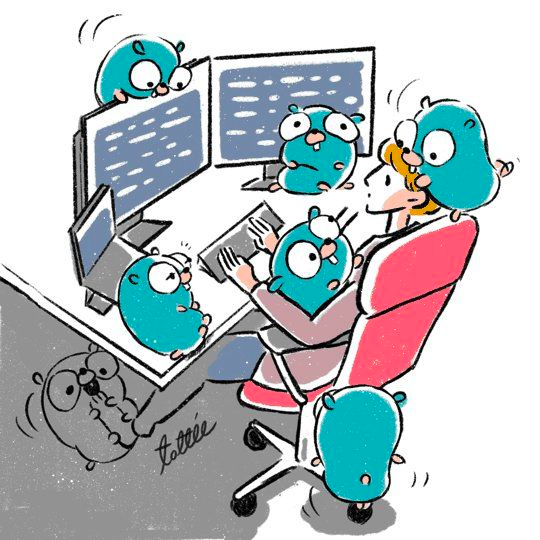

background-image: url(../img/title.svg)

---

background-image: url(../img/rec.svg)

---

background-image: url(../img/topic.svg)

.topic[Кодогенерация и AST]
.tutor[Олег Венгер]
.tutor_desc[Руководитель группы Защиты профилей в Wildberries]

---

background-image: url(../img/rules.svg)

---

# План занятия

* ### Поговорим о кодогенерации
* ### Посмотрим, где она может нам помочь
* ### Посмотрим что такое AST

---

# Кодогенерация

* ### Что это такое?

---

# Кодогенерация
* ### Зачем она нужна?
* ### Какие задачи помогает решить?

---

# Зачем нужна кодогененрация

* ### Генерировать код по метаописанию (swagger, protobuf, ...)
* ### Генерировать заглушки для интерфейсов
* ### Встраивать данные в код

<br><br>
Пример в стандартной библиотеке:<br>
https://golang.org/src/unicode/tables.go

---

# Go generate

```go
//go:generate echo "Hello, world!"

package main

import (
	"fmt"
)

func main() {
	fmt.Println("run any unix command in go:generate")
}
```

```shell
> go generate
Hello, world!
```

https://github.com/golang/go/blob/master/src/cmd/go/internal/generate/generate.go

---

# Цикл разработки пакета с go generate

```shell
	% edit …
	% go generate
	% go test

	% git add *.go  # коммитим сгенерированный код
	% git commit
```

---

# Принципы go generate

[Go generate: A Proposal](https://docs.google.com/document/d/1V03LUfjSADDooDMhe-_K59EgpTEm3V8uvQRuNMAEnjg/edit)

<br>

* ### Запускать на машине разработчика пакета, а не пользователя.
  * утилиты для генерации нужны только разработчику
  * генерация не происходит автоматически при go get

* ### Добавлять disclaimer.

```go
/*
* CODE GENERATED AUTOMATICALLY WITH tool name
* THIS FILE SHOULD NOT BE EDITED BY HAND
*/
```
* ### Работать только с .go-файлами, как часть тулкита go.

---

# Go generate

псевдоним:
```go
//go:generate -command foo go tool foo
```

exec:
```go
go generate -run enums
```

выводить команды:
```go
go generate -x

```

список команд к выполнению:
```
go generate -n
```

---

# Go embed

https://golang.org/pkg/embed/

```
//go:embed static/gopher.png
var gopherPngBytes []byte
```

---

# Stringer

```
go get golang.org/x/tools/cmd/stringer
```

```
func (t T) String() string
```

```
//go:generate stringer -type=MessageStatus
type MessageStatus int

const (
	Sent MessageStatus = iota
	Received
	Rejected
)
```

```
func main() {
	status := Sent
	fmt.Printf("Message is %s", status) // Message is Sent
}
```

---

# Генерация Marshal/Unmarshal: easyjson


```
go get -u github.com/mailru/easyjson/...
```

```
easyjson -all <file>.go
```

 <br>
Генерирует MarshalEasyJSON / UnmarshalEasyJSON, для структур из файла
<br>
Быстрее за счет отсутствия рефлексии
<br><br>


***
P.S. https://github.com/json-iterator/go

---

# Реализация интерфейсов: impl

```
go get -u github.com/josharian/impl
```

```
$ impl 'f *File' io.ReadWriteCloser
func (f *File) Read(p []byte) (n int, err error) {
    panic("not implemented")
}

func (f *File) Write(p []byte) (n int, err error) {
    panic("not implemented")
}

func (f *File) Close() error {
    panic("not implemented")
}
```


---

# Моки интерфейсов: gomock

```
GO111MODULE=on go get github.com/golang/mock/mockgen@latest
```

```
//go:generate mockgen -source=$GOFILE
//-destination ./mocks/mock_getter.go -package mocks Getter
type Getter interface {
    Get(url string) (resp *http.Response, err error)
}
```

---

# AST

### **AST** - это Abstract Syntax Tree, то есть дерево, которое в абстрактном виде представляет структуру программы. AST создаётся парсером по мере синтаксического разбора программы. В современных компиляторах AST и список диагностик (ошибок, предупреждений) - это два результата вызова модуля синтаксического разбора.

---

# AST: свойства

* ### AST не является бинарным деревом: например, у унарного оператора будет один дочерний узел 
* ### AST является гетерогенным деревом, состоящим из узлов разного типа 
* ### В этом AST похож на DOM-представление документа HTML/XML 
* ### В каждом поддереве дочерними узлами становятся лексически вложенные сущности: например, для узла объявления функции дочерними узлами являются инструкции, составляющие тело функции, а также объявления параметров функции (если они выделены в отдельные узлы AST волей автора компилятора)

---

# AST: go

* ### go/ast — декларирует типы дерева разбора;
* ### go/parser — разбирает исходный код в эти типы;
* ### go/printer — выливает AST в файл исходного кода;
* ### go/token — обеспечивает привязку дерева разбора к файлу исходного кода.

---

# Пример разбора

```go
package main

import "fmt"

func main() {
    fmt.Println("Hello, World!")
}
```

---

# Пример разбора

<p align="center">

</p>

---

# Практика

<p align="center">

</p>

---


# Что посмотрели:

- встраивание данных в код
- Stringer: String() для целочисленных типов: golang.org/x/tools/cmd/stringer
- easyjson для быстрой работы с JSON
- моки интерфейсов: github.com/josharian/impl
- AST и пример использования

Больше примеров для вдохновения:

https://github.com/avelino/awesome-go#generation-and-generics

---

background-image: url(../img/questions.svg)

---

background-image: url(../img/poll.svg)

---

background-image: url(../img/next_webinar.svg)
.announce_date[19 апреля]
.announce_topic[Дженерики в Go]

---
background-image: url(../img/thanks.svg)

.tutor[Олег Венгер]
.tutor_desc[Руководитель группы Защиты профилей в Wildberries]
