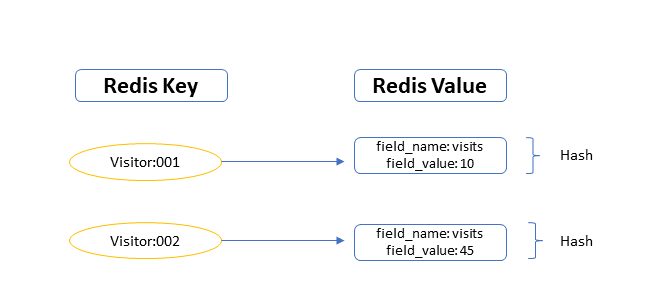

background-image: url(../img/title.svg)

---

background-image: url(../img/rec.svg)

---
background-image: url(../img/topic.svg)

.topic[Работа с NoSQL]
.tutor[Кристина Ступникова]
.tutor_desc[Software Engineer at Tabby]

---

background-image: url(../img/rules.svg)

---

# О чем будем говорить

- ### Обзор концепции NoSQL
- ### Отличия от реляционных БД
- ### Когда использовать NoSQL БД

---

# Обзор концепции NoSQL

- ### NoSQL (Not Only SQL) - это подход к хранению и обработке данных, который не ограничивается схемой данных и позволяет более свободно управлять информацией.

---

# Обзор концепции NoSQL

- ### NoSQL - это не конкретная технология, а семейство различных подходов к хранению данных.

.center-image.half-image[

]
---

# Основные отличия NoSQL БД от реляционных:

* Гибкая схема данных
* Горизонтальное масштабирование

.center-image.half-image[

]
---

# Основные отличия NoSQL БД от реляционных:

* Поддержка разных моделей данных (ключ-значение, документы, столбцы и др.)
* Отсутствие языка запросов (SQL)

.center-image.image-80[

]
---

# Примеры NoSQL БД

.center-image.image-80[

]

https://habr.com/ru/companies/amvera/articles/754702/


---

# Когда использовать NoSQL БД

### Хранение и обработка больших объемов данных

### Проекты, где структура данных меняется часто

### Работа с неструктурированными данными

### Кэширование и обработка очередей

### Проекты, где необходимо горизонтальное масштабирование

---

# MongoDB

### MongoDB - это популярная NoSQL БД, основанная на документах. Она позволяет хранить данные в формате JSON-подобных документов и обеспечивает высокую производительность.

.center-image.half-image[

]

---

# Основные понятия

### Коллекция - это группа документов, которые хранятся в MongoDB. Коллекции аналогичны таблицам в реляционных БД.

### Документы: Записи данных в формате BSON (бинарный JSON).

### Поля: Каждый документ содержит набор пар ключ-значение.

### Индексы: Ускоряют поиск данных.

---
.image-80[

]

---

# Работаем с MondoDB локально через Docker

Запускаем контейнер с сервером MongoDB:

```
docker run -d \
    --name mongo \
    -e MONGO_INITDB_ROOT_USERNAME=admin \
    -e MONGO_INITDB_ROOT_PASSWORD=adminpassword \
    -p 27017:27017 \
    mongo
```

<b>Ждём немного, пока Mongo поднимется</b>

<br>

Подключаемся к серверу:

```
docker exec -it mongo mongo --username admin --password adminpassword --authenticationDatabase admin
```

<br><br>
https://hub.docker.com/_/mongo

---

# Работаем с MondoDB в golang

```go
    // Создание или переключение на базу данных
dbName := "mydb"
db := client.Database(dbName)

// Создание коллекции
collectionName := "mycollection"
collection := db.Collection(collectionName)

// Удаление коллекции
if err := collection.Drop(context.Background()); err != nil {
log.Fatal(err)
}

// Удаление базы данных
if err := client.Database(dbName).Drop(context.Background()); err != nil {
log.Fatal(err)
}

// Закрытие соединения с MongoDB
if err := client.Disconnect(context.Background()); err != nil {
log.Fatal(err)
}
```

---

# Работаем с MondoDB в golang

```go
    // Вставка документа
_, err = collection.InsertOne(context.Background(), bson.M{"name": "John Doe"})

var result bson.M
err = collection.FindOne(context.Background(), bson.M{"name": "John Doe"}).Decode(&result)

// Создание индекса на поле
indexModel := mongo.IndexModel{
    Keys:    bson.D{{Key: "name", Value: 1}}, // Создание восходящего индекса на поле "name"
    Options: options.Index().SetUnique(true), // Сделать индекс уникальным
}

// Создание индекса в коллекции
_, err = collection.Indexes().CreateOne(context.Background(), indexModel)

```

---

# Redis

### Redis (REmote DIctionary Server) - это высокопроизводительная система управления данными, которая предоставляет быстрое хранение и доступ к данным. Redis является NoSQL базой данных, но также часто используется для кеширования и управления сообщениями в системах очередей.

.center-image[

]
---

# Основные структуры данных в Redis

### Строки представляют собой наименьшую единицу данных в Redis и могут содержать текст, числа или бинарные данные.

```redis
SET mykey "Hello, Redis!"
GET mykey
```

---

# Основные структуры данных в Redis

### Хэши представляют собой ассоциативные массивы, где каждый элемент имеет ключ и значение. Очень полезны для представления объектов или структур данных.

```redis
HSET user:1 name "John"
HSET user:1 age 30
HGET user:1 name
HGETALL user:1
```

---

# Основные структуры данных в Redis

### Списки представляют собой упорядоченные коллекции элементов. Элементы можно добавлять и удалять как в начале, так и в конце списка.

```redis
LPUSH tasks "Task 1"
LPUSH tasks "Task 2"
LRANGE tasks 0 -1
```

---

# Основные структуры данных в Redis

### Множества - это неупорядоченные коллекции уникальных элементов. Они поддерживают операции добавления, удаления и проверки присутствия элементов.

```redis
SADD fruits "apple"
SADD fruits "banana"
SMEMBERS fruits
```

---

# Основные структуры данных в Redis

### Сортированные множества - это множества, в которых каждый элемент связан с числовым значением, называемым "очком". Они упорядочены по этому значению.

```redis
ZADD scores 100 "Alice"
ZADD scores 200 "Bob"
ZRANGE scores 0 -1
```

---

# Использование Redis для кеширования

### Redis часто используется в качестве системы кеширования для ускорения доступа к данным. Кеш Redis хранит часто запрашиваемые данные в памяти, что позволяет уменьшить нагрузку на базу данных и ускорить ответы на запросы.

.center-image.image-80[

]

---

# Использование Redis для управления очередями

### Redis часто используется в качестве брокера сообщений для реализации очередей сообщений и управления асинхронными задачами.

.center-image.image-80[

]
---

# Использование redis с golang

```go
    // Кеширование данных
err = client.Set(ctx, "username", "john_doe", 0).Err()
    if err != nil {
        fmt.Println("Ошибка при кешировании данных:", err)
        return
    }

// Получение данных из кеша
username, err := client.Get(ctx, "username").Result()
    if err != nil {
        fmt.Println("Ошибка при получении данных из кеша:", err)
        return
    }
// Отправка сообщения в очередь
err := client.LPush(ctx, queueName, message).Err()

// Получение сообщения из очереди (блокирующая операция)
message, err := client.BRPop(ctx, 0, queueName).Result()
```

---

# Aerospike

### Aerospike - это NoSQL база данных с открытым исходным кодом, спроектированная для обработки больших объемов данных с высокой производительностью и низкой задержкой. Ее архитектура и функциональность делают ее популярным выбором для многих приложений, где требуется быстрое хранение и доступ к данным. Давайте рассмотрим некоторые ключевые аспекты Aerospike:

---

# Aerospike

### Aerospike использует модель данных ключ-запись (Key-Value), где данные хранятся в виде пар ключ-значение. Значения могут быть бинарными данными или JSON-подобными объектами. Эта модель более гибкая и может использоваться для различных типов данных.

---

# Aerospike

### C 2023 года Aerospike будет поддерживать графы

.center-image.image-80[

]

---

# Графовые базы данных

.center-image.image-80[

]

---

# Подключение к Aerospike

```go
package main

import (
	"log"

	aerospike "github.com/aerospike/aerospike-client-go"
)

func main() {
	// Connect to Aerospike cluster
	client, err := aerospike.NewClient("localhost", 3000)
	if err != nil {
		log.Fatalf("Error connecting to Aerospike: %v", err)
	}
	defer client.Close()
	log.Println("Connected to Aerospike!")
}
```

---

# Запись в Aerospike

```go
package main

import (
	"log"

	aerospike "github.com/aerospike/aerospike-client-go"
)

func main() {
	key, err := aerospike.NewKey("test", "myset", "myrecord")
	if err != nil {
		log.Fatalf("Error creating Aerospike key: %v", err)
	}

	bins := aerospike.BinMap{
		"name": "John Doe",
		"age":  30,
	}

	err = client.Put(nil, key, bins)
	if err != nil {
		log.Fatalf("Error writing data to Aerospike: %v", err)
	}
	log.Println("Data written to Aerospike!")
}

```

---

# Чтение из Aerospike

```go
package main

import (
	"log"
)

func main() {
	record, err := client.Get(nil, key)
	if err != nil {
		log.Fatalf("Error reading data from Aerospike: %v", err)
	}

	if record != nil {
		name := record.Bins["name"].(string)
		age := record.Bins["age"].(int)
		log.Printf("Name: %s, Age: %d\n", name, age)
	} else {
		log.Println("Record not found")
	}
}

```

---

# Удаление из Aerospike

```go
package main

import (
	"log"
)

func main() {
	err = client.Delete(nil, key)
	if err != nil {
		log.Fatalf("Error deleting data from Aerospike: %v", err)
	}
	log.Println("Data deleted from Aerospike!")
}
```

https://docs.aerospike.com/tools/aql


---

# ClickHouse

### ClickHouse - это колоночная СУБД с открытым исходным кодом, которая используется для аналитических запросов. Он был разработан для обработки больших объемов данных с высокой производительностью и низкой задержкой. ClickHouse использует модель данных хранения в столбцах, которая улучшает сжатие и ускоряет аналитические запросы.

---

# ClickHouse

### Хранение в столбцах: Данные хранятся в формате столбцов, что улучшает сжатие и ускоряет аналитические запросы.

### Масштабируемость: ClickHouse масштабируется горизонтально, что делает его подходящим для работы с большими данными.

### Высокая производительность: Он оптимизирован для запросов на чтение, что делает его невероятно быстрым для аналитических запросов.

### Поддержка SQL: ClickHouse поддерживает SQL для запросов и манипуляции данными, что облегчает работу.

### Функции агрегации: Предоставляет множество встроенных функций агрегации для анализа данных.

https://clickhouse.com/docs/en/sql-reference/aggregate-functions/reference

---

# ClickHouse

.center-image.full-image[

]
https://www.youtube.com/watch?v=aRT8E0nD_LE

https://posthog.com/blog/clickhouse-vs-postgres
---

# ClickHouse

```sql
CREATE TABLE events
(
    event_date  Date,
    event_name  String,
    user_id     UInt32,
    event_value Float64
) ENGINE = MergeTree()
ORDER BY (event_date, user_id);
```

```sql
SELECT event_date,
       event_name,
       sum(event_value) AS total_value
FROM events
GROUP BY event_date,
         event_name;
```

https://clickhouse.com/docs/en/engines/table-engines/mergetree-family/mergetree

---

# LUA

### LUA - это высокоуровневый скриптовый язык программирования, который был разработан с акцентом на простоту и расширяемость. Он широко используется как встроенный язык сценариев в различных приложениях, включая NoSQL базы данных.

---

# Основы языка LUA

```
-- Это комментарий
print("Привет, мир!")

-- Переменные
local x = 10
local y = 5
local sum = x + y
print("Сумма:", sum)

-- Функции
function greet(name)
    print("Привет, " .. name .. "!")
end

greet("Анна")
```

---

# Использование LUA в Redis

```lua
-- LUA-скрипт для увеличения значения ключа "counter" на 1
local current = tonumber(redis.call('GET', KEYS[1]))
if current then
    redis.call('SET', KEYS[1], current + 1)
    return current + 1
else
    return nil
end
```
---

# Использование LUA в MongoDB

### MongoDB поддерживает выполнение LUA-скриптов с использованием метода eval.
Пример 1: Фильтрация данных в MongoDB с LUA
```lua
-- LUA-скрипт для выборки документов, у которых значение поля "age" больше 30
local result = {}
for _, doc in ipairs(ARGV) do
    if doc.age > 30 then
        table.insert(result, doc)
    end
end
return result
```
---

# Использование LUA в MongoDB
Пример 2: Агрегация данных в MongoDB с LUA

```lua
local sum = 0
local count = 0
for _, doc in ipairs(ARGV) do
    sum = sum + doc.score
    count = count + 1
end
return sum / count
```
---
# Отладка LUA-скриптов

### Для отладки LUA-скриптов можно использовать отладчики и профилировщики, такие как ZeroBrane Studio и lupa.

https://studio.zerobrane.com/documentation

https://pypi.org/project/lupa/0.13.1/
---
# Отладка LUA-скриптов

```lua
-- LUA-скрипт с логированием
local function log(message)
    redis.log(redis.LOG_NOTICE, message)
end

log("Скрипт начал выполнение")

-- Ваш код

log("Скрипт завершил выполнение")
```

---

background-image: url(../img/questions.svg)

---

background-image: url(../img/poll.svg)

---

background-image: url(../img/next_webinar.svg)
.announce_date[27 октября]
.announce_topic[Работа с HTTP]

---
background-image: url(../img/thanks.svg)

.tutor[Кристина Ступникова]
.tutor_desc[Software Engineer at Tabby]
