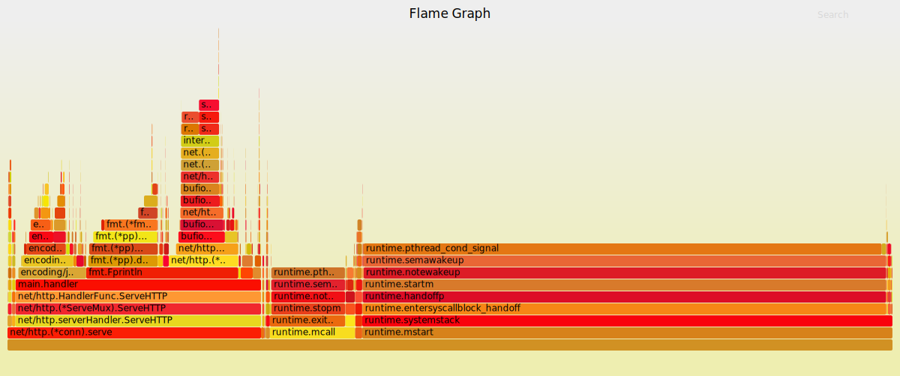

.center.icon[]

---


class: white
background-image: url(tmp/title.svg)
.top.icon[]

# Оптимизация и профилирование

### Иван Ремень

---

class: top white
background-image: url(tmp/sound.svg)
background-size: 130%
.top.icon[]

.sound-top[
  # Как меня слышно и видно?
]

.sound-bottom[
  ## > Напишите в чат
  ### **+** если все хорошо
  ### **–** если есть проблемы cо звуком или с видео
]

---

# Цель занятия 

.right-image[

]


- Научиться писать бенчмарки
- Изучить основные подходы к оптимизации программ в Go
- Научиться пользоваться инструментами профилирования

---

# Перед тем как начать?

.right-image[

]

### Какие инструменты профилирования вы уже используете?

---

# Бенчмаркинг (пример программы)

```
func Fast() int {
	acc := new(int)
	for i := 0; i < 10; i++ {
		acc2 := new(int)
		*acc2 = *acc + 1
		acc = acc2
	}

	return *acc
}

func Slow() int {
	acc := new(int)
	for i := 0; i < 1000; i++ {
		acc2 := new(int)
		*acc2 = *acc + 1
		acc = acc2
	}

	return *acc
}
```

---

# Бенчмаркинг (пример бенчмарка)

exbench_test.go
```
import "testing"

func BenchmarkFast(b *testing.B) {
	for i := 0; i < b.N; i++ {
		Fast()
	}
}

func BenchmarkSlow(b *testing.B) {
	for i := 0; i < b.N; i++ {
		Slow()
	}
}
```
go test -bench=. -benchmem -cpuprofile=cpu.out -memprofile=mem.out .

---

# Бенчмаркинг (параллельный запуск)

```
var (
	mu = sync.Mutex{}
)

func Fast() int {
	acc := 0
	for i := 0; i < 1000; i++ {
		acc++
	}

	return acc
}

func Slow() int {
	mu.Lock()
	defer mu.Unlock()

	acc := 0
	for i := 0; i < 1000; i++ {
		acc++
	}

	return acc
}
```
---

# Бенчмаркинг (параллельный запуск)

exbenchpar_test.go
```
func BenchmarkParallelFast(b *testing.B) {
	b.RunParallel(func(pb *testing.PB) {
		for pb.Next() {
			Fast()
		}
	})
}

func BenchmarkParallelSlow(b *testing.B) {
	b.RunParallel(func(pb *testing.PB) {
		for pb.Next() {
			Slow()
		}
	})
}
```
---
# Преаллокация slices и map

```
func Fast() {
	const sz = 32000
	a := make([]int, 0)
	for i := 0; i < sz; i++ {
		a = append(a, i)
	}
}

func Slow() {
	const sz = 32000
	a := make([]int, 0, sz)
	for i := 0; i < sz; i++ {
		a = append(a, i)
	}
}
```

---

# Переиспользование объектов

```
package reuse

import "encoding/json"

type A struct {
	I int
}

func Slow() {
	for i := 0; i < 1000; i++ {
		a := &A{}
		json.Unmarshal([]byte("{\"i\": 32}"), a)
	}
}

func Fast() {
	a := &A{}
	for i := 0; i < 1000; i++ {
		json.Unmarshal([]byte("{\"i\": 32}"), a)
	}
}
```

---

# strconv vs fmt

```
package fmtvsstrconv

import (
	"fmt"
	"strconv"
)

func Slow() string {
	return fmt.Sprintf("%d",42)
}

func Fast() string {
	return strconv.Itoa(42)
}
```

---

# strings vs regex
```
package stringsvsre

import (
	"regexp"
	"strings"
)

var (
	re *regexp.Regexp
)

func Fast() bool {
	return strings.Contains("Hello world of golang", "world")
}

func VerySlow() bool {
	 res, _ := regexp.MatchString("world", "Hello world of golang")
	 return res
}

func Slow() bool {
	return re.MatchString("Hello world of golang")
}

func init() {
	re, _ = regexp.Compile("world")
}
```

---

# StringBuilder

```
package stringbuilder

import "strings"

func Slow() string {
	a := ""
	a += "1"
	a += "2"
	a += "3"
	a += "4"
	a += "5"
	return a
}

func Fast() string {
	builder := strings.Builder{}
	builder.WriteString("1")
	builder.WriteString("2")
	builder.WriteString("3")
	builder.WriteString("4")
	builder.WriteString("5")
	return builder.String()
}

func VeryFast() string {
	return "1" + "2" + "3" + "4" + "5"
}
```

---

# sync.Pool

```
var (
	pool = sync.Pool{
		New: func() interface{} {
			return &strings.Builder{}
		},
	}
)

func Slow() string {
	builder := strings.Builder{}
	builder.WriteString("Hello")
	return builder.String()
}

func Fast() string {
	builder := pool.Get().(*strings.Builder)
	defer pool.Put(builder) //Try to comment it out!
	builder.Reset()
	builder.WriteString("Hello")
	res := builder.String()
	return res
}
```

---

# Структуры с указателями как часть map
```
const (
	numElements = 10000000
)

var foo = map[string]int{}

func timeGC() {
	t := time.Now()
	runtime.GC()
	fmt.Printf("gc took: %s\n", time.Since(t))
}

func main() {
	for i := 0; i < numElements; i++ {
		foo[strconv.Itoa(i)] = i
	}

	for {
		timeGC()
		time.Sleep(1 * time.Second)
	}
}
```
Держать в heap много структур с указателями дорого.

---

# Кодогенерация vs рефлексия

Вспоминаем easyjson
```
package exjs

import "encoding/json"

var (
	JsonExample = []byte("{\"I\": 10}")
)

//easyjson:json
type A struct {
	I int
}

func StandardMarshal() {
	a := &A{15}
	json.Marshal(a)
}

func StandardUnmarshal() {
	a := &A{}
	json.Unmarshal(JsonExample, &a)
}

func EasyMarshal() {
	a := &A{15}
	a.MarshalJSON()
}

func EasyUnmarshal() {
	a := &A{}
	a.UnmarshalJSON(JsonExample)
}
```

---

# Переиспользование HTTP-соединений
```
var (
	client = http.Client{
		Timeout:   3 * time.Second,
		Transport: &http.Transport{},
	}
)

func Fast() ([]byte, error) {
	resp, err := client.Get("https://api.vk.com/method/users.get")
	if err != nil {
		return nil, err
	}

	defer resp.Body.Close()
	body, err := ioutil.ReadAll(resp.Body)

	return body, nil
}
```

---

# Нагрузчное тестирование (wrk)

```
MBP-Remen:wrk bhychik$ ./wrk -c100 -d2000s -t50 http://127.0.0.1:8080/
Running 33m test @ http://127.0.0.1:8080/
  50 threads and 100 connections
    Thread Stats   Avg      Stdev     Max   +/- Stdev
    Latency    78.24ms  199.19ms   1.09s    91.29%
    Req/Sec    64.80     45.40   370.00     70.79%
  4017 requests in 2.42s, 0.89MB read
  Socket errors: connect 0, read 4188, write 4, timeout 0
  Non-2xx or 3xx responses: 4017
Requests/sec:   1657.77
Transfer/sec:    374.16KB
```

---

# Библиотека net/http

```
package main

import (
	"fmt"
	"net/http"
)

func main() {
	http.HandleFunc("/", func (w http.ResponseWriter, r *http.Request) {
		fmt.Fprintf(w, "Hello, world!\n\n")
	})

	http.ListenAndServe(":8080", nil)
}
```

---

# Библиотека fasthttp
```
package main

import (
	"fmt"
	"log"

	"github.com/valyala/fasthttp"
)

func main() {
	h := requestHandler
	h = fasthttp.CompressHandler(h)

	if err := fasthttp.ListenAndServe("127.0.0.1:8080", h); err != nil {
		log.Fatalf("Error in ListenAndServe: %s", err)
	}
}

func requestHandler(ctx *fasthttp.RequestCtx) {
	fmt.Fprintf(ctx, "Hello, world!\n\n")
}
```

---

# pprof - работаем с консолью


go test -bench=. -benchmem -cpuprofile=cpu.out -memprofile=mem.out -x .

go tool pprof 13_pprof_console.test cpu.out

list Slow

list Fast

go tool pprof 13_pprof_console.test mem.out

alloc_objects

alloc_space

inuse_objects

inuse_space

list Slow

list Fast


---

# pprof - svg и web profiling

```
package main

import (
	"encoding/json"
	"fmt"
	"net/http"
	_ "net/http/pprof"
)

type Resp struct {
	Status int
}

func handler(w http.ResponseWriter, r *http.Request) {
	for i := 0; i < 1000; i++ {
		resp := &Resp{200}
		res, _ := json.Marshal(resp)
		fmt.Fprintln(w, res)
	}
	fmt.Fprintln(w, "Hello, world!\n\n")
}

func main() {
	http.HandleFunc("/", handler)

	http.ListenAndServe(":8080", nil)
}
```


---

# pprof - svg и web profiling

- ./wrk -c100 -d2000s -t50 http://127.0.0.1:8080/
- go tool pprof http://localhost:8080/debug/pprof/profile?seconds=5
- go tool pprof http://localhost:8080/debug/pprof/goroutines

---

# flamegraph



---

# flamegraph

```
package main

import (
	"encoding/json"
	"fmt"
	"net/http"
	_ "net/http/pprof"
)

type Resp struct {
	Status int
}

func handler(w http.ResponseWriter, r *http.Request) {
	for i := 0; i < 1000; i++ {
		resp := &Resp{200}
		res, _ := json.Marshal(resp)
		fmt.Fprintln(w, res)
	}
	fmt.Fprintln(w, "Hello, world!\n\n")
}

func main() {
	http.HandleFunc("/", handler)

	http.ListenAndServe(":8080", nil)
}
```

---

# flamegraph

go get github.com/uber/go-torch

git clone https://github.com/brendangregg/FlameGraph

cd FlameGraph

go-torch

---

# Трейсинг

./wrk -c100 -d2000s -t50 http://127.0.0.1:8080/

wget http://localhost:8080/debug/pprof/trace?seconds=5 -o trace.out

go tool trace trace.out

---

# Системные утилиты

- top
- iotop
- perf

---


# Практика

### Оптимизируем программу

---

# Тест

https://forms.gle/SiDmYTPUU5La3rA88

---


# На занятии

- Научились писать бенчмарки
- Изучили основные подходы к оптимизации программ в Go
- Научились пользоваться инструментами профилирования

---

# Дополнительное чтение

- https://stephen.sh/posts/quick-go-performance-improvements
- https://dave.cheney.net/high-performance-go-workshop/dotgo-paris.html
- https://habr.com/ru/company/badoo/blog/301990/
- https://habr.com/ru/company/badoo/blog/324682/
- https://habr.com/ru/company/mailru/blog/331784/
- https://habr.com/ru/post/443378/

---

## Вопросы?

---

# Опрос

Не забудьте заполнить опрос. Ссылка на опрос будет в слаке.

---

class: white
background-image: url(tmp/title.svg)
.top.icon[]

# Спасибо за внимание!