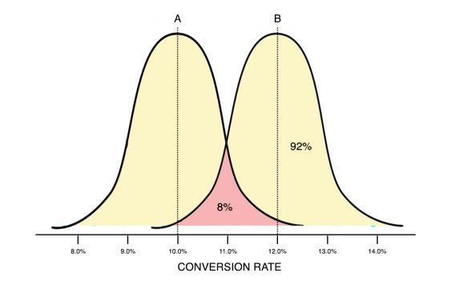

.center.icon[]

---

class: top white
background-image: url(img/sound.svg)
background-size: 130%
.top.icon[]

.sound-top[
  # Как меня слышно и видно?
]

.sound-bottom[
  ## > Напишите в чат
  ### **+** если все хорошо
  ### **–** если есть проблемы cо звуком или с видео
]

---

class: white
background-image: url(img/title.svg)
.top.icon[]

# Оптимизация <br>и профилирование

### Алексей Бакин

---

# Как проходит занятие

* ### Активно участвуем - задаем вопросы.
* ### Чат вижу - могу ответить не сразу.
* ### После занятия - оффтопик, ответы на любые вопросы.

---

# На занятии

* ### Попишем бенчмарки
* ### Посмотрим основные подходы к оптимизации программ в Go
* ### Узнаем про инструменты профилирования

---

# Перед тем как начать

* ### Что такое профилирование?
* ### Зачем профилировать?
* ### Есть ли практический опыт?
* ### Что использовали?

---

# Команды для запуска и анализа бенчмарков

Запустить конкретный бенчмарк
```
go test -bench=BenchmarkFillSlice
```

Бенчить использование памяти
```
go test -bench=BenchmarkFillSlice -benchmem
```

Бенчить 10 секунд
```
go test -bench=BenchmarkFillSlice -benchmem -benchtime 10s
```

Сравнить два бенчмарка
```
benchcmp old new
```

---

# Команды для запуска и анализа бенчмарков

Повторить бенчмарк 5 раз
```
go test -bench=BenchmarkFillSlice -benchmem -benchtime 10s -count 5
```

Получить статистику по нескольким запускам одного бенчмарка
```
benchstat ret
```

Получить статистику и сравнить два бенчмарка
```
benchstat old new
```

---

# Статистическая значимость



Вариант В на самом деле может оказаться хуже варината А с вероятностью 8%.

<br>

https://lpgenerator.ru/blog/2018/08/21/pochemu-v-95-statisticheskoj-znachimosti-net-nichego-osobennogo/

---

# Примеры пулл-риквестов с бенчами

https://github.com/golang/go/pull/30376 (в описании ПРа)

<br>

https://github.com/golang/go/pull/37578 (внутри коммит-сообщения)

---

# Примеры бенчмарков

https://github.com/OtusGolang/webinars_practical_part/tree/master/23-profiling

<br>

**00_lesson** - примеры с урока

---

# Команды для снятия и анализа профилей

Снять cpu и мемори профили бенчмарка
```
go test -bench=. -cpuprofile=cpu.out -memprofile=mem.out .
```

Изучить cpu профиль
```
go tool pprof -http=":8090" bench.test cpu.out
```

---

# Нагрузчное тестирование (wrk, wrk2)

https://github.com/giltene/wrk2
<br><br>
Нагружать сервер 10 секунд(-d), используя 4 потока(-t) и 1000 соединений(-с), стараясь держать рейт в 10000 запросов(-R)

```
wrk -t4 -c1000 -d10s -R10000 http://127.0.0.1:7070/
```

Получить расширенный отчет по времени ответа
```
wrk -t4 -c1000 -d10s -R10000 --latency http://127.0.0.1:7070/
```

Снять 5 секунд cpu профиля и проанализировать
```
go tool pprof -http=":8080" http://127.0.0.1:7070/debug/pprof/profile?seconds=5
```

---

# Тест по третьему модулю

.left-text[
Пожалуйста, пройдите тест.
<br><br>
Он поможет понять, как усвоился материал,
что стоит повторить.
<br><br>
Ссылка в чате
]

.right-image[

]
---

# Опрос

.left-code[
Заполните пожалуйста опрос.
<br><br>
Ссылка в чате.
]

.right-image[

]

---

# Дополнительное чтение

- https://stephen.sh/posts/quick-go-performance-improvements
- https://dave.cheney.net/high-performance-go-workshop/dotgo-paris.html
- https://habr.com/ru/company/badoo/blog/301990/
- https://habr.com/ru/company/badoo/blog/324682/
- https://habr.com/ru/company/mailru/blog/331784/
- https://habr.com/ru/post/443378/

---

# Домашнее задание: "Оптимизация программы"

https://github.com/OtusGolang/home_work/tree/master/hw10_program_optimization

---

class: white
background-image: url(img/message.svg)
.top.icon[]

# Спасибо за внимание!
