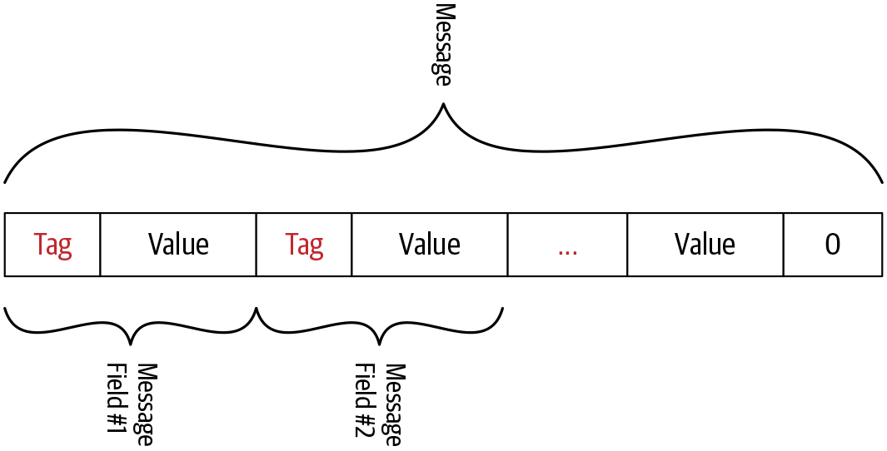
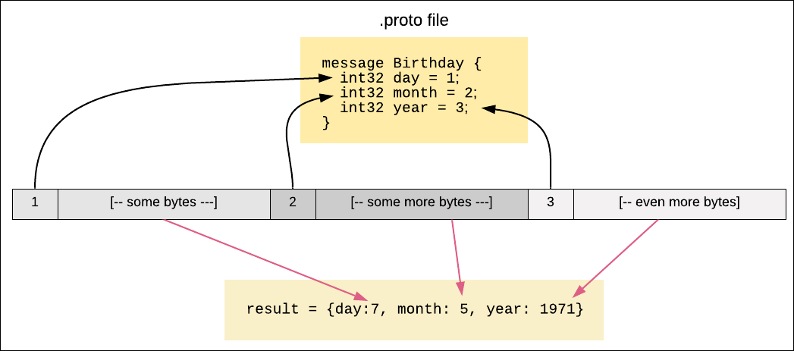
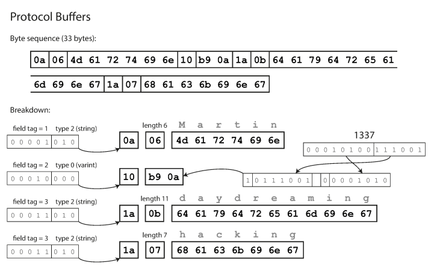
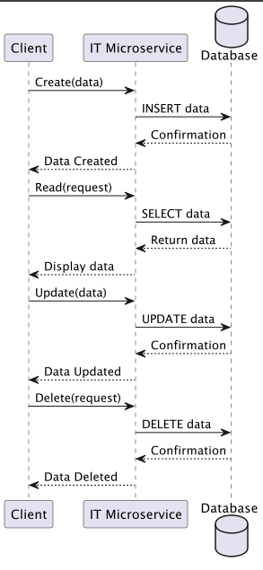

background-image: url(../img/title.svg)

---

background-image: url(../img/rec.svg)

---
background-image: url(../img/topic.svg)

.topic[Работа с gRPC ч.2]
.tutor[Кристина Ступникова]
.tutor_desc[Software Engineer at Tabby]

---

background-image: url(../img/rules.svg)

---

# О чем будем говорить

- ### Создание gRPC клиента и сервера
- ### Лучшие практики gRPC
- ### Интерсепторы
- ### Надежность
- ### TLS при работе с gRPC

---

# Интерсепторы в gRPC

- ### Что такое интерсепторы
- ### Какие бывают интерсепторы

---

# Что такое интерсепторы <br>(interceptors ~ middleware):

### Это инструменты для перехвата и потенциального изменения запросов и ответов, проходящих между клиентами и серверами. Это особенно полезно для реализации поперечной (cross-cutting) функциональности, такой как аутентификация, логирование, мониторинг, распределение транзакций и обработка ошибок.

---

# Клиентские интерсепторы:

- ### Перехватывают входящие и исходящие вызовы на стороне клиента.
- ### Могут модифицировать запрос перед тем, как он будет отправлен на сервер.
- ### Могут обрабатывать или изменять ответ от сервера перед тем, как он будет возвращён вызывающей стороне.

---

# Серверные интерсепторы:

- ### Перехватывают входящие вызовы на стороне сервера до того, как они достигнут сервиса.
- ### Могут изменять поведение вызова, например, добавляя проверку аутентификации или проверку прав доступа, прежде чем запрос будет обработан.
- ### Могут вмешиваться в процесс ответа сервера, позволяя добавлять дополнительные заголовки или изменять ответ перед отправкой клиенту.

---

# Реализация интерсепторов:

### В gRPC интерсепторы реализуются через определённые хуки или методы, которые вызываются в процессе обработки RPC вызовов. Например, в Go вы можете реализовать интерсептор на стороне сервера, предоставив функцию, которая будет принимать context.Context, информацию о RPC и обработчик, который непосредственно выполняет RPC вызов.

---

# Пример реализации интерсептора на Go

```
// UnaryServerInterceptor пример функции интерсептора
func UnaryServerInterceptor(ctx context.Context, req interface{}, info *grpc.UnaryServerInfo, handler grpc.UnaryHandler) (interface{}, error) {
    // До вызова обработчика
    log.Println("Before handler")
    if err := authorize(ctx); err != nil {
        return nil, err
    }

    // Вызов обработчика
    resp, err := handler(ctx, req)

    // После вызова обработчика
    log.Println("After handler")

    return resp, err
}

// Настройка сервера с интерсептором
server := grpc.NewServer(grpc.UnaryInterceptor(UnaryServerInterceptor))
```

---

# TLS

### TLS (Transport Layer Security) — это стандартный протокол безопасности, используемый для шифрования трафика между клиентом и сервером, чтобы обеспечить конфиденциальность и целостность данных при передаче через ненадёжные сети, такие как Интернет.

---

# В gRPC TLS используется для следующих целей:

- ### Шифрование данных: Все передаваемые данные шифруются, поэтому никто, кроме клиента и сервера, не может прочитать их.
- ### Аутентификация сервера: Клиенты могут проверять подлинность сервера посредством TLS-сертификатов, чтобы убедиться, что они соединяются с настоящим сервером, а не с злоумышленником, который пытается осуществить атаку "man-in-the-middle".
- ### Аутентификация клиента: Аналогично, серверы могут требовать от клиентов предоставления сертификатов для их аутентификации, обеспечивая двустороннюю аутентификацию.
- ### Целостность данных: TLS также обеспечивает механизмы, которые позволяют получателям данных проверять, что данные не были изменены в процессе передачи.

---

# Как настроить TLS в gRPC на сервере Go

```
import (
    "google.golang.org/grpc"
    "google.golang.org/grpc/credentials"
)

func main() {
    // Загрузка TLS сертификатов
    creds, err := credentials.NewServerTLSFromFile("path/to/server.crt", "path/to/server.key")
    if err != nil {
        log.Fatalf("Failed to setup TLS: %v", err)
    }

    // Создание gRPC сервера с TLS
    s := grpc.NewServer(grpc.Creds(creds))
    // ...
}
```

---

# Как настроить TLS в gRPC на клиенте Go

```

import (
    "log"
    "google.golang.org/grpc"
    "google.golang.org/grpc/credentials"
)

func main() {
    // Установка TLS-соединения
    creds, err := credentials.NewClientTLSFromFile("path/to/ca.crt", "")
    if err != nil {
        log.Fatalf("Failed to create TLS credentials, %v", err)
    }

    // Добавление TLS-сертификата в опции gRPC диалога
    opts := grpc.WithTransportCredentials(creds)

    // Установка соединения с сервером
    conn, err := grpc.Dial("server.address:port", opts)
    if err != nil {
        log.Fatalf("Did not connect: %v", err)
    }
    defer conn.Close()

    // Использование соединения для создания клиента сервиса
    // client := NewMyServiceClient(conn)
    // ...
}
```

---

# Бинарное представление данных <br>в Protocol Buffers

.center-image.image-80[

]
---

# Бинарное представление данных <br>в Protocol Buffers

.center-image.image-80[

]

---

# Пример записи, закодированной протоколом<br> Protocol Buffers

.center-image[

]

---

# Создание gRPC клиента и сервера <br>От теории к практике

### Сервис для управления задачами

### Сервис будет обеспечивать создание, чтение, обновление и удаление задач
#### CRUD (Create, Read, Update, Delete)

---

# Схема сервиса

.center-image.image-30[

]

---

# Схемы данных

```
type struct Task {
    ID int
    Title string
    Description string
    Status string
}
```

```
type TaskCRUD interface {
    // Create Creates a new task and returns its ID
    Create(t Task) (int, error) 
    // Read Reads a task based on its ID
    Read(id int) (Task, error)  
    // Update Updates a task based on its ID
    Update(id int, t Task) error 
    // Delete Deletes a task based on its ID
    Delete(id int) error          
}
```

---

# Схемы данных

```
type struct Task {
    ID int
    Title string
    Description string
    Status string
}
```

```
type TaskCRUD interface {
    // Create Creates a new task and returns its ID
    Create(t Task) (int, error) 
    // Read Reads a task based on its ID
    Read(id int) (Task, error)  
    // Update Updates a task based on its ID
    Update(id int, t Task) error 
    // Delete Deletes a task based on its ID
    Delete(id int) error          
}
```
---

# Streaming

- ### Unary RPC - один запрос и один ответ
- ### Server streaming RPC - один запрос и много ответов
- ### Client streaming RPC - много запросов и один ответ
- ### Bidirectional streaming RPC - много запросов и много ответов

---

# Когда использовать streaming?

- ### Когда нужно передать большой объем данных (сервер может регулярно отправлять клиенту промежуточные результаты для информирования о прогрессе выполнения)
- ### Когда нужно передать данные в реальном времени (например, чаты, онлайн-игры)
- ### Подписка на события (Publish/Subscribe)
- ### Потоковая передача файлов (например, видео)
- ### Обработка данных на лету (например, обработка аудио/видео)

---

# Итоги

- ### Поговорили о лучших практиках gRPC
- ### Узнали, что такое Интерсепторы
- ### Использовали TLS при работе с gRPC
- ### Разобрались с бинарным представлением данных в формате Protocol Buffers
- ### Разобрались с streaming
- ### Создали несколько gRPC клиентов и серверов

---

background-image: url(../img/questions.svg)

---

background-image: url(../img/poll.svg)

---

background-image: url(../img/next_webinar.svg)
.announce_date[8 ноября]
.announce_topic[Монолит и микросервисы]

---
background-image: url(../img/thanks.svg)

.tutor[Кристина Ступникова]
.tutor_desc[Software Engineer at Tabby]
