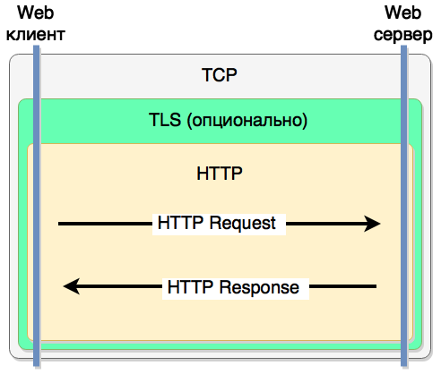

.center.icon[]

---

class: top white
background-image: url(img/sound.svg)
background-size: 130%
.top.icon[]

.sound-top[
  # Как меня слышно и видно?
]

.sound-bottom[
  ## > Напишите в чат
  ### **+** если все хорошо
  ### **-** если есть проблемы cо звуком или с видео
  ### !проверить запись!
]

---

class: white
background-image: url(img/message.svg)
.top.icon[]

# Протокол HTTP

### Дмитрий Смаль, Елена Граховац

---

# План занятия

.big-list[
* Протокол HTTP
* Использование HTTP клиента
* Создание простого HTTP сервера
* Декораторы и middleware
* HTTP/1.1 и HTTP/2.0
* REST, GraphQL, RPC
* Swagger
]

---

# HTTP

.main-image[

]

HTTP - текстовый протокол передачи документов между клиентом и сервером.
Изначально разработан для передачи web страниц, сейчас используется так же как протокол для API.<br>

---

# Задачи HTTP

.big-list[
* Передача документов
* Передача мета-информации
* Авторизация
* Поддержка сессий
* Кеширование документов
* Согласование содержимого (negotiation)
* Управление соединением
]

---

# Ключевые особенности HTTP

.big-list[
* Работает поверх TCP/TLS
* Протокол запрос-ответ
* Не поддерживает состояние (соединение) - *stateless*
* *Текстовый* протокол
* Расширяемый протокол
]

---

# HTTP запрос

```
GET /search?query=go+syntax&limit=5 HTTP/1.1        
Accept: text/html,application/xhtml+xml
Accept-Encoding: gzip, deflate
Cache-Control: max-age=0
Connection: keep-alive
Host: site.ru
User-Agent: Mozilla/5.0 Gecko/20100101 Firefox/39.0

```

```
POST /add_item HTTP/1.1        
Accept: application/json
Accept-Encoding: gzip, deflate
Cache-Control: max-age=0
Connection: keep-alive
Host: www.ru
Content-Length: 42
Content-Type: application/json

{"id":123,"title":"for loop","text":"..."}
```

Перевод строки - `\r\n`

---

# HTTP ответ

```
HTTP/1.1 404 Not Found
Server: nginx/1.5.7
Date: Sat, 25 Jul 2015 09:58:17 GMT
Content-Type: text/html; charset=iso-8859-1
Connection: close

<!DOCTYPE HTML PUBLIC "-//IETF//DTD HTML 2.0//EN">
<HTML><HEAD>...
```

---

# HTTP / 2.0

.big-list[
* `HTTP/2` - бинарный протокол
* используется мультиплексирование потоков
* сервер может возвращать еще не запрошенные файлы
* используется `HPACK` сжатие заголовков
]
---

# HTTP клиент - GET

```go
import (
    "net/http"
    "net/url"
)

// создаем HTTP клиент
client := &http.Client{}

// строим нужный URL
reqArgs := url.Values{}
reqArgs.Add("query", "go syntax")
reqArgs.Add("limit", "5")
reqUrl, _ := url.Parse("https://site.ru")
reqUrl.Path = "/search"
reqUrl.RawQuery = reqArgs.Encode()

// создаем GET-запрос
req, err := http.NewRequest("GET", reqUrl.String(), nil)

// выполняем запрос
req.Header.Add("User-Agent", `Mozilla/5.0 Gecko/20100101 Firefox/39.0`)
resp, err := client.Do(req)
```

---

# HTTP клиент - POST

```go
type AddRequest struct {
  Id    int `json:"id"`
  Title string `json:"title"`
  Text  string `json:"text"`
}

// создаем HTTP клиент
client := &http.Client{}

// Запрос в виде Go структуры
addReq := &AddRequest{
  Id: 123,
  Title: "for loop",
  Text: "...",
}

// Создаем буфер (io.Reader) из которого клиент возьмет тело запроса
var body bytes.Buffer
json.NewEncoder(body).Encode(addReq)

// создаем POST-запрос
req, err := http.NewRequest("POST", "https://site.ru/add_item", body)

// выполняем запрос
resp, err := client.Do(req)
```

---


# HTTP клиент - работа с ответом

```go
// выполняем запрос
resp, err := client.Do(req)
if err != nil {
  // или другая уместная обработка
  return errors.Errorf(err)
}

// если ошибки не было - нам необходимо "закрыть" тело ответа
// иначе при повторном запросе будет открыто новое сетевое соединение
defer resp.Body.Close()

// проверяем HTTP status ответа
if resp.StatusCode != 200 {
  // обработка HTTP статусов зависит от приложения
  return errors.Errorf("unexpected http status: %s", resp.Status)
}

// возможно проверяем какие-то заголовки
ct := resp.Header.Get("Content-Type")
if ct != "application/json" {
  return errors.Errorf("unexpected content-type: %s", ct)
}

// считываем тело ответа (он может быть большим)
body, err := ioutil.ReadAll(resp.Body)
```

---

# HTTP клиент - context

Контекст в Go - это объект ограничивающий время выполнения запрос (кода) и/или предоставляющий контекстную информацию (например trace id) запроса.
<br><br>
Если у вас уже есть некоторый контекст 

```go
func (h *MyHandler) DoSomething(ctx context.Context) error {

  // создаем запрос
  req, _ := http.NewRequest(http.MethodGet, "https://site.ru/some_api", nil)
  
  // теперь запрос будет выполняться в рамках сtx
  req = req.WithContext(ctx)

  // выполняем запрос
  resp, err := h.client.Do(req)

  // ...
}
```

---

# HTTP клиент - context

Есть просто необходимо ограничить время выполнения запроса

```go
// создаем новый контекст
ctx := context.Background()
ctx, cancel := context.WithTimeout(ctx, 3*time.Second)
defer cancel()

// теперь запрос будет выполняться в рамках сtx
req = req.WithContext(ctx)

// выполняем запрос
resp, err := client.Do(req) 
```

---

# HTTP клиент - настройка

Внутри `http.Client` поддерживается пул соединений, т.е:
<br><br>
* одно HTTP соединение будет использовано повторно
* при необходимости будет открыто новое HTTP соединение
* `http.Client` безопасен для конкурентного доступа

<br><br>

Настроить пул соединений и другие параметры можно с помощью `http.Transport`

```go
tr := &http.Transport{
	MaxIdleConns:       10,
	IdleConnTimeout:    30 * time.Second,
	DisableCompression: true,
}
client := &http.Client{Transport: tr}
```

---

# HTTP сервер

```go
type MyHandler struct {
  // все нужные вам объекты: конфиг, логер, соединение с базой и т.п.
}

// реализуем интерфейс `http.Handler`
func (h *MyHandler) ServeHTTP(resp ResponseWriter, req *Request) {
  // эта функция будет обрабатывать входящие запросы
}

func main() {
  // создаем обработчик
  handler := &MyHandler{}

  // создаем HTTP сервер
  server := &http.Server{
    Addr:           ":8080",
    Handler:        handler,
    ReadTimeout:    10 * time.Second,
    WriteTimeout:   10 * time.Second,
    MaxHeaderBytes: 1 << 20,
  }

  // запускаем сервер, это заблокирует текущую горутину
  server.ListenAndServe()
}

```

---

# HTTP сервер - обработчик

```go
func (h *MyHandler) ServeHTTP(resp http.ResponseWriter, req *http.Request) {
  if req.URL.Path == "/search" {
    // разбираем аргументы
    args := req.URL.Query()
    query := args.Get("query")
    limit, err := strconv.Atoi(args.Get("limit"))
    if err != nil {
      resp.WriteHeader(400)
      return
    }
    
    // выполняем бизнес-логику
    results, err := DoBusinessLogicRequest(query, limit)
    if err != nil {
      resp.WriteHeader(404)
      return
    }

    // устанавливаем заголовки ответа
    resp.Header().Set("Content-Type", "application/json; charset=utf-8")
    resp.WriteHeader(200)

    // сериализуем и записываем тело ответа
    json.NewEncoder(resp).Encode(results)
  }
}
```

---

# HTTP сервер - функция как обработчик

С помощью типа `http.HandlerFunc` вы можете использовать обычную функцию в качестве HTTP обработчика

```go
// функция с произвольным именем
func SomeHttpHandler(resp http.ResponseWriter, req *http.Request) {
  // ...
}

func main() {
  // ...
  // создаем HTTP сервер
  server := &http.Server{
    Addr:           ":8080",
    Handler:        http.HandlerFunc(SomeHttpHandler),
    ReadTimeout:    10 * time.Second,
    WriteTimeout:   10 * time.Second,
    MaxHeaderBytes: 1 << 20,
  }
  // ...
}
```

---

# HTTP сервер - routing

```go
type MyHandler struct {}

func (h *MyHandler) Search(resp ResponseWriter, req *Request) {
  // ...
}

func (h *MyHandler) AddItem(resp ResponseWriter, req *Request) {
  // ...
}

func main() {
  handler := &MyHandler{}

  // создаем маршрутизатор запросов
  mux := http.NewServeMux()
  mux.HandleFunc("/search", handler.Search)
  mux.HandleFunc("/add_item", handler.AddItem)

  // создаем и запускаем HTTP сервер
  server := &http.Server{
    Addr:    ":8080",
    Handler: mux,
  }
  log.Fatal(server.ListenAndServe())
}

```
---

# HTTP сервер - middleware

```go
// это функция - middleware, она преобразует один обработчик в другой
func (s *server) adminOnly(h http.HandlerFunc) http.HandlerFunc {
  return func(resp http.ResponseWriter, req *http.Request) {
    if !currentUser(req).IsAdmin {
        http.NotFound(resp, req)
        return
    }
    h(resp, req)
  }
}

func main() {
  handler := &MyHandler{}

  // создаем маршрутизатор запросов
  mux := http.NewServeMux()
  mux.HandleFunc("/search", handler.Search)
  // !!! мы обернули один из обработчиков в middleware
  mux.HandleFunc("/add_item", adminOnly(handler.AddItem))  
}
```

---

# Типовые задачи для Middleware

.big-list[
* Авторизация
* Проверка доступа
* Логирование
* Сжатие ответа
* Трассировка запросов в микросервисах
]

---

# Пример Middleware - ограничение времени запроса

```go

func (h *MyHandler) Search(resp ResponseWriter, req *Request) {
  ctx := req.Context()
  // ...
  // мы должны передавать контекст вниз по всем вызовам
  results, err := DoBusinessLogicRequest(ctx, query, limit)
  // ...
}

func withTimeout(h http.HandlerFunc, timeout time.Duration) http.HandlerFunc {
  return func(resp http.ResponseWriter, req *http.Request) {
    // берем контекст запроса и ограничиваем его таймаутом
    ctx := context.WithTimeout(req.Context(), timeout)
    // обновляем контекст запроса
    req = req.WithContext(ctx)
    h(resp, req)
  }
}

mux := http.NewServeMux()
mux.HandleFunc("/search", withTimeout(handler.Search, 5*time.Second))
```

---

# Пример Middleware - авторизация

```go

func (h *MyHandler) AddItem(resp ResponseWriter, req *Request) {
  ctx := req.Context()
  user := ctx.Value("currentUser").(*MyUser)
  // ...
}

func authorize(h http.HandlerFunc, timeout time.Duration) http.HandlerFunc {
  return func(resp http.ResponseWriter, req *http.Request) {
    // выполняем авторизацию пользователя
    user, err := DoAuthorizeUser(req)
    if err != nil {
      // если не удалось - возвращаем соответствующий HTTP статус
      resp.WriteHeader(403)
      return
    }
    // сохраняем пользователя в контекст
    ctx := context.WithValue(req.Context(), "currentUser", user)
    req = req.WithContext(ctx)
    h(resp, req)
  }
}

mux := http.NewServeMux()
mux.HandleFunc("/add_item", authorize(handler.AddItem))
```

---

# Шутка про роутеры :)

[dayssincelastgohttprouter.com](http://dayssincelastgohttprouter.com)

---

# Полезные пакеты

.big-list[
* [https://github.com/gorilla/mux](https://github.com/gorilla/mux)
* [https://github.com/justinas/alice](https://github.com/justinas/alice)
]

---

# Тестирование

Очень полезный пакет `net/http/httptest`

Пример:
```go
package main

import (
	"fmt"
	"io"
	"io/ioutil"
	"net/http"
	"net/http/httptest"
)

func main() {
	handler := func(w http.ResponseWriter, r *http.Request) {
		io.WriteString(w, "<html><body>Hello World!</body></html>")
	}

	req := httptest.NewRequest("GET", "http://example.com/foo", nil)
	w := httptest.NewRecorder()
	handler(w, req)

	resp := w.Result()
	body, _ := ioutil.ReadAll(resp.Body)

	fmt.Println(resp.StatusCode)
	fmt.Println(resp.Header.Get("Content-Type"))
	fmt.Println(string(body))

}
```

---

# REST, GraphQL, RPC

`REST` - это архитектурный стиль разработки, при котором клиент и сервер обмениваются *документами*.
По сути архитектура `REST` - это классические web страницы.
<br><br>
* `REST` хорошо подходит, если ваш сервис оперирует сложными иерархическими документами с множеством полей и мало возможных действий.
* `REST` плохо подходит, если в вашем сервисе много различных действий и выборок над одними и теми же сущностями.

<br><br>
`RPC` - это удаленный вызов процедур. Существует множество различных протоколов `RPC`: `DCOM`, `SOAP`, `JSON-RPC`, `JSON-RPC`, `gRPC`.
<br><br>
* `RPC` довольно универсальный подход
---

# Простейшее REST API

Запрос
```
GET /method?param1=value1&param2=value2 HTTP/1.1
Host: site.ru
```

Ответ
```
HTTP/1.1 200 OK
Content-Type: application/json; charset=utf-8
Content-Length: 100500

{
  "status": "ok",
  "items": [
    ...
  ]
}
```
---

# JSON-RPC

Запрос
```
POST /api HTTP/1.1
Host: site.ru
Content-Type: application/json
Content-Length: 100500

{"method": "echo", "params": ["Hello JSON-RPC"], "id":1}
```

Ответ
```
HTTP/1.1 200 OK
Content-Type: application/json; charset=utf-8
Content-Length: 100500

{"result": "Hello JSON-RPC", "error": null, "id":1}
```
---

# Swagger

OpenAPI, изначально известное как Swagger это DSL (Domain Specific Language, специализированный язык) для описания REST API. 
Спецификации Open API могут быть описанны в виде JSON или YAML документов. 

<br><br>
Редактировать Swagger спецификацию: [https://editor.swagger.io](https://editor.swagger.io)
<br><br>
Установить утилиту для Go: [https://github.com/go-swagger/go-swagger](https://github.com/go-swagger/go-swagger)

---

# Дополнительные материалы

* [en] [Классный урок про использование контекста](https://github.com/campoy/justforfunc/tree/master/09-context)
* [ru] [Доклад про использование GraphQL в Go](https://youtu.be/tv8muwgj-Y4)
* [en] [Про дизайн клиента и middleware](https://youtu.be/SlhG7bCRA6Q)

---

# Опрос

.left-text[
Заполните пожалуйста опрос
<br><br>
[https://otus.ru/polls/4910/](https://otus.ru/polls/4636/)

]

.right-image[

]

---

class: white
background-image: url(img/message.svg)
.top.icon[]

# Спасибо за внимание!
