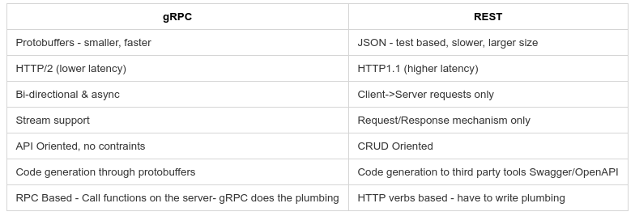

.center.icon[]

---


class: white
background-image: url(tmp/title.svg)
.top.icon[]

# gRPC

### Антон Телышев


---

class: top white
background-image: url(tmp/sound.svg)
background-size: 130%
.top.icon[]

.sound-top[
  # Как меня слышно и видно?
]

.sound-bottom[
  ## > Напишите в чат
  ### **+** если все хорошо
  ### **–** если есть проблемы cо звуком или с видео
]

---

# Цель занятия 

.right-image[

]

# 
- Узнать, что такое gRPC
- Научиться писать Protobuf схемы
- Научиться писать gRPC сервисы 

---

# План занятия

.big-list[
* Что такое gRPC и HTTP/2
* Вспоминаем Protocol buffers
* Прямая и обратная совместимость в Protocol buffers
* Описание API с помощью Protobuf
* Генерация кода для GRPC клиента и сервера
* Реализация API
]

---
# Прежде, чем начать

1) Обновляем protoc
https://github.com/protocolbuffers/protobuf/releases

2) Обновлем protoc-gen-go
```
go get -u google.golang.org/protobuf/cmd/protoc-gen-go
```

---

# Что такое gRPC

RPC - Remote Procedure Call
<br>
<br>

RPC: (CORBA, Sun RPC, DCOM etc.)
- сетевые вызовы абстрагированы от кода
- интерфейсы как сигнатуры функций (Interface Definition Language для language-agnostic)
- тулзы для кодогенерации
- кастомные протоколы

```
      try {
         XmlRpcClient client = new XmlRpcClient("http://localhost/RPC2"); 
         Object result = server.execute("sample.sum", new Vector(17, 13));
         int sum = ((Integer) result).intValue();
      } catch (Exception exception) {
         System.err.println("JavaClient: " + exception);
      }
```
<br>

g:<br>
https://github.com/grpc/grpc/blob/master/doc/g_stands_for.md

---

# Что такое gRPC

```
syntax = "proto3";

package search;
option go_package = ".;searchpb";

service Google {
  // Search returns a Google search result for the query.
  rpc Search(Request) returns (Result) {
  }
}

message Request {
  string query = 1;
}

message Result {
  string title = 1;
  string url = 2;
  string snippet = 3;
}
```

---

# Что такое gRPC

```
protoc search.proto --go_out=. --go-grpc_out=.
```

```
package searchpb;

type GoogleClient interface {
    // Search returns a Google search result for the query.
    Search(ctx context.Context, in *Request, opts ...grpc.CallOption) (*Result, error)
}

type GoogleServer interface {
    // Search returns a Google search result for the query.
    Search(context.Context, *Request) (*Result, error)

}

type Request struct {
    Query string `protobuf:"bytes,1,opt,name=query" json:"query,omitempty"`
}

type Result struct {
    Title   string `protobuf:"bytes,1,opt,name=title" json:"title,omitempty"`
    Url     string `protobuf:"bytes,2,opt,name=url" json:"url,omitempty"`
    Snippet string `protobuf:"bytes,3,opt,name=snippet" json:"snippet,omitempty"`
}

```

---

class: black
background-size: 75%
background-image: url(img/grpcclassics.svg)
# Что такое gRPC


---

# gRPC: где использовать

- микросервисы
- клиент-сервер
- интеграции / API


- Apcera/Kurma: container OS
- Bazil: distributed file system
- CoreOS/Etcd: distributed consistent key-value store
- Google Cloud Bigtable: sparse table storage
- Monetas/Bitmessage: transaction platform
- Pachyderm: containerized data analytics
- YouTube/Vitess: storage platform for scaling MySQL

---

# gRPC vs REST

<!--class: black
background-image: url(img/grpcvsrest.png)
-->
.image[

]

---

# HTTP/2 vs HTTP

- https://imagekit.io/demo/http2-vs-http1
- https://developers.google.com/web/fundamentals/performance/http2/

---

class: black
background-size: 75%
background-image: url(img/headercompression.png)
# HTTP/2 vs HTTP: header compression


---

class: black
background-size: 75%
background-image: url(img/http2multiplexing.png)
# HTTP/2 vs HTTP: multiplexing

---

class: black
background-size: 75%
background-image: url(img/http2-server-push.png)
# HTTP/2 vs HTTP: server push


---

background-image: url(img/http2inoneslide.png)
# HTTP/2


---


# HTTP/2 vs HTTP
   
- бинарный вместо текстового
- мультиплексирование — передача нескольких асинхронных HTTP-запросов по одному TCP-соединению
- сжатие заголовков методом HPACK
- Server Push — несколько ответов на один запрос
- приоритизация запросов (https://habr.com/ru/post/452020/)

https://medium.com/@factoryhr/http-2-the-difference-between-http-1-1-benefits-and-how-to-use-it-38094fa0e95b


---


class: black
background-size: 75%
background-image: url(img/proto3message.png)
# Protocol buffers: краткое содержание предыдущих серий


---

class: black
background-size: 75%
background-image: url(img/encodedecode.png)
# Protocol buffers: краткое содержание предыдущих серий

---


# Protocol buffers: типы данных 

скаляры:

- double (float64)
- float (float32)
- bool (bool)
- string (string) UTF-8 / 7-bit ASCII
- bytes ([]byte)
- int{32,64} (отрицательные значения - 10 байт)
- uint{32,64}
- sint{32,64} (ZigZag для отрицательных значений)

https://developers.google.com/protocol-buffers/docs/encoding

---

class: black
background-size: 75%
background-image: url(img/wiretype.png)
# Protocol buffers: wire types


---

# Protocol buffers: тэги

- 1 - 2^29 (536,870,911)
- 19000 - 19999 зарезервированы для  имплементации Protocol Buffers
- 1-15 занимают 1 байт, используем для часто используемых полей

---

# Protocol buffers: repeated fields

Слайс реализуется через repeated:

```
message SearchResponse {
  repeated Result results = 1;
}

message Result {
  string url = 1;
  string title = 2;
  repeated string snippets = 3;
}
```
```
...
Snippets             []string `protobuf:"bytes,3,rep,name=snippets,proto3" json:"snippets,omitempty"`
...
Results              []*Result `protobuf:"bytes,1,rep,name=results,proto3" json:"results,omitempty"`
```

---

# Protocol buffers: комментарии

```
/* Подробное описание
* результата поиска */
message Result {
  string url = 1;
  // название страницы
  string title = 2;
  repeated string snippets = 3; // фрагменты страницы
}
```

---

# Protocol buffers: дефолтные значения

- string: пустая строка
- number (int32/64 etc.): 0
- bytes: пустой слайс
- enum: первое значение
- repeated: пустой слайс
- Message - зависит от языка (https://developers.google.com/protocol-buffers/docs/reference/go-generated#singular-message)
в Go - nil

---

# Protocol buffers: Enums

```
enum EyeColor {
	UNKNOWN_EYE_COLOR = 0;
	EYE_GREEN = 1;
	EYE_BLUE = 2;
}
message Person {
	string name = 1;
	repeated string phone_numbers = 2;
	EyeColor eye_color = 3;
}
```

```
type EyeColor int32                                                             
                                                                                
const (                                                                         
    EyeColor_UNKNOWN_EYE_COLOR EyeColor = 0                                     
    EyeColor_EYE_GREEN         EyeColor = 1                                     
    EyeColor_EYE_BLUE          EyeColor = 2                                     
) 
```

---

# Protocol buffers: несколько сообщений в одном файле

```
message Person {
    string name = 1;
    Date birthday = 2;
}

message Date {
    int32 year = 1;
    int32 month = 2;
    int32 day = 3;
}
```

```
message Person {
    string name = 1;
    Date birthday = 2;

    message Address {
        string street = 1;
        string city = 2;
        string country = 3;
    }

    Address address = 3;
}
```

---

# Protocol buffers: импорты
<br><br>

date.proto:
```
message BirthDate {
    int32 year = 1;
    int32 month = 2;
    int32 day = 3;
}
```

person.proto:
```
import "date.proto";

message Person {
    string name = 1;
    BirthDate birthday = 2;

    message Address {
        string street = 1;
        string city = 2;
        string country = 3;
    }

    Address address = 3;
}
```

---

# Protocol buffers: пакеты

<br><br>
mydate.proto:
```
syntax = "proto3";

package my.date;

message Date {
    int32 year = 1;
    int32 month = 2;
    int32 day = 3;
}
```

person.proto:
```
syntax = "proto3";

import "date.proto";
import "mydate.proto";

message Person {
    string name = 1;
    BirthDate birthday = 2;
    my.date.Date last_seen = 4;
}
```


---

# Protocol buffers: go_package

<br><br>
simplepb - более явно

```
syntax = "proto3";

package example.simple;

option go_package = "simplepb";

message SimpleMessage {
  int32 id = 1;
  bool is_simple = 2;
  string name = 3;
  repeated int32 sample_list = 4;
}
```
```
// Code generated by protoc-gen-go. DO NOT EDIT.
// source: simple/simple.proto

package simplepb

import proto "github.com/golang/protobuf/proto"
import fmt "fmt"
import math "math"
```

---

# Protocol buffers: oneof, map

oneof - только одно поле из списка может иметь значение
и не может быть repeated

```
message Message {
    int32 id = 1;
    oneof auth {
        string mobile = 2;
        string email = 3;
        int32 userid = 4;
    }
}
```

map: - асс. массив, ключи - скаляры (кроме float/double) значения - любые типы, не может быть repeated

```
message Result {
    string result = 1;
}

message SearchResponse {
    map<string, Result> results = 1;
}
```

---

# Protocol buffers: Well Known Types

https://developers.google.com/protocol-buffers/docs/reference/google.protobuf

```
syntax = "proto3";

import "google/protobuf/timestamp.proto";
import "google/protobuf/duration.proto";


message MyMessage {
    google.protobuf.Timestamp last_online = 1;
    google.protobuf.Duration session_length = 2;
}
```

---

class: black
background-size: 75%
background-image: url(img/backwardforward.png)
# Protocol buffers: прямая/обратная совместимость


---

# Protocol buffers: прямая/обратная совместимость

- не меняйте теги
- старый код будет игнорировать новые поля
- при неизвестных полях испольуются дефолтные значения
- поля можно удалять, но не переиспользовать тег / добавить префик OBSOLETE_ / сделать поле reserved

https://developers.google.com/protocol-buffers/docs/proto#updating

---

# Protocol buffers: прямая/обратная совместимость

<b>Добавление полей</b>:

```
message MyMessage {
	int32 id = 1;
	+ добавим string fist_name = 2;
}
```

- старый код будет игнорировать новое поле
- новый код будет использовать значение по умолчанию при чтении "старых" данных
<br><br>

<b>Переименоваение полей</b>:

```
message MyMessage {
	int32 id = 1;
	- fist_name = 2;
	+ person_first_name = 2;
}
```

- бинарное представление не меняется, тк имеет значение только тег


---

# Protocol buffers: прямая/обратная совместимость

<b>reserved:</b><br><br>

```
message Foo {
    reserved 2, 15, 9 to 11;
	reserved "foo", "bar";
}
```

- можно резервировать теги и поля
- смешивать нельзя
- резервируем теги чтобы новые поля их не переиспользовали (runtime errors)
- резервируем имена полей, чтобы избежать багов

<b>никогда не удаляйте зарезервированные теги</b>
---

# Protocol buffers: дефолтные значения

<br>
- не можем отличить отсутствующее поле от пустого
- убедитесь, что с тз бизнес логики дефолтные значения бессмысленны

```
func (m *Course) GetTitle() string {
	if m != nil {
		return m.Title
	}
	return ""
}
```

<br>
enum'ы тоже можно добавлять, удалять и резервировать:

```
enum DayOfWeek {
    DAY_OF_WEEK_UNCPECIFIED = 0;
    MONDAY = 1;
    TUESDAY = 2;
    WEDNESDAY = 3;
    ...
}
```

---

# Protocol buffers: style guide
<br>

https://developers.google.com/protocol-buffers/docs/style
<br><br>
- строка 80, отступ 2
- файлы lower_snake_case.proto
- сообщения CamelCase, поля - underscore_separated_names 
- CAPITALS_WITH_UNDERSCORES для enums

<br><br>
```
message SongServerRequest {
  required string song_name = 1;
}

enum Foo {
  FOO_UNSPECIFIED = 0;
  FOO_FIRST_VALUE = 1;
  FOO_SECOND_VALUE = 2;
}
```

# 

---

class: black
background-size: 75%
background-image: url(img/grpcapitypes.png)
# Типы gRPC API


---

# Примеры

https://github.com/OtusGolang/webinars_practical_part/tree/master/27-grpc

---

# gRPC: Errors

- https://grpc.io/docs/guides/error/
- https://grpc.io/docs/guides/error/#protocol-errors
- https://godoc.org/google.golang.org/grpc/codes
- https://godoc.org/google.golang.org/grpc/status
- https://jbrandhorst.com/post/grpc-errors/
- http://avi.im/grpc-errors/

```
// Server
func (*server) SquareRoot(ctx context.Context, req *calculatorpb.SquareRootRequest) 
    (*calculatorpb.SquareRootResponse, error) {

	number := req.GetNumber()
	if number < 0 {
		return nil, status.Errorf(codes.InvalidArgument,
          "received a negative number: %v", number)
	}

	return &calculatorpb.SquareRootResponse{
      NumberRoot: math.Sqrt(float64(number)),
    }, nil
}
```

---
# gRPC: Errors

```
// Client
res, err := c.SquareRoot(
    context.Background()
    &calculatorpb.SquareRootRequest{Number: n},
)
if err != nil {
    respErr, ok := status.FromError(err)
    if ok {
        // actual error from gRPC (user error)
        fmt.Printf("Error message from server: %v\n", respErr.Message())
        fmt.Println(respErr.Code())
        if respErr.Code() == codes.InvalidArgument {
            fmt.Println("We probably sent a negative number!")
            return
        }
    } else {
        return
    }
}
```


---
# gRPC: Deadlines

```
duration := time.Duration(*deadlineMs) * time.Millisecond
clientDeadline := time.Now().Add(duration)
ctx, cancel := context.WithDeadline(ctx, clientDeadline)
```

```
if ctx.Err() == context.Canceled {
	return status.New(codes.Canceled, "Client cancelled, abandoning.")
}
```

---

# gRPC: Security (SSL/TLS)

- https://bbengfort.github.io/programmer/2017/03/03/secure-grpc.html
- https://medium.com/@gustavoh/building-microservices-in-go-and-python-using-grpc-and-tls-ssl-authentication-cfcee7c2b052

---

# gRPC: tools

- https://github.com/ktr0731/evans
- https://github.com/fullstorydev/grpcurl
- https://github.com/uw-labs/bloomrpc

---

# gRPC: gateway

- https://github.com/grpc-ecosystem/grpc-gateway

---

# На занятии

- Узнали, что такое gRPC
- Научились писать Protobuf схемы
- Научились писать gRPC сервисы

---

## Вопросы?

---

# Опрос

.left-text[
Заполните пожалуйста опрос
<br><br>
https://otus.ru/polls/?????/
]

.right-image[

]

---
class: white
background-image: url(tmp/title.svg)
.top.icon[]

# Спасибо за внимание!
