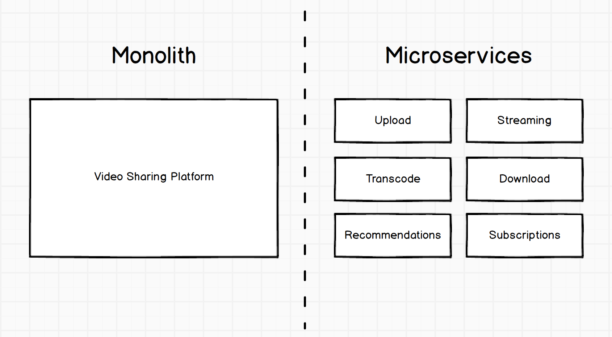

.center.icon[]

---

class: top white
background-image: url(img/sound.svg)
background-size: 130%
.top.icon[]

.sound-top[
  # Как меня слышно и видно?
]

.sound-bottom[
  ## > Напишите в чат
  ### **+** если все хорошо
  ### **-** если есть проблемы cо звуком или с видео
  ### !проверить запись!
]

---

class: white
background-image: url(img/message.svg)
.top.icon[]

# Монолит и микросервисы

### Степанкевич Евгений

---

# План занятия

.big-list[
* Монолит и микросервисы
* Плюсы и минусы микросервисной архитектуры
* 12 Factor application
* Serverless
]

---
# Немного юмора

.main-image[

]

---

# Немного юмора

.medium-image[

]

---

# Микросервисы и монолит

.main-image[
 
]

---

# Микросервисы: отличия

.big-list[
* Микро необязательно про размер, но про зону ответственности
* Самодостаточны, идеальны для горизонтального масштабирования
* Разные технологии для разных задач
* Распределенная кодовая база
]
---

# Микросервисы: плюсы

.big-list[
* Декомпозиция монолита   
  (Несколько простых API проще, чем монстр-монолит)
* Проще юнит тестирование  
  (замокал внешние походы и вперед)
* Независимые релизы и разработка
* Независимая масштабируемость  
  (закупаем серверы под те сервисы, которым это нужно)
]

---

# Микросервисы: ещё плюсы

.big-list[
* Независимая деградация  
  (когда лежит сервис А, сервис Б продолжает жить)
* Возможность пробовать новые технологии
* Повторное использование
  ]

---

# Микросервисы: минусы

.big-list[
* Понимание всего контекста запроса
* Удаленные вызовы дороже локального исполнения
* Распределенность  
  (Отказы, таймауты, ретраи...)
* Транзакционность
* Сложность тестирования всей системы
]

---
# Микросервисы: еще минусы

.big-list[
* "Независимые релизы" и легаси  
  (версионирование ручек)
* Независимая деградация  
  (платежи лежат, сайт считай не работает)
* Сетевой вызов отвалиться вероятнее, чем внутренний
* Сложность масштабирования
  (все ли на одной машине, бд на своей железке)
* Зоопарк технологий
]

---

## 12 факторные приложения

---

 # 1. Кодовая база

#### Одна кодовая база, отслеживаемая в системе контроля версий – множество развёртываний 
 
 
Весь код приложения должен быть в системе контроля версий. И разворачиваться для разработки, 
тестирования и на рабочих серверах из одного репозитория. Что, впрочем, не исключает, что в 
развертываниях может быть код в различных ветках, которые еще не добавлены в релиз.

---

 # 2. Работа с зависимостями

#### Явно объявляйте и изолируйте зависимости
 
 
Приложения не должны иметь неявных зависимостей. Во-первых, все зависимости как 
системные, так и библиотеки должны быть прописаны в манифесте зависимостей. Все 
современные языки предоставляю менеджер пакетов с манифестом зависимостей. 
Кроме этого зависимости должны быть изолированные, чтобы системная библиотека 
«не просочилась» в приложений.

---

 # 3. Конфигурация

#### Сохраняйте конфигурацию в среде выполнения
 
 
Код не зависит от окружения, а конфигурация зависит. Поэтому код должен храниться 
в репозитории, а конфигурация в окружении. Если вы можете опубликовать свой код в 
открытый доступ без компрометации персональных учетных записей – вы все делаете правильно.

---

 # 4. Сторонние службы (Backing Services)

####Считайте сторонние службы (backing services) подключаемыми ресурсами
 
 
Сторонние службы — это базы данных, почтовые службы, кешурующие сервера и API 
различных сервисов. 12-факторное приложение не должно делать различие между локальными 
и удаленными службами. Каждая служба — это подключаемый ресурс, данные для подключения 
к которому (адрес и учетные данные) должны храниться в конфигурации.

---

 # 5. Сборка, релиз, выполнение

####Строго разделяйте стадии сборки и выполнения
 
 
При разработке приложения 12 факторов надо строго разделять эти этапы. Сборка инициируется
разработчиком, когда он готов выложить изменения. Это может быть более длительный процесс, 
но после этого изменения в коде релиза внести нельзя. С другой стороны, этап выполнения должен 
быть как можно более простой операцией, чтобы она могла быть произведена автоматически в случае 
остановки оборудования, или других ошибок, без вмешательства разработчика.

---

 # 6. Процессы
#### Запускайте приложение как один или несколько процессов не сохраняющих внутреннее состояние (stateless)
 
 
Приложение должно запускать как один или несколько процессов, которые не сохраняют свое 
внутреннее состояние. Приложение может использовать данные в оперативной памяти или на диске как 
временное хранилище. Например, при перекодировании изображений. Но любые пользовательские данные должны 
лежать в постоянном хранилище (подключаемом ресурсе).

---

 # 7. Привязка портов
#### Экспортируйте сервисы через привязку портов
 
 
Приложение двенадцати факторов является полностью самодостаточным и не полагается на инъекцию веб-сервера 
во время выполнения для того, чтобы создать веб-сервис. Веб-приложение экспортирует HTTP-сервис путём привязки 
к порту и прослушивает запросы, поступающих на этот порт.

---

 # 8. Параллелизм
#### Масштабируйте приложение с помощью процессов 
 
 
 приложение должно иметь возможность быть запущенным как несколько процессов на различных физических машинах.

---

 #9. Утилизируемость
#### Максимизируйте надёжность с помощью быстрого запуска и корректного завершения работы
 
 
Это логическое следствие процессов, которые не сохраняют свое состояние. Максимизируйте надежность с помощью 
процессов, которые быстро запускаются и корректно завершают свою работу, даже аварийно.

---

 # 10. Паритет разработки/работы приложения
#### Держите окружения разработки, промежуточного развёртывания (staging) и рабочего развёртывания (production) максимально похожими

.main-image[

]

---

 # 11. Журналирование
#### Рассматривайте журнал как поток событий
 
 
Лог — это поток событий, и надо обращаться к нему как к потоку событий. Приложение, не должно само 
записывать данные в файл логов, и тем более управлять файлами (архивировать или удалять).
12 факторное приложение выводит лог своей работы в stdout. Менеджер, которой запускает процесс, должен 
направлять логии систему анализа или архивирования.

---

 # 12. Задачи администрирования
#### Выполняйте задачи администрирования/управления с помощью разовых процессов
 
 
Разовые процессы администрирования (миграции, исправления базы) должны подчиняться тем же правилам, 
что и остальные процессы

---

# Serverless

.big-list[
* Сервер все таки есть
* Function as Service
* Долгий запуск, короткое время жизни
* Нет зависимости от инфраструктуры, но есть vendor lock
]
---
# Serverless: Область применения

.big-list[
* Сократить простой ресурсов
* Ускорить разработку ( писать нужно только бизнес логику)
* Масштабирование никогда не было таким простым
* Не подходит для realtime систем
]
---
# Ссылки

.big-list[
* [https://12factor.net/ru/](https://12factor.net/ru/)
* [https://habr.com/ru/company/flant/blog/347518/](https://habr.com/ru/company/flant/blog/347518/)
* [https://habr.com/ru/company/selectel/blog/452266/](https://habr.com/ru/company/selectel/blog/452266/)
]
---

# Опрос

.left-text[
Заполните пожалуйста опрос
  
[https://otus.ru/polls/15954/](https://otus.ru/polls/15954/)
]

.right-image[

]

---

class: white
background-image: url(img/message.svg)
.top.icon[]

# Спасибо за внимание!
