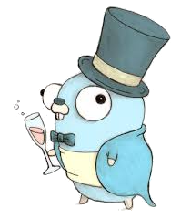

.center.icon[]

---

class: top white
background-image: url(img/sound.svg)
background-size: 130%
.top.icon[]

.sound-top[
  # Как меня слышно и видно?
]

.sound-bottom[
  ## > Напишите в чат
  ### **+** если все хорошо
  ### **-** если есть проблемы cо звуком или с видео
  ### !проверить запись!
]

---

class: white
background-image: url(img/message.svg)
.top.icon[]

# Очереди сообщений

### Антон Телышев

---

# План занятия

.big-list[
* Очереди сообщений
* Событийно-ориентированная архитектуры
* RabbitMQ
* Использование RabbitMQ
* Пару слов о Kafka
]


---

# Очередь сообщений / Message Broker

.main-image[
		
]

* Yandex Message Queue (https://cloud.yandex.ru/services/message-queue)
* Amazon Web Services (AWS) Simple Queue Service (SQS)
* Apache ActiveMQ
* Apache Kafka
* Redis (pubsub)
* RabbitMQ
* NATS

etc.


---

class: black
background-size: 50%
background-image: url(img/crawler.png)

# Пример: crawler (поисковый робот)


---


# Вернемся к проблемам микросервисов...

.main-image[
 
]

---


# Очереди сообщений

* Слабое связывание
* Масштабируемость*
* Эластичность
* Отказоустойчивость
* Гарантированная доставка*
* Гарантированный порядок доставки*
* Буферизация
* Понимание потоков данных
* Асинхронная связь


---


# Событийно-ориентированная архитектура

.main-image[
 
]


---

# Паттерны: Event Notification

.main-image[
 
]

request-driven

---

# Паттерны: Event Notification

.main-image[
 
]

---

# Паттерны: State Transfer

.main-image[
 
]


---

# Паттерны: Event Collaboration

.main-image[
 
]


---

# Паттерны: Event Sourcing

.main-image[
 
]


---

# Паттерн: Команды, События, Запросы

.main-image[
 
]


---

# Паттерны: CQRS
Command Query Responsibility Segregation

.main-image[
 
]


---

# Ссылки

- Разработка транзакционных микросервисов с помощью Агрегатов, Event Sourcing и CQRS<br>
https://habr.com/ru/company/nix/blog/322214/


- Основы CQRS<br>
https://habr.com/ru/company/simbirsoft/blog/329970/


---

# RabbitMQ

RabbitMQ — это распределенная система управления очередью сообщений

<br>
#### Advanced Message Queuing Protocol (AMQP)


.main-image[
	
]


---

# RabbitMQ

- Сообщение (<b>message</b>) — единица передаваемых данных, основная его часть (содержание) никак не интерпретируется сервером, к сообщению могут быть присоединены структурированные заголовки.


- Точка обмена (<b>Exchange</b>) — в неё отправляются сообщения. Точка обмена распределяет сообщения в одну или несколько очередей. При этом в точке обмена сообщения не хранятся.


- Очередь (<b>queue</b>) — здесь хранятся сообщения до тех пор, пока не будут забраны клиентом. Клиент всегда забирает сообщения из одной или нескольких очередей.


- Связки (<b>bindings</b>) - правила для роутинга сообщений


---


background-size: 60%
background-image: url(img/exchangefanout.webp)
# RabbitMQ: fanout exchange

<br><br><br><br><br>
<br><br><br><br><br>
<br><br><br><br><br>
<br><br><br><br><br>

Fanout – полностью игнорирует ключи маршрутизации и отправляет сообщения во все привязанные очереди. Точки обмена этого типа используются для распространения сообщений нескольким клиентам (рассылки уведомлений, обновлений, конфигураций и т.п.).


---

background-size: 60%
background-image: url(img/exchange-direct.png)
# RabbitMQ: direct exchange

<br><br><br><br><br>
<br><br><br><br><br>
<br><br><br><br><br>
<br><br><br><br><br>

Direct – доставляет сообщения в очереди по ключам маршрутизации. Ключи маршрутизации – это дополнительные данные, которые определяют, в какую очередь нужно отправить сообщение. Обычно точки обмена такого типа используются в балансировке нагрузки round-robin.


---

background-size: 90%
background-image: url(img/topicexchange.png)
# RabbitMQ: topic exchange

<br><br><br><br><br>
<br><br><br><br><br>
<br><br><br><br><br>
<br><br><br><br><br>

Topic – используется в шаблонах pub/sub. В этом случае ключ маршрутизации используется вместе с привязкой очередей к точке обмена. например, app.notification.sms.# — в очередь будут доставлены все сообщения, отправленные с ключами, начинающимися с app.notification.sms.

---

# Поиграемся с админкой

```
$ docker run -d --name rb -p 15672:15672 -p 5672:5672 rabbitmq:3-management
http://localhost:15672/ guest:guest
```

---

# Посмотрим на код

.main-image[
 
]

---

# Краткие выводы

- используем каналы и concurrency паттерны
- не забываем про backoff
- реализуем код исходя из особенностей конкретного брокера

---

# Что ещё из популярного? Kafka!

* Распределённый программный брокер сообщений
* Написан на Java/Scala
* Придуман в Linkedin чтобы обрабатывать безумный объем данных
* Есть коммерческая поддержка (Confluent)
* Линейно масштабируемый
* С гаринтией упорядоченности
* Надежный (репликация)
* Высокодоступный (high availability)

---

# Kafka: для каких задач?

- Message broker (ActiveMQ / RabbitMQ)
- Трекинг активности в вебе (linkedin)
- Сбор метрик
- Агрегация логов
- Stream processing (Kafka Streams)
- Event sourcing (https://martinfowler.com/eaaDev/EventSourcing.html)
- Storage? https://www.confluent.io/blog/okay-store-data-apache-kafka/

---

# Kafka: что почитать

* Designing Event Driven Systems
<br>
http://www.benstopford.com/2018/04/27/book-designing-event-driven-systems/


* Kafka: The Definitive Guide
<br>
https://www.confluent.io/wp-content/uploads/confluent-kafka-definitive-guide-complete.pdf


### RabbitMQ vs Kafka

- https://jack-vanlightly.com/blog/2017/12/4/rabbitmq-vs-kafka-part-1-messaging-topologies


- https://content.pivotal.io/blog/understanding-when-to-use-rabbitmq-or-apache-kafka

---

# И еще почитать

- RabbitMQ против Kafka: два разных подхода к обмену сообщениями<br>
https://habr.com/ru/company/itsumma/blog/416629/


- Understanding When to use RabbitMQ or Apache Kafka<br>
https://content.pivotal.io/blog/understanding-when-to-use-rabbitmq-or-apache-kafka


- Apache Kafka: обзор<br>
http://habr.com/ru/company/piter/blog/352978/


- Kafka и микросервисы: обзор<br>
https://habr.com/ru/company/avito/blog/465315/


- Apache Kafka и миллионы сообщений в секунду<br>
https://habr.com/ru/company/tinkoff/blog/342892/


- Apache Kafka и RabbitMQ: семантика и гарантия доставки сообщений<br>
https://habr.com/ru/company/itsumma/blog/437446/


---

# Домашнее задание 

Реализовать "напоминания" о событиях с помощью RabbitMQ:

<br>

- создать процесс, который периодически сканирует основную базу данных, выбирая события о которых нужно напомнить;


- создать процесс, который читает сообщения из очереди и шлет уведомления.

https://github.com/OtusGolang/home_work/blob/master/hw12_13_14_15_calendar/docs/14_README.md

https://github.com/rabbitmq/rabbitmq-tutorials/tree/master/go


---

# Опрос

.left-text[
Заполните пожалуйста опрос
<br>
https://otus.ru/polls/?????/
]

.right-image[

]

---

class: white
background-image: url(img/message.svg)
.top.icon[]

# Спасибо за внимание!
