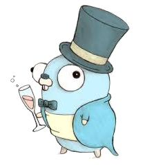

.center.icon[]

---

class: top white
background-image: url(img/sound.svg)
background-size: 130%
.top.icon[]

.sound-top[
  # Как меня слышно и видно?
]

.sound-bottom[
  ## > Напишите в чат
  ### **+** если все хорошо
  ### **-** если есть проблемы cо звуком или с видео
]


---

class: white
background-image: url(img/message.svg)
.top.icon[]

# Тестирование микросервисов

### Антон Телышев


---

# План занятия

.left-text[
<br>
* Какие бывают тесты и зачем
* Интеграционное тестирование
* TDD и BDD
* Язык Gherkin
* godog и запуск тестов через docker compose
]

.right-image[
  
]


---

class: bottom
background-image: url(img/graph.png)
background-size: 95%

# Тестирование

**Тестирование ПО** — проверка соответствия между реальным и ожидаемым поведением программы,
осуществляемая на конечном наборе тестов, выбранном определенным образом. 

https://habr.com/ru/post/279535/


---

# Зачем писать тесты?

<br><br><br><br>
<br><br><br><br>
<br><br><br><br>
<br><br><br><br>
<br>


---


# Зачем писать тесты?

- Проверить себя, уменьшить вероятность ошибки
- Сделать свой код более устойчивым к поспешным изменениям
- Помочь потомкам работать с твоим кодом, понимать его логику
- Ваш вариант


---

class: bottom
background-image: url(img/unit_vs_integr.png)
background-size: 95%

# Модульные VS Интеграционные

https://habr.com/ru/post/358950/
<br>
https://habr.com/ru/post/358178/


---

class: bottom
background-image: url(img/tdd.png)
background-size: 70%

# TDD (Test-Driven Development)

https://ru.wikipedia.org/wiki/Разработка_через_тестирование


---

# TDD: пример

### Задача
Написать функцию Join, которая склеивает слайс рун в строку,
игнорируя пробелы.


---

# TDD (Test-Driven Development)

- Часто можно увидеть в резюме
- Ломает мышление – тяжело писать тесты на то, чего еще нет :)
- Помогает рассмотреть задачу с нескольких сторон, выделить основные рабочие сценарии, определить интерфейсы взаимодействия
- Необходимо применять при работе с малоизученным кодом, а также при исправлении багов


---

# Фиксим баги через TDD

- Вам сообщили о проблеме и вы экстренно её решили.

- Оставив всё как есть, вы написали тест на решение и он с большой долей вероятности прошёл.

- Через какое-то время проблема повторилась. Почему?


---

class: bottom
background-image: url(img/bdd.png)
background-size: 80%

# Behavior-Driven Development (BDD)

https://en.wikipedia.org/wiki/Behavior-driven_development


---

# BDD

- В чём TDD?

- Описание идёт через спецификацию поведения

- Стандарт для спецификации de facto – язык Gherkin

- Наиболее известная компания, продвигающая фреймворки для BDD - **Cucumber**

- Вроде бы BDD позволяет бизнесу быть ближе к программистам, но что думаете сами?


---

# Язык Gherkin


```
Feature: Guess the word

  # The first example has two steps
  Scenario: Maker starts a game
    When the Maker starts a game
    Then the Maker waits for a Breaker to join

  # The second example has three steps
  Scenario: Breaker joins a game
    Given the Maker has started a game with the word "silky"
    When the Breaker joins the Maker's game
    Then the Breaker must guess a word with 5 characters
```

https://cucumber.io/docs/gherkin/reference/


---

# Возвращаясь к интеграционным тестам

Для интеграционных тестов нужна вся (или частично) работающая система.

Какие варианты?


---

# Интеграционные тесты: окружение

- ~~Долго и мучительно~~ поднимаем сервисы, базу, кеши и пр. локально

- У нас есть виртуалка или админы любезно предоставили нам тестовое окружение, куда мы можем раскатиться

- **docker-compose****:
  - поднимаем всю инфраструктуру без особого труда
  - не храним состояние между запусками, если не хотим
  - остается проблема с сервисами, которые ходят во внешнюю сеть (стороннее API и пр.), как решить?


---

# docker-compose: полезные команды

```
docker-compose [-f file] up [–d] [–build] [--exit-code-from service]
docker-compose [-f file] down
docker-compose logs [–f service]
docker-compose ps [–a]
docker-compose [-f file] run service [command]
docker-compose [-f file] exec service [command]
```

---

# Интеграционные тесты: пример

1. Клиент API посылает запрос на регистрацию пользователя в **RegistrationService**

2. **RegistrationService** сохраняет пользователя в базу и публикует событие, что произошла новая регистрация

3. **NotificationService** уведомляет пользователя о регистрации (например смс, email и пр.) и публикует событие,
что такой-то пользователь был проинформирован.


---

class: bottom
background-image: url(img/example.png)
background-size: 90%

# Интеграционные тесты: пример


---

# Интеграционные тесты: возможный тест на Gherkin

```
История: Отсылка email-уведомления

  Как клиент API сервиса регистрации
  Чтобы понимать, что пользователю приходит подтверждение регистрации
  Я хочу получать события из соответствующей очереди

  Сценарий: Получаем событие от сервиса уведомлений
  Когда я отсылаю POST-запрос с пользовательским JSON в сервис регистрации
  Тогда ответ от сервиса должен быть 200 ОК
  И я должен получить событие из очереди, содержащее email-пользователя
```


---

# Интеграционные тесты: реализация


Реализация примера:<br>
https://github.com/OtusGolang/webinars_practical_part/tree/master/5.4_integration_testing

<br><br>
Для BDD используем godog (читайте внимательно README):<br>
https://github.com/DATA-DOG/godog


---

# Опрос

.left-text[
  Заполните пожалуйста опрос о занятии.
  <br><br>
  Ссылка в чате.
]

.right-image[
  
]


---

class: white
background-image: url(img/message.svg)
.top.icon[]

# Спасибо за внимание!
