background-image: url(../img/title.svg)

---

background-image: url(../img/rec.svg)

---
background-image: url(../img/topic.svg)

.topic[Kubernetes]
.tutor[Феоктистов Илья]
.tutor_desc[Senior Software Engineer at Agoda]

---

background-image: url(../img/rules.svg)

---

# О чем будем говорить:

- Что такое Кубернетес
- Архитектура
- Объекты Кубернетеса: pod, replicaSet, deployment

---

# Kubernetes

- Kubernetes (k8s) - инструмент контейнерной оркестрации со множеством встроенных сервисов.

- Разрабатывается Google и передан на поддержку в фонд CNCF, обладает большим комьюнити. Полностью бесплатен.

Де-факто стандарт индустрии по контейнерной оркестрации.

---

# Minikube

- Minikube — это упрощенная реализация полноценного Kubernetes-кластера. Позволяет быстро развернуть простой кластер
  Kubernetes на своей локальной машине

https://minikube.sigs.k8s.io/

---

# Концепция Pod

 
- Pod - это группа контейнеров (один или несколько)
- Минимальная сущность, управляемая Kubernetes'ом

.full-image[
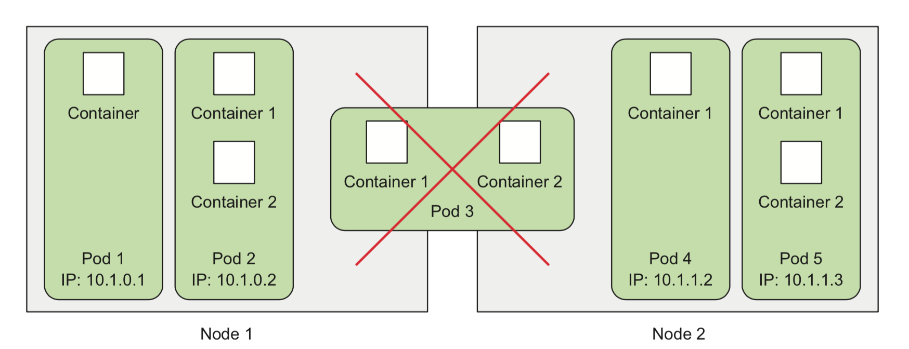
]
---

# Контейнеры внутри одного Pod'а или разные Pod'ы?

- Сервисы должны масштабироваться вместе или по отдельности?
- Должны ли сервисы быть запущены вместе или могут быть
  разнесены на разные хосты?
- Это связанные сервисы или независимые компоненты?

---

# kubectl

##### CLI утилита, распространяемая в виде бинарного файла

 
Объекты в кластере можно:

- Создать (kubectl create)
- Обновить (kubectl apply)
- Получить (kubectl get)
- Посмотреть (kubectl describe)
- Удалить (kubectl delete)

---

## Из каких компонентов состоит кластер k8s?

- Control Plane ноды
- Worker ноды

.center-image[
.half-image[
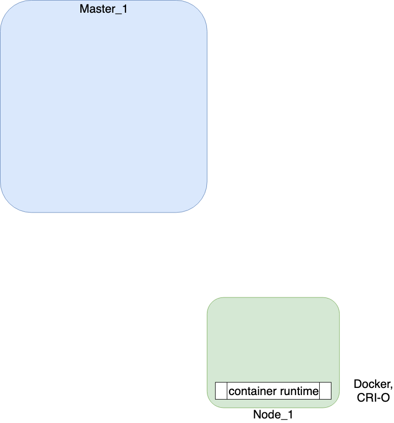
]
]
---

## Из каких компонентов состоит кластер k8s?

### Основные компоненты:

- etcd
- api-server
- controller-manager
- scheduler
- kubelet
- kube-proxy

  .threefour-image[
  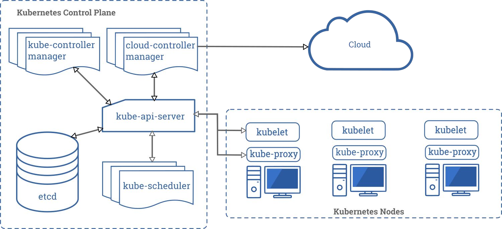
  ]

---

# etcd

etcd – key/value база данных для хранения конфигурации
кластера

- Работает по алгоритму raft (он обеспечивает надежность
  за счет поддержки кворума)
- Единственная база данных для хранения конфигурации,
  которую поддерживает k8s
- Единственный stateful-компонент
- На каждую master-ноду устанавливается по ноде etcd

---

# api-server

api-server – центральный, главный компонент k8s

- Stateless (в отличии от etcd)
- Взаимодействие через kubectl (но
  можно работать и просто curl’ом)
- Единственный компонент, который общается с etcd
- Работает по REST API
- Обеспечивает авторизацию и аутентификацию (разграничение прав доступа до содержимому кластера)

  .center-image[
  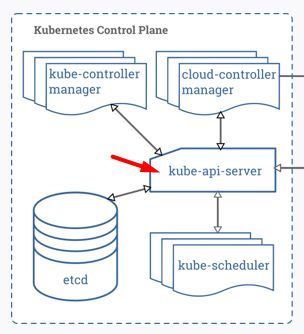
  ]

---

# controller-manager

### controller-manager – запускает процессы набора контроллеров

В состав controller-manager’а входят следующие контроллеры:

- node-controller
- replicaset-controller
- endpoints-controller
- account-controller
- token-controller

---

# scheduler

scheduler назначает поды на ноды с учетом множества факторов

controller-manager генерирует манифесты подов, записывает данные в api-server, а scheduler назначает их на ноды,учитывая
важные параметры:

- Affinity и Anti-affinity
- Requests и Limits

---

# requests/limits

В некоторых сценариях использования k8s вам может понадобиться явное указание реквестов и лимитов ресурсов для ваших
сервисов.
Сделать это можно с помощью соответствущих разделов в манифесте – requests/limits

.center-image[
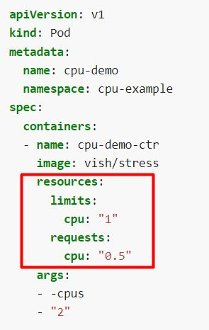
]
---

# affinity/anti-affinity

Раздел спецификации «nodeSelector» предоставяет очень простой способ привязать поды к узлам с определенными метками.

Функций affinity/anti-affinity значительно расширяют типы
ограничений, которые вы можете выразить.

.center-image[
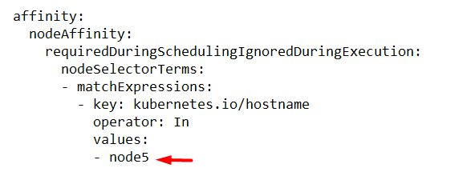
]
---

# Вспомогательные компоненты k8s

Помимо основных компонентов, установленных на
мастер-нодах, для работы кластера необходимы
дополнительные компоненты, которые устанавливаются на
всех нодах (мастер и воркер):

- kubelet
- kube-proxy

.right-image[
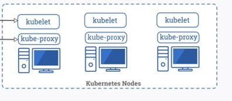
]
---

# kubelet

kubelet – агент, работающий на узле кластера

- Работает на каждой ноде (и мастер и воркер)
- Не запускается в докере, работает как процесс на
  хосте (systemctl status kubelet)
- Отдает команду docker daemon через docker api
  (docker run, напр.)
- фактически реализует запуск подов на узле
- Обеспечивает проверки liveness probe, readiness
  probe, startup probe

---

# kubelet. Подробнее о probe

- Liveness probe – используется длā определения, когда контейнер необходимо перезапустить

- Readiness probe – используется длā проверки, доступен ли модуль в течение всего жизненного цикла. В отличие от
  liveness probe, в случае сбоя проверки останавливается толяко трафик к модулю , но перезапуска не происходит
- Startup probe – используется для проверки, что приложение в контейнере было запущено. Если проба настроена, то
  liveness и readiness проверки
  блокируются, до того как проба пройдет успешно

.full-image[
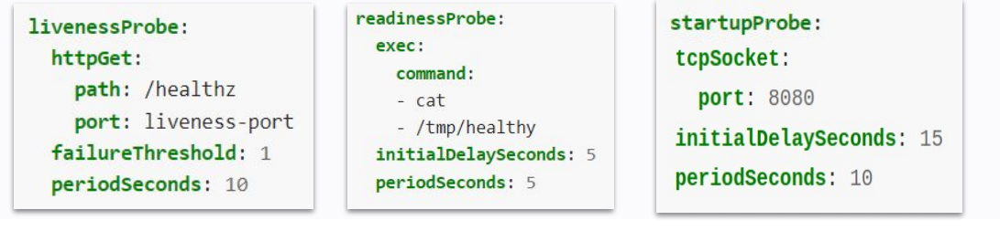
]

---

# kube-proxy

kube-proxy – сетевой прокси, работаĀщий на каждом узле в
кластере

- Взаимодействует с api-server
- Устанавливается на всех нодах
- Управляет сетевыми правилами на нодах
- Запускается в контейнере

---

## Подведем итог

Для работоспособности кластера необходимы следующие компоненты.

- etcd
- api-server
- controller manager
- scheduler
- kubelet
- kube-proxy

.center-image[
.half-image[
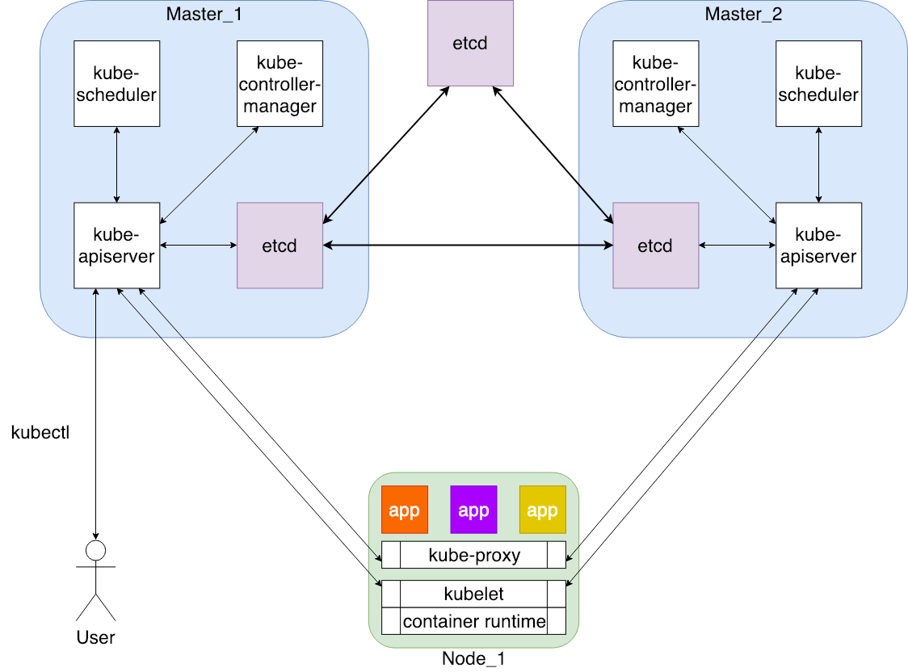
]
]

---

# ReplicaSet

- Следит за тем, чтобы число подов соответствовало заданному
- Умеет пересоздавать Podы при отказе узла (обычные "голые" поды
  умирают вместе c нодой)
- Умеет добавлять/удалять Podы не пересоздавая всю группу
- **НЕ** проверяет соответствие запущенных Podов шаблону

---

# Пора деплоить...

Алгоритм:

- Создать в торой ReplicaSet с новой конфигураций
- Одновременно:
    - уменьшаем replicas в с таром ReplicaSet
    - увеличиваем replicas в новом ReplicaSet

Когде-то давно так работал `kubectl rolling-update` в
связке с `ReplicationController`

Главное НО - приходится это делать руками

---

# Deployment

- Это контроллер контроллеров, управляющий ReplicaSets
- Делает то, что описано на слайде выше, но без ручного вмешательства, внутри кластера K8s
- Соответственно, это "декларативный" способ развертывания
- И рекомендованный способ запуска Podов (даже если нужна только одна реплика)

---

# Связь Deployment, ReplicaSet и Pod

.center-image[
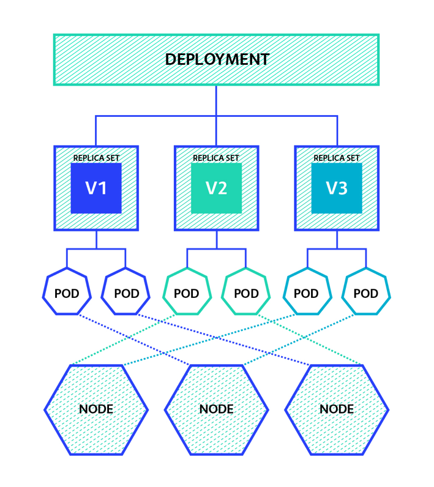
]

---

# Стратегии Deployment

- Стратегия Recreate не имеет настроек. Фактически, это удаление
  старого ReplicaSet и создание нового.
- Rolling Update можно покрутить в разные стороны:

  .center-image[
  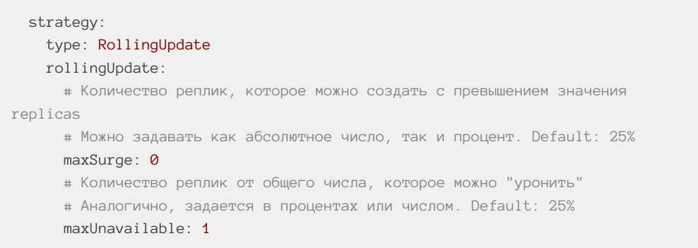
  ]

---

# Деплойменты (deployments)

За счет гарантированного поддержания определенного
количества идентичных подов, Deployment позволяет
выполнять следующие операции в кластере:

- Обновление (rolling update)
- Просматривать информацию о текущем
  обновлении (rollout status)
- Откат обновлениā (rollout undo)
- История ревизий обновлений (rollout history)
- Откат (роллбак) до конкретной ревизии обновления
  (rollout undo to revision)
- Скалирование рабочих нагрузок (scaling)

---

background-image: url(../img/questions.svg)

---

background-image: url(../img/poll.svg)

---

background-image: url(../img/next_webinar.svg)
.announce_date[1 декабря]
.announce_topic[Kubernetes часть 2]

---
background-image: url(../img/thanks.svg)

.tutor[Илья Феоктистов]
.tutor_desc[Senior Software Engineer at Agoda]
