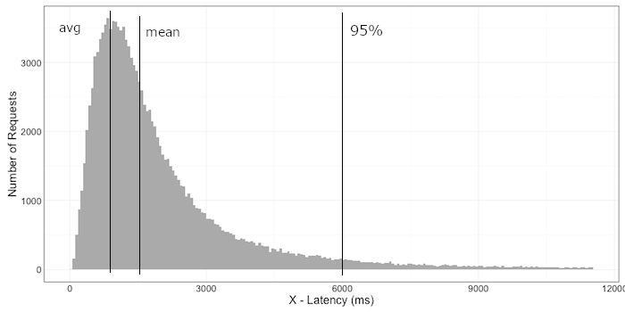

.center.icon[]

---

class: top white
background-image: url(img/sound.svg)
background-size: 130%
.top.icon[]

.sound-top[
  # Как меня слышно и видно?
]

.sound-bottom[
  ## > Напишите в чат
  ### **+** если все хорошо
  ### **-** если есть проблемы cо звуком или с видео
  ### !проверить запись!
]

---

class: white
background-image: url(img/message.svg)
.top.icon[]

# Метрики и мониторинг

### Дмитрий Смаль, Антон Телышев

---

# План занятия

.big-list[
* Observability и Operability
* Метрики и мониторинг
* Мониторинг ресурсов: LA, CPU, MEM, IO
* Мониторинг приложений
* Мониторинг баз данных
* Prometheus
]

---

# Observability

Observability (наблюдаемость) - мера того, насколько по выходным данным можно
восстановить информацию о состоянии системы.
<br><br>
Примеры:
- логирование (zap, logrus -> fluentd -> kibana)
- мониторинг (zabbix, prometheus)
- алертинг (chatops, pagerduty, opsgenie)
- трейсинг (jaeger, zipkin, opentracing, datadog apm)
- профилирование (pprof)
- сбор ошибок и аварий (sentry)

---

# Operability

Operability (работоспособность) - мера того, насколько приложение умеет
сообщать о своем состоянии здоровья, а инфраструктура управлять этим состоянием.
<br><br>
Примеры:
- простейшие хелсчеки
- liveness и readiness в Kubernetes

---

# Зачем нужен мониторинг ?

.big-list[
* Отладка, решение текущих проблем
* SRE мир: SLA, SLO, SLI
* Отправка уведомлений
* Технические и бизнесовые A/B эксперименты
* Анализ трендов, прогнозирование
]

SRE (Site Reliability Engineering) book:
<br>
https://landing.google.com/sre/sre-book/chapters/monitoring-distributed-systems/

---

# Виды мониторинга

.big-list[
* Количественный / Событийный (y/n)
* Whitebox / Blackbox
* Push / Pull
]


---

# Push vs Pull

*Push* - агент, работающий на окружении (например, сайдкар), подключается к серверу мониторинга
и отправляет данные.

<br>
Особенности:
* мониторинг специфических/одноразовых задач
* может работать за NAT
* не нужно открывать никакие URL'ы/порты на стороне пирложения
* из приложения нужно конфигурировать подключение

Примеры: `graphite`, `statsd`
<br><br>

*Pull* - сервис мониторинга сам опрашивает инфраструктуры/сервисы и агрегирует статистику.

<br>
Особенности:
* не нужно подключаться к агенту на стороне приложения 
* нужно открывать URL или порт, который будет доступен сервису мониторинга
* более отказоустойчивый
* не требует авторизации /верификации источника

Примеры: `datadog-agent`, `prometheus`

---

# Мониторинг инфраструктуры

.big-list[
* LA (Load Average) - длина очереди процессов в планировщике
* CPU (User/System/Wait) - время проводимое процессором в различных режимах
* Memory (RSS/Shared/Cached/Free) - распределение памяти в системе
* IO stats
* Network stats
]

---

# Load Average

LA - сложная метрика, ее можно интерпретировать как количество процессов(потоков) в ОС, 
находящихся в ожидании какого-либо ресурса (чаще всего CPU или диск). 
<br><br>
*Нормальной* считается загрузка когда LA ~ числу ядер процессора.
<br><br>

Как посмотреть:
* top
* iostat, dstat
  
```
$ top
Processes: 420 total, 3 running, 417 sleeping, 1860 threads                                                                                                                                            08:10:08
Load Avg: 2.47, 2.53, 2.38
```

---

# CPU

* User (`usr`, `us`) - процессор выполняет код программ. Высокое значение может быть признаком неоптимальных алгоритмов.
<br><br>

* System (`sys`, `sy`) - процессор выполняет код ядра. Высокое значение может означать большое кол-во операций ввода/вывода или сетевых пакетов.
<br><br>

* Wait (`wai`, `wa`) - процессор находится в ожидании ввода/вывода. Высокое значение означает недостаточную мощность дисковой системы.
<br><br>

* Idle (`id`)- процессор бездействует.
<br><br>

Как посмотреть: top, htop

```
$ top
Processes: 419 total, 2 running, 417 sleeping, 1868 threads                                                                                                                                            08:14:32
CPU usage: 5.11% user, 4.39% sys, 90.48% idle
```

---

# Memory

* Resident (`Res`/`RSS`) - память, занятая данными программ (как правило кучи). Высокое значение может говорить об утечках памяти в программах.
<br><br>

* Shared (`Shr`) - память, разделяемая между разными процессами (как правило сегменты кода).
<br><br>

* Cached - дисковый кеш операционный системы, в нагруженных системах (СУБД) состоянии занимает все свободное место.
<br><br>

* Free - незанятая память.
<br><br>

Как посмотреть:
* top
* free

```
$ top                                                                                                                                        08:28:11
SharedLibs: 249M resident, 42M data, 35M linkedit.
MemRegions: 164838 total, 2815M resident, 134M private, 1737M shared.
PhysMem: 12G used (2571M wired), 4457M unused.
```
  
---

# IO

* `%util` - процент времени в течение которого диск занят вводом/выводом.
* `r/s`, `w/s` - число запросов на чтение/запись в секунду.
* `rKb/s`, `wKb/s` - объем данных прочитанных/записанных в секунду.
* `await`, `r_await`, `w_await` - среднее время в мс. ожидания+выполнения запроса ввода/вывода. latency диска.
* `avgqu-sz` - средняя длина очереди запросов к диску.

Как посмотреть:
* iostat -x 1
* dstat

Проблемы:
* `%util` ~ 100% - вам не хватает мощности диска
* `%util` сильно отличается у разных дисков в RAID - неисправен диск?

```
$ iostat
Device:   r/s     w/s    rsec/s   wsec/s  avgqu-sz   await  %util
sda      0.26    0.81    14.00    21.68   0.05       36.55   2.28
sda2     1.89    0.26    0.81     14.00   0.07       45.85   1.12
```

---

# Troubleshooting

Алгоритм:
* идентифицировать проблему
* найти причину (?)
* решить  проблему

Расширенный алгоритм: управление инцидентами.
Гуглить по фразам "incident management" и "blameless postmortem".

<br><br>
Инструменты:
* `top`, `htop` - умеют сортировать процессы по CPU, RES
* `iotop` - умеет сортировать процессы по использованию диска
* `iftop` - трафик, по хостам 
* `atop` - записывает лог, позволяет исследовать ситуацию *post hoc*
  
---

# Мониторинг Web/API серверов

.big-list[
* RPS (request per second)
* Response time 
* Задержка между компонентами приложения (latency)
* Код ответа (HTTP status 200/500/5xx/4xx)
* Разделение по методам API
]
<br><br>
Для детального анализа: трейсинг, например,<br>
https://opentracing.io/

---

# Распределение значений

.main_image[

]

Среднее значение (`avg`, `mean`) или даже медиана (`median`) не отображают всей картины!
<br><br>
Полезно измерять *процентили* (percentile): время в которое укладываются 95% или, например, 99% запросов.

---

# Мониторинг баз данных

.big-list[
* TPS (transactions per second)
* QPS (queries per second)
* IO usage
* CPU usage
* Replication Lag
* Wait Events
* Active connections
]

---

# Основные группы метрик

.big-list[
* Latency - время задержки
* Traffic - количество запросов и объем трафика
* Errors - количество и характер ошибок
* Saturation - утилизация ресурсов
]

---


# Prometheus

.main-image[

]

---

# Prometheus - установка и запуск сервера

```
docker run \
    -p 9090:9090 \
    -v /tmp/prometheus.yml:/etc/prometheus/prometheus.yml \
    prom/prometheus
```

Настройка `/tmp/prometheus.yml`
```
global:
  scrape_interval:  15s  # как часто опрашивать exporter-ы

scrape_configs:
  - job_name: 'prometheus'
    static_configs:
      - targets: ['localhost:9090']
  - job_name: 'app'
    static_configs:
      - targets: ['localhost:9100', 'localhost:9102', 'localhost:9103', 'localhost:9187'] 
```

https://prometheus.io/docs/prometheus/latest/installation/

---

# Prometheus - запуск

С настройками по умолчанию Prometheus будет доступен на порту 9090: 
[http://127.0.0.1:9090/](http://127.0.0.1:9090/)

---

# Prometheus - мониторинг

- мониторинг сервера: <br>
https://github.com/prometheus/collectd_exporter (collectd + collectd-exporter) <br>
https://github.com/prometheus/node_exporter
<br><br>

- мониторинг базы: postgres-exporter <br>
https://github.com/wrouesnel/postgres_exporter
<br><br>

- визуализация <br>
https://grafana.com/docs/grafana/latest/installation/docker/

---

# Prometheus - протокол

Простой способ исследовать: `wget -O - http://localhost:9103/metrics`

```
# TYPE go_memstats_heap_alloc_bytes gauge
go_memstats_heap_alloc_bytes 1.036096e+06

collectd_processes_ps_state{instance="mialinx-test-ub.ru-central1.internal",processes="blocked"} 0
collectd_processes_ps_state{instance="mialinx-test-ub.ru-central1.internal",processes="paging"} 0
collectd_processes_ps_state{instance="mialinx-test-ub.ru-central1.internal",processes="running"} 1
collectd_processes_ps_state{instance="mialinx-test-ub.ru-central1.internal",processes="sleeping"} 57
collectd_processes_ps_state{instance="mialinx-test-ub.ru-central1.internal",processes="stopped"} 0
collectd_processes_ps_state{instance="mialinx-test-ub.ru-central1.internal",processes="zombies"} 0

go_gc_duration_seconds{quantile="0"} 4.0147e-05
go_gc_duration_seconds{quantile="0.25"} 6.950600000000001e-05
go_gc_duration_seconds{quantile="0.5"} 0.000108126
go_gc_duration_seconds{quantile="0.75"} 0.001107202
go_gc_duration_seconds{quantile="1"} 0.039212351
go_gc_duration_seconds_sum 0.49406203400000004
go_gc_duration_seconds_count 282
```
---

# Prometheus - типы метрик

.big-list[
* `Counter` - монотонно возрастающее число, например, число запросов
* `Gauge` - текущее значение, например, потребление памяти
* `Histogram` - распределение значений по бакетам (сколько раз значение попало в интервал)
* `Summary` - похоже на `histogram`, но по квантилям
* Векторные типы для подсчета данных по меткам
]

Документация: https://prometheus.io/docs/concepts/metric_types/
<br><br>

Отличная документация в godoc: https://godoc.org/github.com/prometheus/client_golang/prometheus

---

# Prometheus - мониторинг Go HTTP сервисов

```
import (
  "log"
  "net/http"
  "github.com/prometheus/client_golang/prometheus/promhttp"
  metrics "github.com/slok/go-http-metrics/metrics/prometheus"
  "github.com/slok/go-http-metrics/middleware"
)

func myHandler(w http.ResponseWriter, r *http.Request) {
  w.WriteHeader(http.StatusOK)
  w.Write([]byte("hello world!"))
}

func main() {
  // middleware для мониторинг
  mdlw := middleware.New(middleware.Config{
    Recorder: metrics.NewRecorder(metrics.Config{}),
  })
  h := mdlw.Handler("", http.HandlerFunc(myHandler))
  // HTTP exporter для prometheus
  go http.ListenAndServe(":9102", promhttp.Handler())
  // Ваш основной HTTP сервис
  if err := http.ListenAndServe(":8080", h); err != nil {
    log.Panicf("error while serving: %s", err)
  }
}
```

---

# Prometheus - собственные метрики

```
import "github.com/prometheus/client_golang/prometheus"

var regCounter = prometheus.NewCounter(prometheus.CounterOpts{
  Name: "business_registration",
  Help: "Client registration event",
})

func init() {
  prometheus.MustRegister(regCounter)
}

func myHandler(w http.ResponseWriter, r *http.Request) {
  w.WriteHeader(http.StatusOK)
  w.Write([]byte("Hello, world!"))
  regCounter.Inc()
}

```

---

# Дополнительные материалы

SRE book:<br>
https://landing.google.com/sre/sre-book/chapters/monitoring-distributed-systems/
<br><br>

Monitoring and Observability:<br>
https://medium.com/@copyconstruct/monitoring-and-observability-8417d1952e1c

---


# Опрос

.left-text[
Заполните пожалуйста опрос
<br><br>
https://otus.ru/polls/8478/
]

.right-image[

]

---

class: white
background-image: url(img/message.svg)
.top.icon[]

# Спасибо за внимание!
