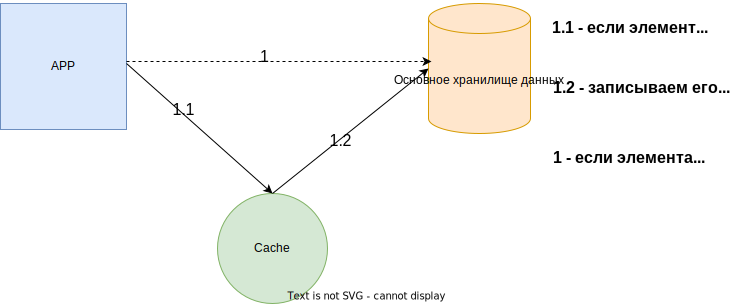
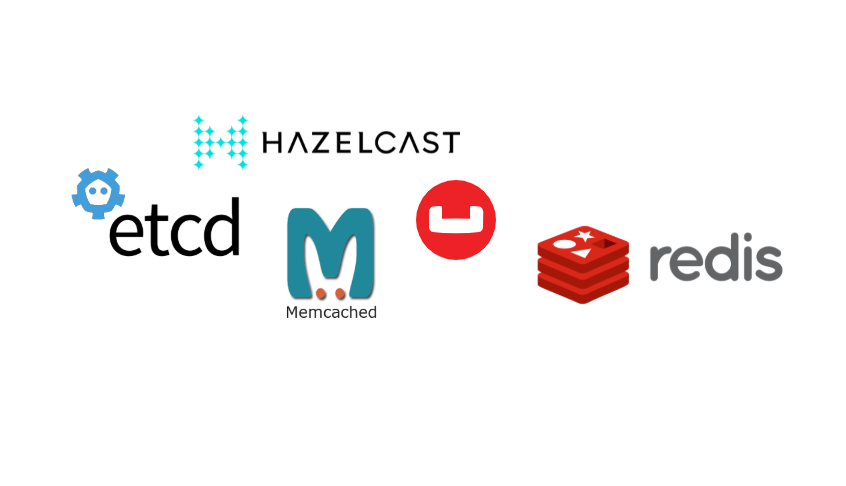
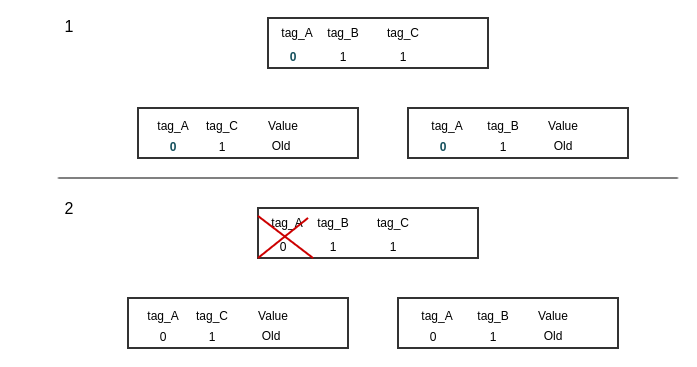
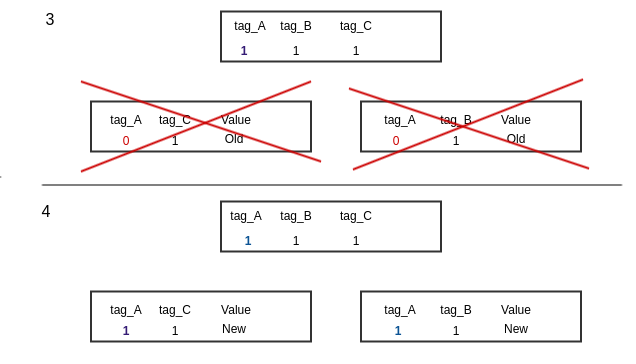
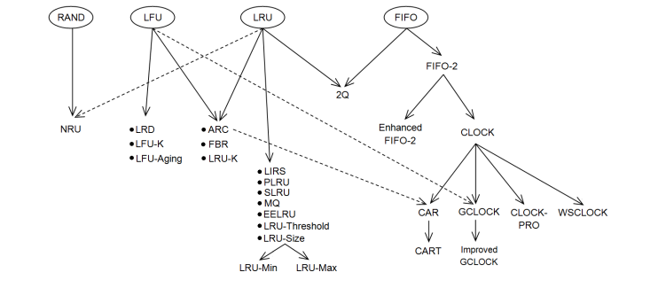

.center.icon[]

---

class: top white
background-image: url(img/sound.svg)
background-size: 130%
.top.icon[]

.sound-top[
# Как меня слышно и видно?
]

.sound-bottom[
## > Напишите в чат
### **+** если все хорошо
### **-** если есть проблемы cо звуком или с видео
### !проверить запись!
]

---

class: white
background-image: url(img/message.svg)
.top.icon[]

# Кэширование данных

### Автор/Лектор

---

# План занятия

.big-list[

* Для чего нужно кэширование?
* Основные понятия
* Что влияет на принятие решений о кэшировании
* Стратегии кэширования 
* Внешнее хранилище vs локальное кэширование
* Инвалидация кэша
* Алгоритмы вытеснения
* Инструменты 
* Проблемы

  ]

---

.main-image[

]
.top.icon[]

---

# Для чего нужно кэширование?

* Обслуживание большего количества клиентов с теми же ресурсами благодаря: 
  * переиспользованию ранее полученных или вычисленных данных
  * снижению лишней нагрузки с поставщиков данных

 
* Сокращение response time сервисов

 
* Стабилизация работы сервисов при пиковых нагрузках

 
* Стабилизация работы при кратковременных отказах систем - поставщиков данных

---

# Основные понятия
.big-list[

`Cache miss` - промах кэша - запрошенный ключ не был найден в кэше.

 
`Cache Hit` - попадание в кэш - запрошенный ключ найден в кэше.

 
`Hit ratio` - процент попаданий запросов в кэш - основной параметр, который характеризует эффективность кэширования:

 
    `Hit ratio = Количество попаданий в кэш/Количество запросов`

 
`Прогрев кэша` - процесс записи данных в оперативную память приложения или внешнего хранилища кэша.

 
`Ключ кэширования` - уникальный идентификатор. Ключ используется для поиска значения.

 
`Горячий ключ` - ключ кэширования, на который приходится большая часть запросов на чтение.

 
`Инвалидация` - удаление кэшированных объектов.

]

---

# Где применяется

* ###  процессоры
* ###  жесткие диски
* ###  операционные системы
* ###  сети доставки контента (CDN)
* ###  системы DNS
* ###  браузеры
* ###  приложения
* ###  реляционные базы данных
* ###  сервисы кэширования в оперативной памяти

---

# Какие факторы влияют на принятие решений о кэшировании

.main-image[

]
---

# Безопасно ли использовать кэшированное значение?

* Один и тот же фрагмент данных может иметь разные требования к согласованности в разных контекстах.

 
>Пример: во время оформления онлайн-заказа необходима актуальная информация о наличии товара, поэтому кэширование может быть проблемой. Но на других страницах интернет - магазина информация о наличии товара может быть устаревшей на несколько минут без негативного влияния на пользователей.

 

.main-image[

]

---
# Какое допустимое время жизни объектов в кэше?

* Если время жизни объектов в кэше слишком мало, то извлечение данных из основного хранилища и добавление их в кэш будет происходить слишком часто, на это будут уходить лишние ресурсы, а Hit rate будет минимальным.

---

# Допустима ли несогласованность?

* Не все стратегии кэширования гарантируют согласованность данных между основным хранилищем и кэшем. Данные в кэше будут устаревать.

.main-image[

]

---

# Вытеснение данных из кэша

* В большинстве случаев кэш имеет меньший объем памяти, чем основное хранилище. При достижении этого размера, часть объектов кэша будут вытесняться.
  Необходимо использовать наиболее оптимальную политику вытеснения.

---

# Эффективность кэша

### Когда кэширование эффективно

* данные из кэша приходят быстрее, чем из основного хранилища
* редкая инвалидация
* небольшое множество горячих ключей
* чтение преобладает над записью

### Что снижает эффективность

* частая инвалидация
* кэширование редко запрашиваемых данных
* недостаточный объем кэша
* неоптимальный выбор алгоритма вытеснения

---

# Стратегии кэширования
* ### Lazy caching
* ### Write-Through
* ### Read-Through
* ### Write-Around

---

# Lazy caching (Ленивое кэширование)

.full-image[

]

 
Приложение сначала идет в кэш.
  
Если данные в нем есть, то возвращает их клиенту. 
  
Если нет - идет в основное хранилище данных, обновляет кэш и отдает данные пользователю.

---
# Lazy caching (Ленивое кэширование)
### `Плюсы`

* Кэш содержит только те объекты, которые действительно запрашивают пользователи.
* Новые объекты добавляются в кэш только по мере необходимости.
* Система устойчива к сбоям кэша. Если кэш недоступен, то приложение может взаимодействовать с источником данных напрямую.

 
### `Минусы`

* Каждый промах кэша требует совершить три операции, что может приводить к значительным задержкам.
* Данные записываются напрямую в основное хранилище, что может привести к тому, что в кэше окажутся неактуальные данные. Для решения этой проблемы необходимо предусматривать механизм инвалидации.
---

# Write-through (Сквозная запись)

.main-image[

]

 
Данные сначала всегда записываются в кэш. 
  
Затем в основное хранилище данных.
  
Кэш обновляется в реальном времени при обновлении в основном хранилище.

---
# Write-through (Сквозная запись)
### `Плюсы`

* Упрощает процесс обновления кэша. Кэш всегда актуален.
* При достаточном объеме памяти позволяет избежать промахов кэша, что позволяет приложению работать эффективнее и быстрее.
* Долгая запись при обновлении данных, но обеспечивает быстрое чтение.

 

### `Минусы`

* Кэш может быть заполнен ненужными объектами, к которым нет запросов, но потребляют лишнюю память. 
* Ненужные объекты могут вытеснять из памяти более нужные.
* Нужен дополнительный механизм, позволяющий заново заполнить кэш при его потере. Комбинирование двух подходов Lazy caching и Write-through решает эту проблему, так как они связаны с противоложными сторонами потоков данных и дополняют друг друга.

---

# Read-Through (Сквозное чтение)

.main-image[

]

 
Приложение всегда считывает данные только из кэша. 
 
При этом логика наполнения кэша данными выносится в отдельный модуль, например, в крон джобу.

---
# Read-Through (Сквозное чтение)
### `Плюсы`

* Так как приложение читает данные напрямую из кэша и логика записи вынесена в отдельный модуль, логика приложения становится проще.
* Масштабируемость чтения: существует много ситуаций, когда срок действия элемента кэша истекает, и несколько параллельных пользовательских потоков в конечном итоге обращаются к базе данных.
  Сквозное чтение сохраняет ключ в кэше, пока он извлекает его последнюю копию из основного хранилища. Затем он обновляет элемент кэша. В результате приложение никогда не обращается к базе данных за этими элементами кэша, а нагрузка на источник данных сводится к минимуму.

 

###  `Минусы`

* Сложность реализации (относительно Lazy caching)

---
# Write-around (Запись в обход)

.main-image[

]

 
Если элемент есть в кэше, то при изменении данных он обновляется.
 
Если нет, тогда запись происходит только в основное хранилище.

 
Этот подход можно комбинировать с другими, например Lazy caching. Это позволит избежать заполнение кэша лишними данными.
---

# Внешнее кэширование или локальное

.main-image[

]

---
# Локальное кэширование

### `Плюсы`

* Высокая скорость получения данных.
* Отсутствие сетевых запросов.
* Отсутствие проблем с горячими ключами, которые могут приводить к ассиметричным нагрузкам на шарды внешнего кэша.
* Нет расходов на Marshaling/Unmarshalling данных из кэша.

---

# Локальное кэширование

### `Минусы`

* **Горизонтальное масштабирование сервиса может упереться в производительность сервисов** - источников данных, так как каждый инстанс на старте и по мере устаревания кэша, должен заливать в память кэш.
 
Кэширование там, где высокие нагрузки, а значит большое количество инстансов ожидаемо. 

 
* **Холодный старт**. Кэш необходимо прогревать при каждом рестарте/редеплое сервиса. Это приводит к росту нагрузки на сервисы - исчтоники данных и может вызвать деградацию response time.

 
* Сложная **логика инвалидации** in-memory кэша, обеспечивающая консистентность данных в кэше всех инстансов приложения.

 
! Совмещение in-memory кэша и внешнего позволяет решить многие проблемы.

---
# Локальное кэширование

### Когда применять

* Кэширование небольших объемов данных, которые редко изменяются.
   
  `Пример`: справочные значения.

 
* Когда основная нагрузка приходится на несколько горячих ключей. 
Разместив их в in-memory кэше можно избежать ассиметричных нагрузок на шарды внешнего кэша.

---
# Внешнее кэширование

 
Наиболее распространенная реализация этого типа кэширования основана на базах данных типа «key-value».

.full-image[

]

---
# Внешнее кэширование

### `Плюсы`

* данные хранятся централизованно =>
    * прогрев кэша быстрее, чем in-memory
    * проще логика инвалидации, чем in-memory
* может хранить большие объемы данных
* ниже нагрузка на сервисы-источники данных (часто данные достаточно запросить только один раз)
* надежность - можно использовать персистентное хранилище
* масштабирование - внешнее хранилище кэша и сервис, который его использует, масштабируются независимо по мере необходимости

---

# Внешнее кэширование

###  `Минусы`

* Высокие **требования к устойчивости к сбоям**: Потеря существенной части кэшей может привести к полному отказу всей системы. На время прогрева кэша основная нагрузка ляжет на функционал, который может быть не готов к таким нагрузкам.

 
* Затраты на **Marshaling/Unmarshalling** кэшируемых данных. Они становятся существенными, если кэшируются большие структуры.

 
* Неравномерная нагрузка на шарды кэша - горячие ключи.

 
* При изменениях форматов ключей или кэшируемых данных необходимо обеспечивать их совместимость.

---

# Инвалидация

* ### по TTL
* ### обновление кэша при изменении данных
* ### удаление кэша при изменении данных
* ### версионирование
* ### тегирование 

.right-image[

]

---

# TTL (Time-to-live)

TTL  — это время, после которого, данные будут удалены из кэша. 
TTL устанавливается при записи объекта в кэш.

 
### `Плюсы`:
* Простота реализации
* Выявляет невалидны ключи. Когда обновление или удаление ключа не произошло при обновлении исходных данных в основном хранилище, 
в конечном счете срок действия ключа кэша истечет автоматически, и он будет обновлен (Eventual consistency).

---

# TTL (Time-to-live)

### `Минусы`:
* Неконсистентные данные
* Избыточная инвалидация
* Промахи кэша
* Может стать причиной резкого роста нагрузки на систему:

 
Примеры: 

 
    1) При постоянном использовании одной и той же длины TTL, срок действия многих ключей кэша может истечь в один момент времени.
      Одно из решений этой проблемы - добавить случайность к TTL: +/- 2 min.

 
    2) Миллионы людей подписаны на популярного пользователя в соцсети. Этот пользователь не обновлял свой профиль и не публиковал никаких новых сообщений, но срок действия кэша его профиля истек из-за TTL.
      В этот момент основное хранилище данных может оказаться перегружено идентичными запросами.

---

# Обновление кэша при изменении данных

* Применяется в стратегии кэширования Write-through.

### `Плюсы`:
* Консистентные данные
* Нет избыточной инвалидации

### `Минусы`:
* Сложность реализации
* Увеличивает время записи
* Невалидные ключи могут долго не выявляться

---
# Инвалидация кэша при изменении данных

* При изменении данных кэш только удаляется. Запись в кэш происходит позже, например, при первом запросе данных.

### `Плюсы`:

* Время записи
* Простота реализации
* Консистентные данные

### `Минусы`:
* Промахи кэша
* Невалидные ключи могут долго не выявляться

---

# Версионирование ключа кэширования

* Обычно сочетается с другими подходами инвалидации и может применяться для инвалидации ключей когда между ними отсутствуют зависимости. 
Например, при массовом попадании в кэш невалидных данных,

 
К ключу кэширования добавляется версия:

 

`{id}_seller_v1`

 
Для инвалидации всех ключей кэширования с префиксом `seller` достаточно инкрементировать версию ключа.
 

---

# Тегированный кэш

Применяется в сочетании с другими подходами инвалидации, когда между ключами есть зависимости.
 
Нужно отразить зависимости в кэше, чтобы сразу выполнять инвалидацию группы элементов.

 
`Реализация`:

 
Вместе с данными сохраняется текущая версия тега, от которого зависят эти данные.

 
**Группа кэшей** - это кэши, имеющие один общий тэг.

 
Чтобы сбросить группу кэшей, достаточно инкрементировать версию соответствующего тэга.
При обновлении данных генерируется новая версия тега.

---

# Тегированный кэш

.center-image[

]

---
# Тегированный кэш

.center-image[

]

---

# Алгоритмы замещения данных в кэше

**Алгоритм замещения** - алгоритм, определяющий порядок удаления объектов из кэш-памяти и записи на их место новых данных.

 
**Оптимальный алгоритм** должен выбирать для замещения элемент, обращение к которому не ожидается в будущем дольше других.

 
Выбор алгоритма кэша зависит от того, как будет использоваться память, от последовательности, периодичности, частоты запросов.

---

# Алгоритмы замещения данных в кэше

.main-image[

]

---

# Алгоритмы замещения данных в кэше

.main-image[

]

---

# Алгоритмы замещения данных в кэше

### 1. LRU (Least Recently Used)
### 2. LFU (Least frequently used)
### 3. SLRU (Segmented LRU)
### 4. LIFO (Last in first out)
### 5. FIFO (First in first out)
### 6. 2Q (2 queue)
### 7. MQ (Multi queue)

---

# LRU (Least Recently Used)

.main-image[

]

---
# LRU (Least Recently Used)

`Least Recently Used` - каждый новый элемент вставляется в голову списка. При запросе элемента он перемещается в голову списка вытесняя оттуда старый элемент.
Если нужно освободить место, вытесняется элемент из хвоста списка.

 
`Минусы`

 
LRU кэш может быть заполнен элементами, которые были запрошены только один раз, таким образом из памяти исключаются ключи, которые запрашивали чаще.
 
Этот алгоритм применяется, если данные, к которым недавно обращались, скорее всего, вскоре понадобятся повторно. 
 
Если к данным обращаются по расписанию в запланированное время, например при циклическом сканировании, LRU не подойдет.

---
# LFU (Least frequently used)

.main-image[

]

---

# LFU (Least frequently used)

### get(E)

.main-image[

]

---

# LFU (Least frequently used)

`Least frequently used` - данный алгоритм подсчитывает частоту запросов каждого элемента кэша и вытесняет тот элемент, к которому обращались меньше всего раз.

---
# SLRU (Segmented LRU)

.main-image[

]

---

# SLRU (Segmented LRU)

`Segmented Least Recently Used` - модернизированная версия обычного LRU.

 
Кэш разделен на два сегмента: "испытательный" и защищенный сегмент. Может быть добавлен сегмент для наименее активных объектов.

 
При первом запросе значение попадает в первый сегмент, при повтороном запросе элемент перекладывается во второй.

 
Этот метод позволяет избежать переполнения кэша данными, которые не будут использоваться повторно, потому что защищенный сегмент содержит элементы, к которым обращались не менее двух раз.

---

# LIFO (Last in first out)

`Last in first out` - из кэша вытесняется элемент, добавленный самым последним, независимо от того, как часто или сколько раз он был запрошен.

---

# FIFO (First in first out)

`First in first out` - из кэша удаляются элементы в том же порядке, в котором они были добавлены, независимо от того, как часто или сколько раз они были запрошены.

---

# 2Q (2 queue)

.main-image[

]

---
# 2Q (2 queue)

`2 queue` - в алгоритме две очереди. Кэш разделяется на части, как в сегментированном LRU.

 
Первая очередь содержит новые элементы и работает как очередь FIFO. Она поделена на две очереди: In и Out.

 
Элементы запрошенные из In никуда не двигаются. При вытеснении из In элементы перемещаются в Out.

 
Элементы запрошенные из Out — попадают в LRU очередь. Вытесненные элементы из Out (не запрошенные) — удаляются.

 
https://www.vldb.org/conf/1994/P439.PDF

---

# MQ (Multi queue)

`Multi Queue` - вариация LRU кэша. 

 
Этот алгоритм содержит несколько очередей, где объекты расположены по рейтингу.  Каждый список построен по принципу LRU.

 
Для каждого объекта ведётся счётчик его запросов (LFU).
Алгоритм уменьшает рейтинг объекта, чтобы в конечном счете вытеснить объекты, к которым обращались часто в прошлом, но не запрашивали в течение длительного времени.

 
Чтобы в кэше не висели ранее популярные элементы, к которым больше нет запросов, в MQ ля каждого элемента введено понятие 
`expiredTime = currentTime + lifeTime`.
 
При каждом запросе проверяется условие `currentTime > expiredTime` и если оно выполняется, то элемент перемещается в начало нижележащего списка(если ниже спускаться некуда,
то перемещается в конец текущего списка)

 
https://www.usenix.org/legacy/event/usenix01/full_papers/zhou/zhou.pdf

---
# Инструменты кэширования

### Локальное:
* ### Map
* ### ristretto

### Внешнее:
* ### redis
* ### memcached
* ### couchbase
* ### etcd
* ### hazelcast

---
# Локальное кэширование

### https://pkg.go.dev/sync#Map

### https://github.com/dgraph-io/ristretto

---
# Сравнение инструментов внешнего кэширования

.center-image[

]

---

# Внешнее кэширование

### redis: https://redis.io/
### memcached: https://memcached.org/
### couchbase: https://docs.couchbase.com/
### etcd: https://etcd.io/
### hazelcast: https://hazelcast.com/

Ещё больше сравнение характеристик 
https://db-engines.com/en/system/Couchbase%3BHazelcast%3BMemcached%3BRedis%3Betcd

 
DB Ranking:  https://db-engines.com/en/ranking_trend

---

# Внешнее кэширование

.main-image[

]

---

# Проблемы

.right-image[

]
---

# The thundering herd problem

### Эффект "стаи собак"

 
Это резкий рост нагрузки на систему, который возникает, когда множество различных процессов приложения (или запросов) одновременно запрашивают один ключ кэша, получают cache miss, а затем каждый из них параллельно выполняет один и тот же запрос к базе данных.
И чем дороже этот запрос, тем большее влияние он оказывает на базу данных.

 
> Примеры:

 
- Старт распродажи в интернет магазине в Черную пятницу.
- Истечение срока действия кэша (TTL) популярного товара на маркетплейсе.
- Добавление нового шарда кэша: его память пуста и механизм ребалансировки начинает заполнять её.

---

# The thundering herd problem

### Решения:

* ### предварительный прогрев кэша

* ### отдавать истекшие данные

  * приложение берет на себя ответственность за обновление ключа по TTL
  * кладем в кэш время истечения ключа
  * при чтении приложение проверяет TTL ключа
  * если TTL истек, приложение продлевает его ещё на небольшой срок
  * в это время идет за актуальными данными и обновлет кэш

 

>Этот способ позволяет снять существенный % запросов, но не гарантирует только 1 запрос в основное хранилище.

---

# Неравномерное распределение данных 

.main-image[

]

Для повышения надежности и производительности системы кэширования ее делят на несколько шардов. 

---

# Неравномерное распределение данных 

### Как равномерно делить данные между ними?

 

1) **Хеширование ключей** - данные разделяются по серверам в зависимости от ключа кэширования. Для этого используется хеш функция, которая на вход принимает ключ и возвращает номер сервера.

 
https://github.com/serialx/hashring

 
`Минусы`:
* в случае добавления новых шардов кэшей из-за ребалансировки ключей теряются данные
* хеширование не поможет, если большой процент операций чтения/записи приходится на один ключ

 

2) Если известно, что один конкретный ключ - горячий, то можно добавить в начало или конец этого ключа случайное число из заданного диапазона.

 
Простое двузначное число из диапазона 0 - 99 позволит равномерно распределить операции записи и чтения по 100 разным ключам и распределить их по разным шардам.
  Этот подход имеет смысл только для небольшого числа горячих ключей.

---
class: white
background-image: url(img/message.svg)
.top.icon[]

# Спасибо за внимание!
