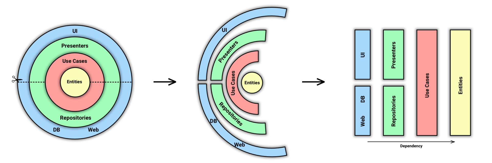
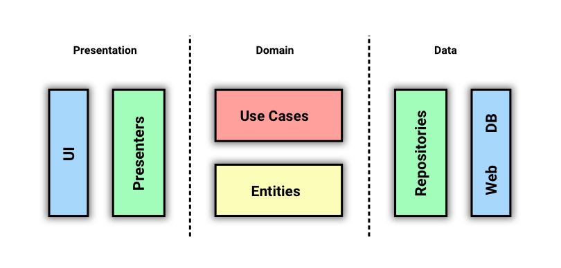
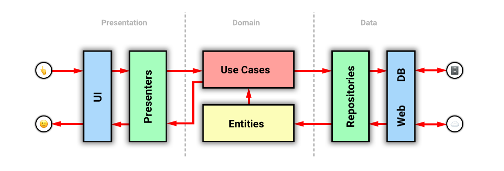
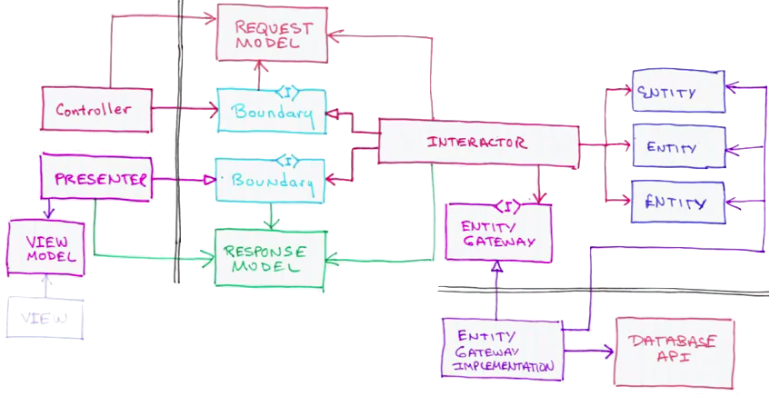

.center.icon[]

---

class: top white
background-image: url(img/sound.svg)
background-size: 130%
.top.icon[]

.sound-top[
  # Как меня слышно и видно?
]

.sound-bottom[
  ## > Напишите в чат
  ### **+** если все хорошо
  ### **-** если есть проблемы cо звуком или с видео
  ### !проверить запись!
]

---

class: white
background-image: url(img/message.svg)
.top.icon[]

# Clean Architecture

### Дмитрий Смаль
### Антон Телышев

---

# MVC

.main-image[

]

---

# MVC: проблемы

- завязанность на фреймворк
- сложно расширять
- проблемы на большой кодовой базе
- сложность в тестировании


---

# Clean Architecture

.main-image[

]

---

# Clean Architecture

Архитектура должна:
* быть тестируемой;
* не зависеть от UI;
* не зависеть от БД, внешних фреймворков и библиотек.

https://habr.com/ru/company/mobileup/blog/335382/


---

# Clean Architecture

### Ключевое правило - Dependency Rule:
внутренние слои НЕ зависят от внешних

.main-image[

]


---

# Clean Architecture

.main-image[

]


---

# Clean Architecture

.main-image[

]


---

# Clean Architecture

.main-image[

]


---

# Демо - проект

https://github.com/OtusGolang/webinars_practical_part/tree/master/19-clean-architecture


---

# Демо - проект

```
├── Makefile
├── api
│   └── api.proto
├── cmd
│   ├── grpc_client.go
│   ├── grpc_server.go
│   └── root.go
├── internal
│   ├── domain
│   │   ├── errors
│   │   │   └── error.go
│   │   ├── interfaces
│   │   │   └── event_storage.go
│   │   ├── models
│   │   │   └── event.go
│   │   └── services
│   │       └── event.go
│   ├── grpc
│   │   └── api
│   │       ├── api.pb.go
│   │       └── server.go
│   └── maindb
│       └── maindb.go
├── main.go
└── sql
```
---

# Слои проекта

### Devives, DB, UI..
* Postgres / драйвер pgx
* библиотека GRPC 
* библиотека Cobra

### Gateways, Presenters, Controllers
* `cleancalendar/cmd/*.go`
* `internal/grpc/*.go`
* `internal/maindb/*.go`

### Entities, Usecases
* `internal/domain/models/*.go`
* `internal/domain/services/*.go`
* `internal/domain/interfaces/*.go`
  

---

# Точки роста

.big-list[
* Обращение к `domain` слою через интерфейсы
* Dependency Injection [https://habr.com/ru/company/funcorp/blog/372199/](https://habr.com/ru/company/funcorp/blog/372199/)
]

---

# Плюсы и минусы

### Плюсы
.big-list[
* Чистая модель и бизнес-логика
* Возможность простого Unit-тестирования
]

### Минусы
.big-list[
* Зачастую выглядит как overkill
* Есть шанс получить Anemic Model
]

### Микросервисы ?


---

# Clean Architecture

<br>
And remember, we are all pirates by nature; and the rules I'm talking about here are really more like guidelines… (c) Uncle Bob


---

# Дополнительные ключевые слова

- Package Oriented Design
- Domain Driven Development


---

# Опрос

.left-text[
Заполните пожалуйста опрос
<br><br>
[https://otus.ru/polls/6324/](https://otus.ru/polls/6324/)
]

.right-image[

]

---

class: white
background-image: url(img/message.svg)
.top.icon[]

# Спасибо за внимание!
