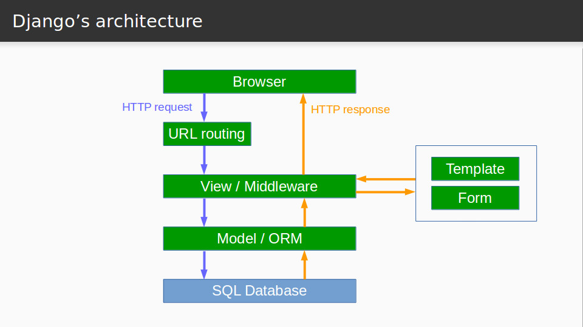

.center.icon[]

---

class: top white
background-image: url(img/sound.svg)
background-size: 130%
.top.icon[]

.sound-top[
  # Как меня слышно и видно?
]

.sound-bottom[
  ## > Напишите в чат
  ### **+** если все хорошо
  ### **-** если есть проблемы cо звуком или с видео
  ### !проверить запись!
]

---

class: white
background-image: url(img/message.svg)
.top.icon[]

# Clean Architecture

### Дмитрий Смаль

---

# MVC

.main-image[

]

---

# Clean Architecture

.main-image[

]

---

# Clean Architecture

### Ключевое правило: внутренние слои НЕ зависят от внешних

---

# Демо - проект

[https://github.com/OtusTeam/Go/tree/master/cleancalendar](https://github.com/OtusTeam/Go/tree/master/cleancalendar)

---

# Демо - проект

```
├── Makefile
├── api
│   └── api.proto
├── cmd
│   ├── grpc_client.go
│   ├── grpc_server.go
│   └── root.go
├── internal
│   ├── domain
│   │   ├── errors
│   │   │   └── error.go
│   │   ├── interfaces
│   │   │   └── event_storage.go
│   │   ├── models
│   │   │   └── event.go
│   │   └── services
│   │       └── event.go
│   ├── grpc
│   │   └── api
│   │       ├── api.pb.go
│   │       └── server.go
│   └── maindb
│       └── maindb.go
├── main.go
└── sql
```
---

# Слои проекта

### Devives, DB, UI..
* Postgres / драйвер pgx
* библиотека GRPC 
* библиотека Cobra

### Gateways, Presenters, Controllers
* `cleancalendar/cmd/*.go`
* `internal/grpc/*.go`
* `internal/maindb/*.go`

### Entities, Usecases
* `internal/domain/models/*.go`
* `internal/domain/services/*.go`
* `internal/domain/interfaces/*.go`
  
---

# Go Standard Layout

[https://github.com/golang-standards/project-layout](https://github.com/golang-standards/project-layout)

```
.
├── Makefile
├── api
├── assets
├── build
├── cmd
├── configs
├── deployments
├── docs
├── examples
├── githooks
├── init
├── internal
├── pkg
├── scripts
├── test
├── third_party
├── tools
├── vendor
├── web
└── website
```

---

# Точки роста

.big-list[
* Обращение к `domain` слою через интерфейсы
* Dependcy Injection [https://habr.com/ru/company/funcorp/blog/372199/](https://habr.com/ru/company/funcorp/blog/372199/)
]

---

# Плюсы и минусы

### Плюсы
.big-list[
* Чистая модель и бизнес-логика
* Возможность простого Unit-тестирования
]

### Минусы
.big-list[
* Зачастую выглядит как overkill
* Есть шанс получить Anemic Model
]

### Микросервисы ?

---

# TODO

.big-list[
* Реализация бизнес-логики (валидация)
* Тестирование бизнес-логики
* Альтернативный интерфейс (REST/http)
]

---

# Опрос

.left-text[
Заполните пожалуйста опрос
<br><br>
[https://otus.ru/polls/5138/](https://otus.ru/polls/5138/)
]

.right-image[

]

---

class: white
background-image: url(img/message.svg)
.top.icon[]

# Спасибо за внимание!
