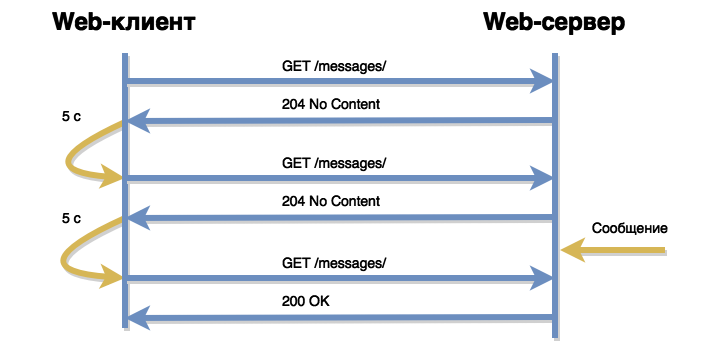
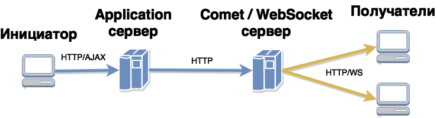
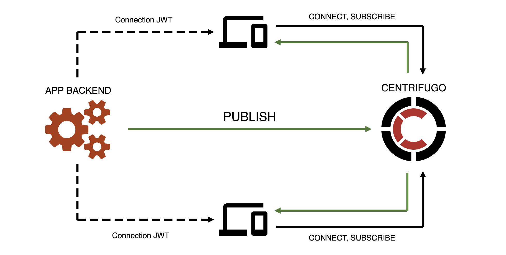

.center.icon[]

---

class: top white
background-image: url(img/sound.svg)
background-size: 130%
.top.icon[]

.sound-top[
  # Как меня слышно и видно?
]

.sound-bottom[
  ## > Напишите в чат
  ### **+** если все хорошо
  ### **-** если есть проблемы cо звуком или с видео
  ### !проверить запись!
]

---

class: white
background-image: url(img/message.svg)
.top.icon[]

# Real-Time сообщения

### Дмитрий Смаль

---

# План занятия

.big-list[
* Real-Time сообщения
* Polling
* Server-Push / Comet
* Web-Sockets
* Архитектура
]

---

# Примеры использования

.big-list[
* Чаты и мессенджеры
* Отображение котировок
* Прямые трансляции (a-la twitter)
* Push уведомления
* Сетевой обмен в играх на HTML
]

---

# Решения

.big-list[
* *Polling* - периодический опрос сервера
* *Comet (Long polling)* - polling с долгоживущими запросами
* *Server Push* - бесконечный запрос
* *WebSocket* - специализированный протокол
]

---

# Polling - периодический опрос

.main-image[

]

---

# Polling на клиенте

```
var since = 0;
setInterval(function() {
    $.ajax({
        type: 'GET',
        url:  '/messages/',
        data: { cid: 5, since: since },
    }).success(function(resp) {
        if (!resp || !resp.length) {
            return;
        }
        handleMessages(resp);
        since = resp[0].Id;
    });
}, 5000);
```
---

# Polling на сервере

```
// TODO: обработка ошибок!
func pollHandler(w http.ResponseWriter, r *http.Request) {
    cid := r.URL.Query().Get("cid")
    since := r.URL.Query().Get("since")
    
    type Message struct{Id string; Cid string; Text string}
    var messages []Message
    
    db := getDb()
    rows, _ := db.Query("select id, cid, text from messages " +
     " where cid = ? and id > ?", cid, since)
    defer rows.Close()
    for rows.Next() {
        var msg Message
        _ = rows.Scan(&msg.Id, &msg.Cid, &msg.Text)
        messages = append(messages, msg)
    }
    
    js, _ := json.Marshal(messages)
    w.Header().Set("Content-Type", "application/json")
    w.Write(js)
}
```

---

# Плюсы и минусы

.big-list[
* &plus; Простота и надежность реализации
* &plus; Не требуется дополнительного ПО
* &minus; Сообщения приходят с задержкой до N секунд
* &minus; Избыточное число HTTP запросов `RPS=CCU/N`
* &minus; Ограничение по числу пользователей
]
  
---

# Comet

.main-image[

]

---

# Comet на клиенте

```
function getComet() {
    $.ajax({
        type: 'GET',
        url:  '/listen/',
        data: { cid: 5 },
    }).success(function(resp) {
        handleMessages(resp);
        getComet();
    }).error(function() {
        setTimeout(getComet, 10000);
    });
}
getComet();
```
---

# Comet на сервере

В технологии *Comet* сервер должен поддерживать одновременно открытыми большое количество соединений,
причем каждое соединение находится в ожидании сообщений для него. По этой причине мы не можем использовать
классический application-сервер в роли comet-сервера. Для comet-сервера необходима отдельная технология,
например [https://github.com/wandenberg/nginx-push-stream-module](nginx + push-stream-module).

---

# Архитектура

.main-image[

]

---

# Comet на сервере

Используем [https://www.nginx.com/resources/wiki/modules/push_stream/](https://www.nginx.com/resources/wiki/modules/push_stream/)

```
location /publish/ {
    push_stream_publisher normal;       # включаем отправку
    push_stream_channels_path $arg_cid; # id канала
    push_stream_store_messages off;     # не храним сообщения
    allow   127.0.0.1;
    deny    all;
}

location /listen/ {
    push_stream_subscriber long-polling;    # включаем доставку
    push_stream_channels_path  $arg_cid;    # id канала
    default_type application/json;          # MIME тип сообщения
}
```

---

# Плюсы и минусы Comet

.big-list[
* &plus; Поддержка всеми браузерами
* &plus; Поддержка большого числа пользователей
* &plus; Относительная простота реализации
* &minus; Избыточные HTTP запросы
* &minus; Half-duplex
]

---

# Server push

.main-image[

]

---

# Server push

```
<script>
    function handle(message) {
        // любая логика
    }
</script>
<iframe src='/listen/?cid=123'></iframe>
```
<br><br>
Ответ сервера:
```
<script>parent.handle({ message: 'hello' })</script>
```
---

# WebSocket 

.main-image[

]

---

# WebSocket handshake

```
GET /listen HTTP/1.1
Host: server.example.com
Upgrade: websocket
Connection: Upgrade
Sec-WebSocket-Key: dGhlIHNhbXBsZSBub25jZQ==
Sec-WebSocket-Origin: http://example.com
Sec-WebSocket-Protocol: chat, superchat
Sec-WebSocket-Version: 13

HTTP/1.1 101 Switching Protocols
Upgrade: websocket
Connection: Upgrade
Sec-WebSocket-Accept: s3pPLMBiTxaQ9kYGzzhZRbK+xOo=
Sec-WebSocket-Protocol: chat
```

---

# WebSocket на стороне клиента

```
var socket = new WebSocket('wss://host.com/listen');

socket.onopen = function(event) {
    console.log('ws opened');
    var data = JSON.stringify({ message: "Hello WebSocket" });
    socket.send(data);
};
socket.onmessage = function(event) {
    var resp = JSON.parse(event.data);
    console.log('ws message', resp.message);
};
socket.onclose = function(event) {
    console.log('ws closed')
};
```
---


# WebSocket на стороне сервера

```
var clientsMutex sync.Mutex
var clients map[string]*websocket.Conn = make(map[string]*websocket.Conn)
var upgrader = websocket.Upgrader{ReadBufferSize: 1024, WriteBufferSize: 1024}

func wsHandler(w http.ResponseWriter, r *http.Request) {
        cid := r.URL.Query().Get("cid")
        if cid == "" {
                http.Error(w, "cid not passed", 400)
                return
        }
        conn, err := upgrader.Upgrade(w, r, nil)
        if err != nil {
                http.Error(w, err.Error(), 500)
                return
        }
        conn.SetCloseHandler(func(int, string) error {
                clientsMutex.Lock()
                delete(clients, cid)
                clientsMutex.Unlock()
                return nil
        })
        clientsMutex.Lock()
        clients[cid] = conn
        clientsMutex.Unlock()
}
```
---

# WebSocket на стороне сервера (2)

```
func pushHandler(w http.ResponseWriter, r *http.Request) {
    cid := r.URL.Query().Get("cid")
    if cid == "" {
        http.Error(w, "cid not passed", 400)
        return
    }
    msg, err := ioutil.ReadAll(r.Body)
    if err != nil {
        http.Error(w, "failed to read message", 400)
        return
    }
    clientsMutex.Lock()
    conn, ok := clients[cid]
    clientsMutex.Unlock()
    if !ok {
        http.NotFound(w, r)
        return
    }
    err = conn.WriteMessage(websocket.TextMessage, msg)
    if err != nil {
        http.Error(w, err.Error(), 500)
        return
    }
    w.Write([]byte("OK"))
}
```
---

# Плюсы и минусы WebSocket

.big-list[
* &plus; Минимальный объем трафика
* &plus; Минимальная нагрузка на сервер
* &plus; Поддержка большого числа пользователей
* &plus; Full-duplex
* &minus; Нет поддержки IE&lt;10, OperaMini, Android&lt;4.4
* &minus; Требуется специальный WebSocket-сервер
* &minus; Плохо работает с прокси-серверами
]

---

# Отправка сообщений

```
import requests # pip install requests
import json
puburl = 'http://127.0.0.1/publish/'
def send_message(request):
    cid = request.GET.get('to')
    text = request.GET.get('text')
    body = json.dumps({ 'message': text })
    try: ## может быть долгим
        resp = requests.post(puburl, params={'cid':cid}, data=body)
        if resp.status_code == 200:
            return HttpResponseAjax()
        else:
            return HttpResponseAjaxError(code=resp.status_code)
    except:
        return HttpResponseAjaxError(code=500)
```

---

# Отправка через очередь
.main-image[

]

---

# Centrifugo

.main-image[

]

[https://github.com/centrifugal/centrifugo](https://github.com/centrifugal/centrifugo)

---

# Опрос

.left-text[
Заполните пожалуйста опрос
<br><br>
[https://otus.ru/polls/5605/](https://otus.ru/polls/5605/)
]

.right-image[

]

---

class: white
background-image: url(img/message.svg)
.top.icon[]

# Спасибо за внимание!
