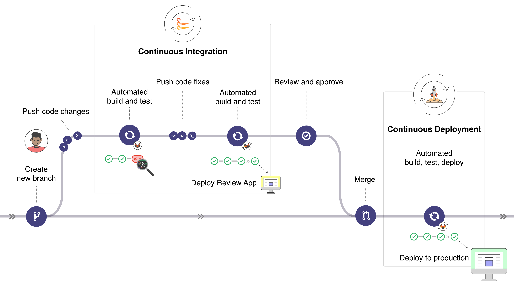
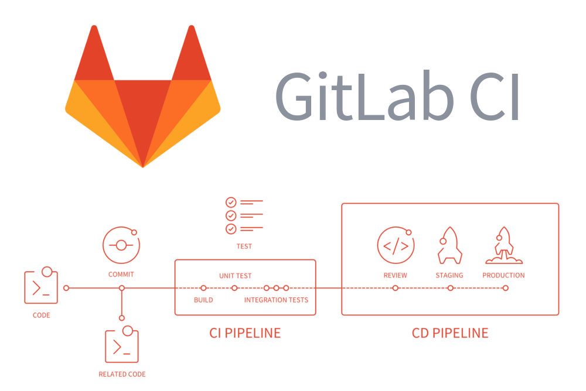

.center.icon[]


---

class: top white
background-image: url(img/sound.svg)
background-size: 130%
.top.icon[]

.sound-top[
  # Как меня слышно и видно?
]

.sound-bottom[
  ## > Напишите в чат
  ### **+** если все хорошо
  ### **-** если есть проблемы cо звуком или с видео
  ### !проверить запись!
]


---

class: white
background-image: url(img/message.svg)
.top.icon[]

# Gitlab CI

### Александр Давыдов
### Антон Телышев


---

# План занятия

.big-list[
  * CI/CD
  * Gitlab CI
  * Golang + Gitlab CI 
  <!-- + Heroku -->
]


---

# Цель занятия

* Научиться "заворачивать" свой проект в CI pipeline
<!-- * Деплоить проект на Heroku -->


---

# CI / CD workflow

.main-image[
 
]

CI, Continuous Integration — непрерывная интеграция - это практика разработки ПО, которая заключается в слиянии рабочих копий в общую основную ветвь разработки несколько раз в день и выполнении частых автосборок проекта для скорейшего выявления потенциальных дефектов и решения интеграционных проблем.


---

background-size: 90%
background-image: url(img/traditionalintegration.png)
# CI: непрерывная интеграция


---

background-size: 85%
background-image: url(img/continuousintegration.png)
# CI: непрерывная интеграция


---

background-size: 85%
background-image: url(img/cidd.gif)
# CI / CD

<br><br><br><br><br>
<br><br><br><br><br>
<br><br><br><br><br>
- Continuous Integration = build + test
- Continuous Delivery = build + test + manual deploy
- Continuous Deployment = build + test + automatic deploy


---

# Профит

Continuous Integration

<br>
- Быстрое обнаружение ошибок
- Интеграция проще, так как изменения меньше
- Нельзя "отложить фиксы до релиза"

Continuous Delivery

<br>
- Код всегда готов к релизу
- Снижение риска при релизах
- Скорость/надежность деплоев
- Быстрая обратная связь от бизнеса


---

background-size: 80%
background-image: url(img/cisystems.png)
# CI / CD


<br><br><br><br><br>
<br><br><br><br><br>
<br><br><br><br><br>
<br><br><br><br><br>
* https://www.browserstack.com/blog/best-ci-cd-tools-comparison/
* https://www.cuelogic.com/blog/best-continuous-integration-ci-tools
* https://techrocks.ru/2019/03/11/10-continuous-integration-systems/


---

# Gitlab CI

.main-image[
 
]


---

# Gitlab CI: действующие лица

.main-image[
 
]

- Commit - изменение кода в репозитории.

- Job - набор команд для исполнения Runner'ом.

- Pipeline -  набор задач (jobs) распределенных по стадиям (stages).

- Runner - агент / сервер, выполняюший задачи.

- Stages -  обозначает стадию, к которой принадлежит задача. Задачи  в стадии выполняются параллельно.


---

# Gitlab CI: jobs

Задача определяется именем и имеет как минимум один скрипт.

<br>

.gitlab-ci.yml
```yml
job1:
  script: "execute-script-for-job1"

job2:
  script: "execute-script-for-job2"
```

job:
```yml
hello:
  script:
  - apt-get install smth
  - echo "hello"
```


---

# Gitlab CI: условия выполнения

```yml
job:
  only:
    - /^issue-.*$/
  except:
    - branches
```

```yml
job:
  only: [tags, triggers, schedules]
```

```yml
stages: [build, cleanup_build]

build_job:
  stage: build
  script: "make build"

cleanup_build_job:
  stage: cleanup_build
  script: "cleanup build when failed"
  when: on_failure
```


---

# Gitlab CI: stages

```yml
stages:
  - build
  - test
  - deploy

job 1:
  stage: build
  script: make build dependencies

job 2:
  stage: build
  script: make build artifacts

job 3:
  stage: test
  script: make test

job 4:
  stage: deploy
  script: make deploy
```


---

# Gitlab CI: artifacts

```yaml
build:tags:
  image: $CI_IMAGE
  stage: build
  variables:
    CGO_ENABLED: 0
  script: 
    - go build -o $CI_PROJECT_DIR/app -ldflags
      "-X main.commit=${CI_COMMIT_SHA}
       -X main.buildNum=${CI_JOB_ID}
       -X main.version=${CI_COMMIT_TAG}" .
  artifacts:
    paths:
    - app
  only:
  - tags
```


---

# Gitlab CI: Docker image

```yaml
image: ruby:2.3

test:2.1:
  image: ruby:2.1
  services:
    - postgres:9.3
  script:
    - bundle exec rake spec

test:2.2:
  image: ruby:2.2
  services:
    - postgres:9.4
  script:
    - bundle exec rake spec
```


---

# Gitlab CI: выполнение  для ветки

```yaml
only:
- branch_name
```


```yaml
staging:
  stage: deploy
  script:
    - apt-get update -qy
    - apt-get install -y ruby-dev
    - gem install dpl
    - dpl
      --provider=heroku
      --app=otus-ci-staging
      --api-key=$HEROKU_API_KEY
  environment:
    name: Staging
    url: https://otus-ci-staging.herokuapp.com/
  only:
    - master
```


---

# Gitlab CI: before/after script

```yaml
default:
  before_script: "global before script"

job:
  before_script: "execute this instead of global before script"
  script: "my command"
  after_script: "execute this after my script"
```

```yaml
image: ruby:2.3

before_script:
  - bundle install

pages:
  stage: deploy
  script:
  - bundle exec jekyll build -d public
  artifacts:
    paths:
    - public
  only:
    - master
```


---

# Gitalb CI: services

```yaml
variables:
  POSTGRES_DB: "my_custom_db"
  POSTGRES_USER: "postgres"
  POSTGRES_PASSWORD: "example"
  PGDATA: "/var/lib/postgresql/data"
  POSTGRES_INITDB_ARGS: "--encoding=UTF8 --data-checksums"

services:
  - name: postgres:9.4
    alias: db
    entrypoint: ["docker-entrypoint.sh"]
    command: ["postgres"]

image:
  name: ruby:2.2
  entrypoint: ["/bin/bash"]

before_script:
  - bundle install

test:
  script:
    - bundle exec rake spec
```


---

# Gitlab CI: предопределенные переменные

<br><br>
https://docs.gitlab.com/ee/ci/variables/predefined_variables.html

```yaml
build:tags:
  image: $CI_IMAGE
  stage: build
  variables:
    CGO_ENABLED: 0
  script: go build  -o $CI_PROJECT_DIR/app -ldflags
            "-X main.commit=${CI_COMMIT_SHA}
             -X main.buildNum=${CI_JOB_ID} 
             -X main.version=${CI_COMMIT_TAG}" .
  artifacts:
    paths:
    - app
```

<br>

- CI_ENVIRONMENT_NAME / CI_ENVIRONMENT_SLUG
- CI_COMMIT_MESSAGE
- CI_COMMIT_REF_NAME
- etc.


---

# Gitlab CI: кастомные переменные

```yaml
variables:
  S3_BUCKET_NAME: "yourbucket"
deploy:
  image: python:latest
  script:
  - pip install awscli
  - aws s3 cp ./ s3://$S3_BUCKET_NAME/
    --recursive --exclude "*" --include "*.html"
```

GitLab -> Settings -> CI/CD -> Variables

---

# Gitlab CI: окружения

```yaml
deploy_review:
  stage: deploy
  script: echo "Deploy a review app"
  environment:
    name: review/$CI_COMMIT_REF_NAME
    url: https://$CI_ENVIRONMENT_SLUG.example.com
  only:
    - branches

deploy_staging:
  stage: deploy
  script: echo "Deploy to staging server"
  environment:
    name: staging
    url: https://staging.example.com

deploy_prod:
  stage: deploy
  script: echo "Deploy to production server"
  environment:
    name: production
    url: https://example.com
  when: manual
```

https://docs.gitlab.com/ee/ci/environments.html

---

# Gitlab CI: кэширование зависимостей

- cache: используем как временное хранилище для зависимостей проекта
- artifacts: результаты выполнения stage, сохраняются между стадиями

```yaml
cache:
  key: one-key-to-rule-them-all
```

```yaml
cache:
  key: ${CI_COMMIT_REF_SLUG} # same branch
```

```yaml
cache:
  key: "$CI_PROJECT_NAME"
  untracked: true
  paths:
    - "$GOPATH/pkg/mod"
```


---

# Gitlab CI tags

```yaml
buildapp:
  image: $CI_IMAGE
  stage: build
  variables:
    CGO_ENABLED: 0
  script: go build -o app.
  artifacts:
    paths: [app]
  only: [tags]

deploys:
  image: docker:stable
  stage: deploy
  script:
    - echo $APP_IMAGE
    - docker build --build-arg bin=build --network host
       -t $APP_IMAGE .
  after_script:
    - docker push $APP_IMAGE
  dependencies:
    - buildapp
  only:
    - tags
```

https://docs.gitlab.com/ee/ci/yaml/README.html#dependencies


---

# Gitlab CI: triggers

```bash
$ git push -o ci.skip
$ git commit -am "[ci skip]"
$ git commit -am "[skip ci]"
```

https://docs.gitlab.com/ee/ci/yaml/#skipping-jobs


---

background-size: 80%
background-image: url(img/runner.png)
# Gitlab CI Runner

<br><br><br><br>
<br><br><br><br>
<br><br><br><br>
<br><br><br><br>
<br><br><br><br>
https://docs.gitlab.com/ee/ci/runners/


---

# Gitlab CI Runner

- Shared Runners - [fair usage queue](https://docs.gitlab.com/ee/ci/runners/#how-shared-runners-pick-jobs), шарятся между проектами
- Specific Runners - для задач со специфичными требованиями, FIFO
- Group Runners - FIFO, для групп

```bash
$ brew install gitlab-runner
$ gitlab-runner register
$ gitlab-runner install
$ gitlab-runner start
$ gitlab-runner exec shell test
```

- https://gitlab.com/gitlab-org/gitlab-runner/issues/312
- https://docs.gitlab.com/runner/
- https://medium.com/@umutuluer/how-to-test-gitlab-ci-locally-f9e6cef4f054


---

# Gitlab CI: executors

- SSH
- Shell
- Parallels
- VirtualBox
- Docker
- Docker Machine (auto-scaling)
- Kubernetes
- Custom


---

# GOPROXY

- https://github.com/goproxyio/goproxy

<br>
- https://arslan.io/2019/08/02/why-you-should-use-a-go-module-proxy/

<br>
- GOPRIVATE:<br>https://golang.org/cmd/go/#hdr-Module_configuration_for_non_public_modules

---

# Простой пример


https://gitlab.com/Antonboom/otus-ci-example

---

# Ссылки

.big-list[
* [https://about.gitlab.com/blog/2017/11/27/go-tools-and-gitlab-how-to-do-continuous-integration-like-a-boss/](https://about.gitlab.com/blog/2017/11/27/go-tools-and-gitlab-how-to-do-continuous-integration-like-a-boss/)
]


---

# Опрос

.left-text[
  Заполните пожалуйста опрос
  <br><br>
  [https://otus.ru/polls/6331/](https://otus.ru/polls/6331/)
]

.right-image[
  
]


---

class: white
background-image: url(img/message.svg)
.top.icon[]

# Спасибо за внимание!

