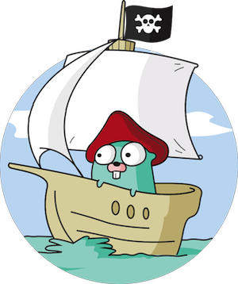

.center.icon[]

---

class: top white
background-image: url(../img/check.svg)
background-size: 130%
.top.icon[]

.sound-top[
  # Как меня слышно и видно?
]

.sound-bottom[
	## > Напишите в чат
	+ если все хорошо
	- если есть проблемы со звуком или с видео]

---

class: white
background-image: url(../img/message.svg)
.top.icon[]

# Интерфейсы в Go. <br>Часть 1

### Алексей Бакин

---

# О чем будем говорить

* ### Определение и реализация интерфейсов
* ### Композиция интерфейсов
* ### Пустой интерфейс
* ### Внутреннее устройство интерфейсов
* ### Интерфейсы и производительность программы

---

# Интерфейсы: определение

# Что это?

---

# Интерфейсы: определение

**Интерфейс** — набор методов, которые надо реализовать, чтобы удовлетворить интерфейсу. Ключевое слово: `interface`.

```
type Stringer interface {
    String() string
}

type Shape interface {
    Area() float64
    Perimeter() float64
}
```

---

# Интерфейсы и типы

Переменная **типа интерфейс** может содержать значение типа, реализующего этот интерфейс.

```
var s Stringer
s = time.Time{}
```

https://go.dev/doc/effective_go#interfaces_and_types

---

# Интерфейсы реализуются неявно

```
type Duck interface {
    Talk() string
    Walk()
    Swim()
}

type Dog struct {
    name string
}

func (d Dog) Talk() string {
    return "AGGGRRRR"
}

func (d Dog) Walk() { }

func (d Dog) Swim() { }

```

https://goplay.tools/snippet/GWYHjaDPnLG

---

# Интерфейсы реализуются неявно

```
type MyVeryOwnStringer struct { s string}

func (s MyVeryOwnStringer) String() string {
    return "my string representation of MyVeryOwnStringer"
}


func main() {
    // my string representation of MyVeryOwnStringer{}
    fmt.Println(MyVeryOwnStringer{"hello"})
}
```

```
type Stringer interface {
    String() string
}
```

https://goplay.tools/snippet/ppTH6Ya-fX5

https://go.dev/src/fmt/print.go#L611

---

# Одному интерфейсу могут соответствовать много типов

```
package io

type Writer interface {
	Write(p []byte) (n int, err error)
}
```

```
package bytes

type Buffer struct
func (b *Buffer) Write(p []byte) (n int, err error)
```

```
package os

type File struct
func (f *File) Write(b []byte) (n int, err error)
```

https://goplay.tools/snippet/0wMhI-6pdAF

---

# Тип может реализовать несколько интерфейсов

```
package io

type Reader interface {
	Read(p []byte) (n int, err error)
}

type Writer interface {
	Write(p []byte) (n int, err error)
}
```

```
package bytes

type Buffer struct
func (b *Buffer) Read(p []byte) (n int, err error)
func (b *Buffer) Write(p []byte) (n int, err error)
```

https://goplay.tools/snippet/bM3gJm3WIcc

---

# Интерфейсы: композиция

```
type Reader interface {
    Read(p []byte) (n int, err error)
}

type Closer interface {
    Close() error
}

type ReadCloser interface {
    Reader
    Closer
}
```

---

# Интерфейсы: композиция (комплексный пример)

```
import "fmt"

type Greeter interface {
     hello()
}

type Stranger interface {
    Bye() string
    Greeter
    fmt.Stringer
}
```

---

# Интерфейсы: циклические зависимости

```
type I interface {
    J
    i()
}

type J interface {
    K
    j()
}

type K interface {
    k()
    I
}
```

```
./prog.go:5:6: invalid recursive type I
	prog.go:5:6: I refers to
	prog.go:10:6: J refers to
	prog.go:15:6: K refers to
	prog.go:5:6: I
```

https://goplay.tools/snippet/2fDIbsBoZfv


---

# Интерфейсы: имена методов

Имена методов не должны повторяться:

```
type Hound interface {
    destroy()
    bark(int)
}

type Retriever interface {
    Hound
    bark() // duplicate method
}

```

```
./prog.go:6:2: duplicate method bark
```

https://goplay.tools/snippet/wMw2VKOIysx


---

# Интерфейс может быть пустым

Пустой интерфейс не содержит методов:

```
type Any interface{}
```

```
func Fprintln(w io.Writer, a ...interface{}) (n int, err error) {
   ...
}
```

---

# Интерфейсы: interface{}

Как быть?

```
func PrintAll(vals []interface{}) {
    for _, val := range vals {
        fmt.Println(val)
    }
}

func main() {
    names := []string{"stanley", "david", "oscar"}
    PrintAll(names)
}
```

https://goplay.tools/snippet/1w7ksGW0uXh

---

# interface{} is says nothing

https://go-proverbs.github.io/

---

# Интерфейсы изнутри: iface

```
type iface struct {
    tab  *itab // Информация об интерфейсе
    data unsafe.Pointer // Хранимые данные
}
```

```
// itab содержит тип интерфейса и информацию о хранимом типе.
type itab struct {
    inter *interfacetype // Метаданные интерфейса
    _type *_type // Go-шный тип хранимого интерфейсом значения
    hash  uint32
    _     [4]byte
    fun   [1]uintptr // Список методов типа, удовлетворяющих интерфейсу
}
```

https://github.com/teh-cmc/go-internals/blob/master/chapter2_interfaces/README.md#anatomy-of-an-interface
<br><br>

Структура устарела, но алгоритм такой же:<br>
https://www.tapirgames.com/blog/golang-interface-implementation


---

# Интерфейсы изнутри

```
type Speaker interface {
    SayHello()
}

type Human struct {
    Greeting string
}

func (h Human) SayHello() {
    fmt.Println(h.Greeting)
}

...

var s Speaker
h := Human{Greeting: "Hello"}
s = Speaker(h)
s.SayHello()

```

https://goplay.tools/snippet/rjboVEC3V6w

---

background-size: 60%
background-image: url(img/internalinterfaces.png)

# Интерфейсы изнутри

---

# Интерфейсы изнутри

На этапе компиляции:
- генерируются метаданные для каждого статического типа, включая его список методов
- генерируются метаданные для каждого интерфейса, включая его
список методов


И при компиляции и в рантайме в зависимости от выражения:
- сравниваются methodset'ы типа и интерфейса
- создается и кэшируется `itab`


```
var s Speaker = string("test") // compile-time error
var s Speaker = io.Reader // compile time error
var h string = Human{} // compile time error

// runtime error
var s interface{};
h = s.(Human)
```


---

# Интерфейсы изнутри

Что здесь происходит?
```
// Создание интерфейса:
// - аллокация места для хранения адреса ресивера
// - получение itab:
//      - проверка кэша
//      - нахождение реализаций методов
// - создание iface: runtime.convT2I
s := Speaker(Human{Greeting: "Hello"})

// Динамический диспатчинг
// - для рантайма это вызов n-го метода s.Method_0()
// - превращается в вызов вида s.itab.fun[0](s.data)
s.SayHello()
```


---

background-size: 60%
background-image: url(img/emptyinterface.png)

# Интерфейсы изнутри: пустой интерфейс

---

# Интерфейсы изнутри

Динамический тип и значение можно посмотреть с помощью `%v` и `%T`

```
type Temp int

func (t Temp) String() string {
    return strconv.Itoa(int(t)) + " °C"
}

func main() {
    var x fmt.Stringer
    x = Temp(24)
    fmt.Printf("%v | %T\n", x, x) // 24 °C | main.Temp
}
```

https://goplay.tools/snippet/9ldo_icbhj0


---

# Интерфейсы изнутри: benchmark

```

type Addifier interface {
    Add(a, b int32) int32
}

type Adder struct { id int32 }

func (adder Adder) Add(a, b int32) int32 {
    return a + b
}

func BenchmarkDirect(b *testing.B) {
    adder := Adder{id: 6754}
    for i := 0; i < b.N; i++ {
        adder.Add(10, 32)
    }
}

func BenchmarkInterface(b *testing.B) {
    adder := Addifier(Adder{id: 6754})
    for i := 0; i < b.N; i++ {
        adder.Add(10, 32)
    }
}
```


---

# Интерфейсы изнутри: benchmark

```
BenchmarkDirect-16      1000000000   0.2436 ns/op   0 B/op   0 allocs/op
BenchmarkInterface-16   957668390    1.157 ns/op    0 B/op   0 allocs/op
```

```
$ GOOS=linux GOARCH=amd64 go tool compile -m addifier.go

Addifier(adder) escapes to heap
```

---

# Интерфейсы: еще раз о ресиверах

https://goplay.tools/snippet/jm1bKNLABnB
<br><br>
https://stackoverflow.com/a/45653986
<br><br>
https://stackoverflow.com/a/48874650

---

# Интерфейсы

- это набор сигнатур методов
- интерфейс реализуется неявно
- интерфейс может встраивать другие интерфейсы
- имена методов интерфейса не должны повторяться
- интерфейс может быть пустым (не иметь методов), такому интерфейсу удовлетворяет любой тип

---

# Интерфейсы: интерактив

Реализовать интерфейс Adult
<br><br>
https://goplay.tools/snippet/A48l0-8FQX0

---

# Опрос

.left-text[
Заполните пожалуйста опрос
<br><br>
Ссылка в чате.
]

.right-image[

]

---

# Следующее занятие

## Интерфейсы. Часть 2

<br>
<br>
<br>

## 14 декабря, вторник

---

class: white
background-image: url(../img/message.svg)
.top.icon[]

# Спасибо за внимание!
